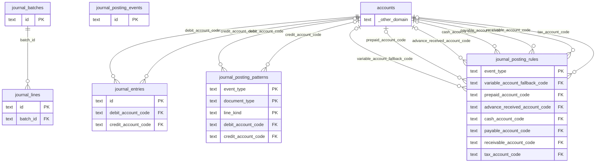

# DB 構造: 会計(仕訳)

> このファイルは `packages/backend/scripts/db-docs/generate-db-docs.mjs` で自動生成しています。直接編集しないでください(更新方法は [DB 構造の概要](README.md#更新方法))。

仕訳ルール・仕訳の起票イベントと、仕訳データ(DB_JOURNAL)。

## テーブル一覧

| テーブル | 名前 | DB | 説明 |
|---|---|---|---|
| [journal_batches](#journal_batches) | 仕訳バッチ | `DB_JOURNAL` | 1つの会計事象 = 1バッチ。借方と貸方の合計が一致する単位(DB_JOURNAL) |
| [journal_entries](#journal_entries) | 仕訳(旧) | `DB` | 以前の1行型の仕訳テーブル。現在は使っていない |
| [journal_lines](#journal_lines) | 仕訳明細 | `DB_JOURNAL` | 仕訳バッチの借方・貸方の各行(DB_JOURNAL) |
| [journal_posting_events](#journal_posting_events) | 仕訳の起票イベント | `DB` | 仕訳を作るべき伝票の一覧(送信待ち)。仕訳本体は DB_JOURNAL に作る |
| [journal_posting_patterns](#journal_posting_patterns) | 仕訳パターン | `DB` | 仕訳の組(会計事象×伝票区分×本体・消費税・充当)ごとの借方・貸方の勘定科目。無い組は仕訳ルールの科目から組み立てる |
| [journal_posting_rules](#journal_posting_rules) | 仕訳ルール | `DB` | 会計事象(売上・仕入・入金・支払・前受・前払)ごとの借方・貸方の勘定科目 |

## ER 図

主キー(PK)と外部キー(FK)の項目だけを表示しています。`_other_domain` は他の領域のテーブルです。

## テーブルの詳細

🔑 = 主キー、必須の ○ = 空にできない項目です。

### journal_batches(仕訳バッチ)

1つの会計事象 = 1バッチ。借方と貸方の合計が一致する単位(DB_JOURNAL)

- DB: `DB_JOURNAL`

| 項目 | 型 | 必須 | 既定値 | 参照先 | 説明 |
|---|---|:---:|---|---|---|
| 🔑 `id` | 文字列 | ○ |  |  | ID(主キー) |
| `entry_date` | 日時 | ○ |  |  | 計上日 |
| `description` | 文字列 | ○ |  |  | 説明 |
| `source_type` | 文字列 | ○ |  |  | 転記元のトレーサビリティ。この3つ組が冪等キーになる(二重転記の防止) sourceType: 'purchase_order' ／ 'sales_order' ／ 'sales_invoice' ／ 'purchase_recognition' ／ 'payment_receipt'(入金消込) ／ 'paym… |
| `source_ref_id` | 文字列 | ○ |  |  | 元の伝票のID |
| `event_type` | 文字列 | ○ |  |  | 会計事象の種類 |
| `total_debit_amount` | 整数 | ○ |  |  | 貸借合計。明細から算出できるが、検算と一覧表示のために冗長に保持する |
| `total_credit_amount` | 整数 | ○ |  |  | 貸方の合計金額 |
| `reversal_of_batch_id` | 文字列 |  |  |  | 反対仕訳による取消。取消仕訳はこの列に取消対象バッチIDを持つ (仕訳は物理削除・更新をせず、必ず反対仕訳で打ち消す) |
| `correction_of_batch_id` | 文字列 |  |  |  | 訂正仕訳(勘定科目・摘要のみ変更した新バッチ)による連鎖追跡。訂正仕訳はこの列に 訂正対象(元バッチ、または前回の訂正仕訳)のバッチIDを持つ。 |
| `project_id` | 文字列 |  |  |  | プロジェクト |
| `project_name` | 文字列 |  |  |  | プロジェクト名 |
| `memo` | 文字列 |  |  |  | 備考 |
| `posted_by_id` | 文字列 | ○ |  |  | 仕訳にした人(従業員番号。別 DB のため外部キーは無い) |
| `posted_at` | 日時 | ○ |  |  | 仕訳にした日時 |

- 一意(重複不可): `source_type` + `source_ref_id` + `event_type`

### journal_entries(仕訳(旧))

以前の1行型の仕訳テーブル。現在は使っていない

- DB: `DB`

| 項目 | 型 | 必須 | 既定値 | 参照先 | 説明 |
|---|---|:---:|---|---|---|
| 🔑 `id` | 文字列 | ○ |  |  | ID(主キー) |
| `entry_date` | 日時 | ○ |  |  | 計上日 |
| `debit_account_code` | 文字列 | ○ |  | [accounts](master.md#accounts).code | 借方の勘定科目 |
| `debit_amount` | 整数 | ○ |  |  | 借方の金額 |
| `credit_account_code` | 文字列 | ○ |  | [accounts](master.md#accounts).code | 貸方の勘定科目 |
| `credit_amount` | 整数 | ○ |  |  | 貸方の金額 |
| `description` | 文字列 | ○ |  |  | 説明 |
| `source_ref_id` | 文字列 |  |  |  | 元の伝票のID |
| `memo` | 文字列 |  |  |  | 備考 |
| `created_by` | 文字列 | ○ |  |  | 作成者(従業員番号) |
| `created_at` | 日時 | ○ |  |  | 作成日時 |

### journal_lines(仕訳明細)

仕訳バッチの借方・貸方の各行(DB_JOURNAL)

- DB: `DB_JOURNAL`

| 項目 | 型 | 必須 | 既定値 | 参照先 | 説明 |
|---|---|:---:|---|---|---|
| 🔑 `id` | 文字列 | ○ |  |  | ID(主キー) |
| `batch_id` | 文字列 | ○ |  | [journal_batches](#journal_batches).id | 仕訳バッチ |
| `line_no` | 整数 | ○ |  |  | バッチ内の表示順(1始まり) |
| `side` | 文字列 | ○ |  |  | 'DEBIT'(借方) ／ 'CREDIT'(貸方) |
| `account_code` | 文字列 | ○ |  |  | 勘定科目 |
| `account_name` | 文字列 | ○ |  |  | 勘定科目名 |
| `external_mapping_code` | 文字列 |  |  |  | 会計ソフト側のコード |
| `amount` | 整数 | ○ |  |  | 金額 |
| `tax_category_code` | 文字列 |  |  |  | 消費税区分 |
| `tax_rate` | 数値 |  |  |  | 税率 |
| `item_id` | 文字列 |  |  |  | 商品 |
| `item_name` | 文字列 |  |  |  | 品名(マスタに無い品目も入力できる) |
| `source_ref_item_id` | 文字列 |  |  |  | 元伝票の明細ID |
| `memo` | 文字列 |  |  |  | 備考 |

### journal_posting_events(仕訳の起票イベント)

仕訳を作るべき伝票の一覧(送信待ち)。仕訳本体は DB_JOURNAL に作る

- DB: `DB`

| 項目 | 型 | 必須 | 既定値 | 参照先 | 説明 |
|---|---|:---:|---|---|---|
| 🔑 `id` | 文字列 | ○ |  |  | ID(主キー) |
| `source_type` | 文字列 | ○ |  |  | journal_batchesと同じ3つ組。転記先バッチの冪等キーでもある |
| `source_ref_id` | 文字列 | ○ |  |  | 元の伝票のID |
| `event_type` | 文字列 | ○ |  |  | 会計事象の種類 |
| `payload` | 文字列 | ○ |  |  | 転記に必要な情報(計上日・摘要・借貸明細)の確定スナップショットをJSONで保持する。 再試行時に元伝票を読み直すと、その間の伝票変更が過去の会計事象に混入するため、 起票時点の内容をここに固定する |
| `status` | 文字列 | ○ | `PENDING` |  | 状態 |
| `posted_batch_id` | 文字列 |  |  |  | 転記先(DB_JOURNAL)のjournal_batches.id |
| `retry_count` | 整数 | ○ | `0` |  | 再送の回数 |
| `error_message` | 文字列 |  |  |  | エラーの内容 |
| `requested_by_id` | 文字列 | ○ |  |  | 起票した人(従業員番号) |
| `requested_at` | 日時 | ○ |  |  | 申請日時 |
| `posted_at` | 日時 |  |  |  | 仕訳にした日時 |

- 一意(重複不可): `source_type` + `source_ref_id` + `event_type`

### journal_posting_patterns(仕訳パターン)

仕訳の組(会計事象×伝票区分×本体・消費税・充当)ごとの借方・貸方の勘定科目。無い組は仕訳ルールの科目から組み立てる

- DB: `DB`

| 項目 | 型 | 必須 | 既定値 | 参照先 | 説明 |
|---|---|:---:|---|---|---|
| 🔑 `event_type` | 文字列 | ○ |  |  | 会計事象の種類 |
| 🔑 `document_type` | 文字列 | ○ |  |  | 帳票の種類 |
| 🔑 `line_kind` | 文字列 | ○ |  |  | BODY=本体(明細の税抜金額)、TAX=消費税、ADVANCE=前受金・前渡金の充当 |
| `debit_from_item` | 真偽値 | ○ | `false` |  | true の場合は品目マスタ(明細)の科目を使い、無い場合に debitAccountCode を使う |
| `debit_account_code` | 文字列 |  |  | [accounts](master.md#accounts).code | 借方の勘定科目 |
| `credit_from_item` | 真偽値 | ○ | `false` |  | true の場合は品目マスタ(明細)の科目を使い、無い場合に creditAccountCode を使う |
| `credit_account_code` | 文字列 |  |  | [accounts](master.md#accounts).code | 貸方の勘定科目 |
| `updated_by` | 文字列 |  |  |  | 更新者(従業員番号) |
| `updated_at` | 日時 |  |  |  | 更新日時 |

- 主キー(複合): `event_type` + `document_type` + `line_kind`

### journal_posting_rules(仕訳ルール)

会計事象(売上・仕入・入金・支払・前受・前払)ごとの借方・貸方の勘定科目

- DB: `DB`

| 項目 | 型 | 必須 | 既定値 | 参照先 | 説明 |
|---|---|:---:|---|---|---|
| 🔑 `event_type` | 文字列 | ○ |  |  | 会計事象の種類 |
| `variable_account_priority` | 文字列 | ○ | `ITEM_MASTER_FIRST` |  | 品目に連動する変動科目(仕入高/売上高)の優先順位。PURCHASE/SALESでのみ使う (PREPAYMENT/ADVANCE_RECEIPTは品目非依存の一括仕訳のため常にvariableAccountFallbackCodeを使う) |
| `variable_account_fallback_code` | 文字列 |  |  | [accounts](master.md#accounts).code | 品目マスタ・伝票ヘッダーのどちらにも科目が無い行、またはPREPAYMENT/ADVANCE_RECEIPTで使う既定科目 |
| `prepaid_account_code` | 文字列 |  |  | [accounts](master.md#accounts).code | 前渡金(PREPAYMENT借方/PURCHASE充当) |
| `advance_received_account_code` | 文字列 |  |  | [accounts](master.md#accounts).code | 前受金(ADVANCE_RECEIPT貸方/SALES充当) |
| `cash_account_code` | 文字列 |  |  | [accounts](master.md#accounts).code | 現金預金(PREPAYMENT貸方/ADVANCE_RECEIPT借方) |
| `payable_account_code` | 文字列 |  |  | [accounts](master.md#accounts).code | 買掛金(PURCHASE貸方) |
| `receivable_account_code` | 文字列 |  |  | [accounts](master.md#accounts).code | 売掛金(SALES借方) |
| `tax_account_code` | 文字列 |  |  | [accounts](master.md#accounts).code | 仮払消費税(PURCHASE)/仮受消費税(SALES) |
| `enabled` | 真偽値 | ○ | `false` |  | 未設定のまま自動転記が走らないようにするための明示的な有効化フラグ(既定false)。 全ての必須科目が埋まっていてもこれがfalseなら転記サービスはスキップする |
| `memo` | 文字列 |  |  |  | 備考 |
| `updated_by` | 文字列 |  |  |  | 更新者(従業員番号) |
| `updated_at` | 日時 |  |  |  | 更新日時 |
