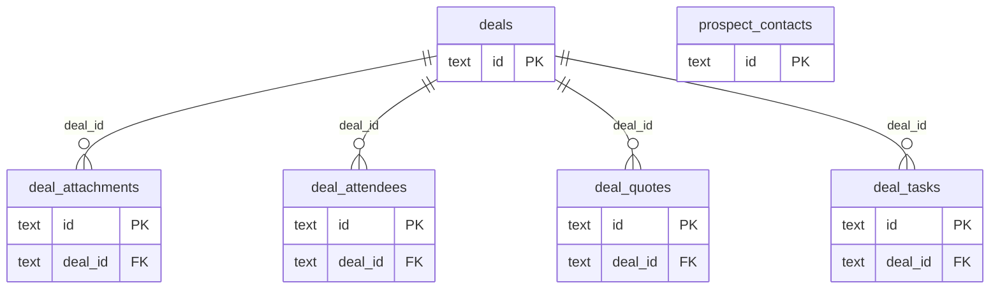

# DB 構造: 商談

> このファイルは `packages/backend/scripts/db-docs/generate-db-docs.mjs` で自動生成しています。直接編集しないでください(更新方法は [DB 構造の概要](README.md#更新方法))。

商談・面談者・タスク・見込み客の担当者(DB_DEALS)。

## テーブル一覧

| テーブル | 名前 | DB | 説明 |
|---|---|---|---|
| [deal_attachments](#deal_attachments) | 商談の添付ファイル | `DB_DEALS` | 商談の添付ファイル(実体は R2) |
| [deal_attendees](#deal_attendees) | 面談者 | `DB_DEALS` | 商談で会った相手。氏名などはその時点の内容で保存する |
| [deal_quotes](#deal_quotes) | 商談と見積の紐づけ | `DB_DEALS` | 商談に関連する見積(見積は業務DBにあるため外部キーは無い) |
| [deal_tasks](#deal_tasks) | 商談のタスク | `DB_DEALS` | 次回までに行うタスクと担当・期限・完了 |
| [deals](#deals) | 商談 | `DB_DEALS` | 見込み客・得意先との商談(日時・場所・内容・状態・担当者) |
| [prospect_contacts](#prospect_contacts) | 見込み客の担当者 | `DB_DEALS` | 商談の入力中にその場で登録する、見込み客の担当者 |

## ER 図

主キー(PK)と外部キー(FK)の項目だけを表示しています。`_other_domain` は他の領域のテーブルです。

## テーブルの詳細

🔑 = 主キー、必須の ○ = 空にできない項目です。

### deal_attachments(商談の添付ファイル)

商談の添付ファイル(実体は R2)

- DB: `DB_DEALS`

| 項目 | 型 | 必須 | 既定値 | 参照先 | 説明 |
|---|---|:---:|---|---|---|
| 🔑 `id` | 文字列 | ○ |  |  | ID(主キー) |
| `deal_id` | 文字列 | ○ |  | [deals](#deals).id | 商談 |
| `file_name` | 文字列 | ○ |  |  | ファイル名 |
| `attachment_r2_path` | 文字列 | ○ |  |  | ファイルの保存先(R2 のキー) |
| `file_type` | 文字列 | ○ | `OTHER` |  | ファイルの種類(MIMEタイプ) |
| `uploaded_by_id` | 文字列 | ○ |  |  | 登録した人 |
| `uploaded_at` | 日時 | ○ |  |  | 登録日時 |

### deal_attendees(面談者)

商談で会った相手。氏名などはその時点の内容で保存する

- DB: `DB_DEALS`

| 項目 | 型 | 必須 | 既定値 | 参照先 | 説明 |
|---|---|:---:|---|---|---|
| 🔑 `id` | 文字列 | ○ |  |  | ID(主キー) |
| `deal_id` | 文字列 | ○ |  | [deals](#deals).id | 商談 |
| `kind` | 文字列 | ○ |  |  | 種類 |
| `ref_id` | 文字列 |  |  |  | 関連する伝票のID |
| `name` | 文字列 | ○ |  |  | 名称 |
| `note` | 文字列 |  |  |  | 役職・所属など |
| `sort_order` | 整数 | ○ | `0` |  | 表示順 |

### deal_quotes(商談と見積の紐づけ)

商談に関連する見積(見積は業務DBにあるため外部キーは無い)

- DB: `DB_DEALS`

| 項目 | 型 | 必須 | 既定値 | 参照先 | 説明 |
|---|---|:---:|---|---|---|
| 🔑 `id` | 文字列 | ○ |  |  | ID(主キー) |
| `deal_id` | 文字列 | ○ |  | [deals](#deals).id | 商談 |
| `quote_id` | 文字列 | ○ |  |  | 見積 |
| `linked_by` | 文字列 | ○ |  |  | 紐づけた人 |
| `linked_at` | 日時 | ○ |  |  | 紐づけた日時 |

- 一意(重複不可): `deal_id` + `quote_id`

### deal_tasks(商談のタスク)

次回までに行うタスクと担当・期限・完了

- DB: `DB_DEALS`

| 項目 | 型 | 必須 | 既定値 | 参照先 | 説明 |
|---|---|:---:|---|---|---|
| 🔑 `id` | 文字列 | ○ |  |  | ID(主キー) |
| `deal_id` | 文字列 | ○ |  | [deals](#deals).id | 商談 |
| `title` | 文字列 | ○ |  |  | 件名・タイトル |
| `due_date` | 日時 |  |  |  | 期限 |
| `assignee_employee_number` | 文字列 |  |  |  | 担当者(従業員番号) |
| `is_done` | 真偽値 | ○ | `false` |  | 完了したかどうか |
| `done_at` | 日時 |  |  |  | 完了日時 |
| `sort_order` | 整数 | ○ | `0` |  | 表示順 |

### deals(商談)

見込み客・得意先との商談(日時・場所・内容・状態・担当者)

- DB: `DB_DEALS`

| 項目 | 型 | 必須 | 既定値 | 参照先 | 説明 |
|---|---|:---:|---|---|---|
| 🔑 `id` | 文字列 | ○ |  |  | ID(主キー) |
| `partner_id` | 文字列 | ○ |  |  | 取引先 |
| `title` | 文字列 | ○ |  |  | 件名・タイトル |
| `deal_date` | 日時 | ○ |  |  | 商談日 |
| `start_time` | 文字列 |  |  |  | 開始時刻(HH:MM) |
| `end_time` | 文字列 |  |  |  | 終了時刻(HH:MM) |
| `location` | 文字列 |  |  |  | 場所 |
| `memo` | 文字列 |  |  |  | 備考 |
| `status` | 文字列 | ○ | `OPEN` |  | 状態 |
| `owner_employee_number` | 文字列 |  |  |  | 自社の商談担当者(社員番号) |
| `created_by` | 文字列 | ○ |  |  | 作成者(従業員番号) |
| `created_at` | 日時 | ○ |  |  | 作成日時 |
| `updated_by` | 文字列 | ○ |  |  | 更新者(従業員番号) |
| `updated_at` | 日時 | ○ |  |  | 更新日時 |

### prospect_contacts(見込み客の担当者)

商談の入力中にその場で登録する、見込み客の担当者

- DB: `DB_DEALS`

| 項目 | 型 | 必須 | 既定値 | 参照先 | 説明 |
|---|---|:---:|---|---|---|
| 🔑 `id` | 文字列 | ○ |  |  | ID(主キー) |
| `partner_id` | 文字列 | ○ |  |  | 取引先 |
| `name` | 文字列 | ○ |  |  | 名称 |
| `department_name` | 文字列 |  |  |  | 部署名 |
| `position` | 文字列 |  |  |  | 表示順・位置 |
| `email` | 文字列 |  |  |  | メールアドレス |
| `phone` | 文字列 |  |  |  | 電話番号 |
| `memo` | 文字列 |  |  |  | 備考 |
| `created_by` | 文字列 | ○ |  |  | 作成者(従業員番号) |
| `created_at` | 日時 | ○ |  |  | 作成日時 |
| `updated_by` | 文字列 | ○ |  |  | 更新者(従業員番号) |
| `updated_at` | 日時 | ○ |  |  | 更新日時 |
