# DB 構造: 在庫

> このファイルは `packages/backend/scripts/db-docs/generate-db-docs.mjs` で自動生成しています。直接編集しないでください(更新方法は [DB 構造の概要](README.md#更新方法))。

在庫・入出庫・入出荷指示・棚卸・品質区分の変更・廃棄・返品・引当。

## テーブル一覧

| テーブル | 名前 | DB | 説明 |
|---|---|---|---|
| [item_receipt_attachments](#item_receipt_attachments) | 入庫の添付ファイル | `DB` | 検収書 PDF(実体は R2、版を管理) |
| [item_receipt_headers](#item_receipt_headers) | 入庫 | `DB` | 入庫(検収)のヘッダー。仕入先・移動元倉庫・入庫日・承認状態・発注との紐づけなど |
| [item_receipt_instruction_items](#item_receipt_instruction_items) | 入荷指示明細 | `DB` | 入荷指示の明細と、入庫による消込の状況 |
| [item_receipt_instructions](#item_receipt_instructions) | 入荷指示 | `DB` | 外部倉庫への入荷指示のヘッダー |
| [item_receipt_items](#item_receipt_items) | 入庫明細 | `DB` | 入庫の明細(商品・倉庫・ロケーション・ロット・数量・検品結果) |
| [item_shipment_headers](#item_shipment_headers) | 出庫 | `DB` | 出庫のヘッダー。得意先・移動先倉庫・出庫日・承認状態・受注との紐づけ・納品書など |
| [item_shipment_instruction_items](#item_shipment_instruction_items) | 出荷指示明細 | `DB` | 出荷指示の明細と、出庫による消込の状況 |
| [item_shipment_instructions](#item_shipment_instructions) | 出荷指示 | `DB` | 外部倉庫への出荷指示のヘッダー |
| [item_shipment_items](#item_shipment_items) | 出庫明細 | `DB` | 出庫の明細(商品・倉庫・ロケーション・ロット・品質区分・数量) |
| [item_stock_reservations](#item_stock_reservations) | 在庫の引当(商品単位) | `DB` | 受注による商品単位の在庫の引当(以前の方式。倉庫別の引当より前に承認された受注用) |
| [receipt_instruction_attachments](#receipt_instruction_attachments) | 入荷指示書 | `DB` | 入荷指示書 PDF(実体は R2) |
| [shipment_instruction_attachments](#shipment_instruction_attachments) | 出荷指示書 | `DB` | 出荷指示書 PDF(実体は R2) |
| [stock_audits](#stock_audits) | 棚卸 | `DB` | 棚卸(実在庫との差の調整)。1行 = 1回の棚卸 |
| [stock_disposals](#stock_disposals) | 廃棄 | `DB` | 在庫の廃棄。1行 = 1回の廃棄 |
| [stock_reclassifications](#stock_reclassifications) | 品質区分の変更 | `DB` | 良品・破損品・検品待ちの区分の変更。1行 = 1回の変更 |
| [stock_returns](#stock_returns) | 返品 | `DB` | 仕入先への返品・得意先からの返品。1行 = 1回の返品 |
| [stock_transactions](#stock_transactions) | 在庫の増減履歴 | `DB` | 入庫・出庫・棚卸・品質区分の変更・廃棄・返品による在庫の増減の記録 |
| [stocks](#stocks) | 在庫 | `DB` | 商品 × 倉庫 × ロケーション × ロット × 品質区分ごとの在庫数 |
| [warehouse_stock_reservations](#warehouse_stock_reservations) | 在庫の引当(倉庫単位) | `DB` | 受注による商品 × 倉庫単位の在庫の引当数 |

## ER 図

主キー(PK)と外部キー(FK)の項目だけを表示しています。`_other_domain` は他の領域のテーブルです。

```mermaid
erDiagram
  item_receipt_attachments {
    text id PK
    text receipt_header_id FK
    text receipt_item_id FK
  }
  item_receipt_headers {
    text id PK
    text order_id FK
    text partner_id FK
    text receipt_instruction_id FK
    text source_warehouse_id FK
    text approval_flow_id FK
  }
  item_receipt_instruction_items {
    text id PK
    text instruction_header_id FK
    text item_id FK
    text account_code FK
  }
  item_receipt_instructions {
    text id PK
    text partner_id FK
    text approval_flow_id FK
  }
  item_receipt_items {
    text id PK
    text receipt_header_id FK
    text order_item_id FK
    text item_id FK
    text account_code FK
  }
  item_shipment_headers {
    text id PK
    text partner_id FK
    text shipment_instruction_id FK
    text sales_order_id FK
    text destination_warehouse_id FK
    text approval_flow_id FK
  }
  item_shipment_instruction_items {
    text id PK
    text instruction_header_id FK
    text item_id FK
    text sales_order_item_id FK
    text account_code FK
  }
  item_shipment_instructions {
    text id PK
    text partner_id FK
    text approval_flow_id FK
    text sales_order_id FK
  }
  item_shipment_items {
    text id PK
    text shipment_header_id FK
    text item_id FK
    text sales_order_item_id FK
    text account_code FK
  }
  item_stock_reservations {
    text item_id PK
  }
  receipt_instruction_attachments {
    text id PK
    text instruction_id FK
  }
  shipment_instruction_attachments {
    text id PK
    text instruction_id FK
  }
  stock_audits {
    text id PK
    text item_id FK
    text account_code FK
    text approval_flow_id FK
  }
  stock_disposals {
    text id PK
    text item_id FK
    text account_code FK
    text approval_flow_id FK
  }
  stock_reclassifications {
    text id PK
    text item_id FK
    text account_code FK
    text approval_flow_id FK
  }
  stock_returns {
    text id PK
    text item_id FK
    text account_code FK
    text approval_flow_id FK
  }
  stock_transactions {
    text id PK
  }
  stocks {
    text id PK
    text item_id FK
    text warehouse_id FK
    text location_id FK
    text account_code FK
  }
  warehouse_stock_reservations {
    text item_id PK
    text warehouse_id PK
  }
  accounts {
    text _other_domain
  }
  approval_flows {
    text _other_domain
  }
  items {
    text _other_domain
  }
  locations {
    text _other_domain
  }
  order_items {
    text _other_domain
  }
  orders {
    text _other_domain
  }
  partners {
    text _other_domain
  }
  sales_order_items {
    text _other_domain
  }
  sales_orders {
    text _other_domain
  }
  warehouses {
    text _other_domain
  }
  item_receipt_headers ||--o{ item_receipt_attachments : "receipt_header_id"
  item_receipt_items |o--o{ item_receipt_attachments : "receipt_item_id"
  orders |o--o{ item_receipt_headers : "order_id"
  partners |o--o{ item_receipt_headers : "partner_id"
  item_receipt_instructions |o--o{ item_receipt_headers : "receipt_instruction_id"
  warehouses |o--o{ item_receipt_headers : "source_warehouse_id"
  approval_flows |o--o{ item_receipt_headers : "approval_flow_id"
  item_receipt_instructions |o--o{ item_receipt_instruction_items : "instruction_header_id"
  items ||--o{ item_receipt_instruction_items : "item_id"
  accounts ||--o{ item_receipt_instruction_items : "account_code"
  partners ||--o{ item_receipt_instructions : "partner_id"
  approval_flows |o--o{ item_receipt_instructions : "approval_flow_id"
  item_receipt_headers |o--o{ item_receipt_items : "receipt_header_id"
  order_items |o--o{ item_receipt_items : "order_item_id"
  items ||--o{ item_receipt_items : "item_id"
  accounts ||--o{ item_receipt_items : "account_code"
  partners |o--o{ item_shipment_headers : "partner_id"
  item_shipment_instructions |o--o{ item_shipment_headers : "shipment_instruction_id"
  sales_orders |o--o{ item_shipment_headers : "sales_order_id"
  warehouses |o--o{ item_shipment_headers : "destination_warehouse_id"
  approval_flows |o--o{ item_shipment_headers : "approval_flow_id"
  item_shipment_instructions |o--o{ item_shipment_instruction_items : "instruction_header_id"
  items ||--o{ item_shipment_instruction_items : "item_id"
  sales_order_items |o--o{ item_shipment_instruction_items : "sales_order_item_id"
  accounts ||--o{ item_shipment_instruction_items : "account_code"
  partners ||--o{ item_shipment_instructions : "partner_id"
  approval_flows |o--o{ item_shipment_instructions : "approval_flow_id"
  sales_orders |o--o{ item_shipment_instructions : "sales_order_id"
  item_shipment_headers |o--o{ item_shipment_items : "shipment_header_id"
  items ||--o{ item_shipment_items : "item_id"
  sales_order_items |o--o{ item_shipment_items : "sales_order_item_id"
  accounts ||--o{ item_shipment_items : "account_code"
  item_receipt_instructions ||--o{ receipt_instruction_attachments : "instruction_id"
  item_shipment_instructions ||--o{ shipment_instruction_attachments : "instruction_id"
  items ||--o{ stock_audits : "item_id"
  accounts ||--o{ stock_audits : "account_code"
  approval_flows |o--o{ stock_audits : "approval_flow_id"
  items ||--o{ stock_disposals : "item_id"
  accounts ||--o{ stock_disposals : "account_code"
  approval_flows |o--o{ stock_disposals : "approval_flow_id"
  items ||--o{ stock_reclassifications : "item_id"
  accounts ||--o{ stock_reclassifications : "account_code"
  approval_flows |o--o{ stock_reclassifications : "approval_flow_id"
  items ||--o{ stock_returns : "item_id"
  accounts ||--o{ stock_returns : "account_code"
  approval_flows |o--o{ stock_returns : "approval_flow_id"
  items ||--o{ stocks : "item_id"
  warehouses ||--o{ stocks : "warehouse_id"
  locations ||--o{ stocks : "location_id"
  accounts ||--o{ stocks : "account_code"
```

## テーブルの詳細

🔑 = 主キー、必須の ○ = 空にできない項目です。

### item_receipt_attachments(入庫の添付ファイル)

検収書 PDF(実体は R2、版を管理)

- DB: `DB`

| 項目 | 型 | 必須 | 既定値 | 参照先 | 説明 |
|---|---|:---:|---|---|---|
| 🔑 `id` | 文字列 | ○ |  |  | ID(主キー) |
| `receipt_header_id` | 文字列 | ○ |  | [item_receipt_headers](#item_receipt_headers).id | 入庫のヘッダー |
| `receipt_item_id` | 文字列 |  |  | [item_receipt_items](#item_receipt_items).id | 入庫明細 |
| `file_name` | 文字列 | ○ |  |  | ファイル名 |
| `attachment_r2_path` | 文字列 |  |  |  | ファイルの保存先(R2 のキー) |
| `file_type` | 文字列 | ○ | `OTHER` |  | ファイルの種類(MIMEタイプ) |
| `uploaded_by_id` | 文字列 | ○ |  |  | 登録した人 |
| `uploaded_at` | 日時 | ○ |  |  | 登録日時 |
| `storage_type` | 文字列 | ○ | `R2` |  | ファイルの保存方法(R2・外部URL) |
| `external_url` | 文字列 |  |  |  | 外部URL(R2 ではなく外部に置く場合) |

### item_receipt_headers(入庫)

入庫(検収)のヘッダー。仕入先・移動元倉庫・入庫日・承認状態・発注との紐づけなど

- DB: `DB`

| 項目 | 型 | 必須 | 既定値 | 参照先 | 説明 |
|---|---|:---:|---|---|---|
| 🔑 `id` | 文字列 | ○ |  |  | ID(主キー) |
| `order_id` | 文字列 |  |  | [orders](purchase.md#orders).id | 発注 |
| `partner_id` | 文字列 |  |  | [partners](master.md#partners).id | 取引先 |
| `receipt_instruction_id` | 文字列 |  |  | [item_receipt_instructions](#item_receipt_instructions).id | 消込用。この実績がどの入荷指示に基づくものかを示す(任意、1指示:N実績) |
| `received_date` | 日時 | ○ |  |  | 入庫日 |
| `supplier_invoice_number` | 文字列 |  |  |  | 仕入先の請求書番号 |
| `source_warehouse_id` | 文字列 |  |  | [warehouses](master.md#warehouses).id | 倉庫間移動の入庫側。仕入先(partnerId)の代わりに、移動元となる 自社/外部倉庫を指定できる(排他。 |
| `attachment_r2_path` | 文字列 |  |  |  | ファイルの保存先(R2 のキー) |
| `status` | 文字列 | ○ | `UNAPPROVED` |  | 状態 |
| `current_approval_layer` | 整数 | ○ | `1` |  | 承認中の段(何段目の承認待ちか) |
| `approval_flow_id` | 文字列 |  |  | [approval_flows](workflow.md#approval_flows).id | 使用中の承認フロー |
| `memo` | 文字列 |  |  |  | 備考 |
| `created_by` | 文字列 | ○ |  |  | 作成者(従業員番号) |
| `created_at` | 日時 | ○ |  |  | 作成日時 |

### item_receipt_instruction_items(入荷指示明細)

入荷指示の明細と、入庫による消込の状況

- DB: `DB`

| 項目 | 型 | 必須 | 既定値 | 参照先 | 説明 |
|---|---|:---:|---|---|---|
| 🔑 `id` | 文字列 | ○ |  |  | ID(主キー) |
| `instruction_header_id` | 文字列 |  |  | [item_receipt_instructions](#item_receipt_instructions).id | 指示のヘッダー |
| `item_id` | 文字列 | ○ |  | [items](master.md#items).id | 商品 |
| `lot_number` | 文字列 | ○ | `NONE` |  | ロット番号 |
| `instructed_quantity` | 数値 | ○ |  |  | 指示数量 |
| `account_code` | 文字列 | ○ |  | [accounts](master.md#accounts).code | 勘定科目 |
| `memo` | 文字列 |  |  |  | 備考 |

### item_receipt_instructions(入荷指示)

外部倉庫への入荷指示のヘッダー

- DB: `DB`

| 項目 | 型 | 必須 | 既定値 | 参照先 | 説明 |
|---|---|:---:|---|---|---|
| 🔑 `id` | 文字列 | ○ |  |  | ID(主キー) |
| `partner_id` | 文字列 | ○ |  | [partners](master.md#partners).id | 取引先 |
| `warehouse_id` | 文字列 | ○ |  |  | 倉庫 |
| `instructed_receive_date` | 日時 | ○ |  |  | 入荷予定日 |
| `status` | 文字列 | ○ | `UNAPPROVED` |  | 状態 |
| `current_approval_layer` | 整数 | ○ | `1` |  | 承認中の段(何段目の承認待ちか) |
| `approval_flow_id` | 文字列 |  |  | [approval_flows](workflow.md#approval_flows).id | 使用中の承認フロー |
| `instruction_document_r2_path` | 文字列 |  |  |  | 指示書 PDF の保存先(R2) |
| `memo` | 文字列 |  |  |  | 備考 |
| `created_by` | 文字列 | ○ |  |  | 作成者(従業員番号) |
| `created_at` | 日時 | ○ |  |  | 作成日時 |

### item_receipt_items(入庫明細)

入庫の明細(商品・倉庫・ロケーション・ロット・数量・検品結果)

- DB: `DB`

| 項目 | 型 | 必須 | 既定値 | 参照先 | 説明 |
|---|---|:---:|---|---|---|
| 🔑 `id` | 文字列 | ○ |  |  | ID(主キー) |
| `receipt_header_id` | 文字列 |  |  | [item_receipt_headers](#item_receipt_headers).id | 入庫のヘッダー |
| `order_item_id` | 文字列 |  |  | [order_items](purchase.md#order_items).id | 発注明細 |
| `item_id` | 文字列 | ○ |  | [items](master.md#items).id | 商品 |
| `warehouse_id` | 文字列 | ○ |  |  | 倉庫 |
| `location_id` | 文字列 | ○ |  |  | ロケーション |
| `lot_number` | 文字列 | ○ | `NONE` |  | ロット番号 |
| `received_quantity` | 数値 | ○ |  |  | 入庫数量 |
| `account_code` | 文字列 | ○ |  | [accounts](master.md#accounts).code | 勘定科目 |
| `inspection_status` | 文字列 | ○ | `PASSED` |  | 検品結果 |
| `inspection_memo` | 文字列 |  |  |  | 検品の備考 |
| `actual_product_photo_r2_path` | 文字列 |  |  |  | 現物写真の保存先(R2) |
| `item_attachment_r2_path` | 文字列 |  |  |  | 添付ファイルの保存先(R2) |
| `qr_code_key` | 文字列 |  |  |  | QRコード用のキー |
| `memo` | 文字列 |  |  |  | 備考 |

### item_shipment_headers(出庫)

出庫のヘッダー。得意先・移動先倉庫・出庫日・承認状態・受注との紐づけ・納品書など

- DB: `DB`

| 項目 | 型 | 必須 | 既定値 | 参照先 | 説明 |
|---|---|:---:|---|---|---|
| 🔑 `id` | 文字列 | ○ |  |  | ID(主キー) |
| `partner_id` | 文字列 |  |  | [partners](master.md#partners).id | 取引先 |
| `shipment_instruction_id` | 文字列 |  |  | [item_shipment_instructions](#item_shipment_instructions).id | 消込用。この実績がどの出荷指示に基づくものかを示す(任意、1指示:N実績)。 |
| `sales_order_id` | 文字列 |  |  | [sales_orders](sales.md#sales_orders).id | 受注 |
| `destination_warehouse_id` | 文字列 |  |  | [warehouses](master.md#warehouses).id | 倉庫間移動の出庫側。得意先(partnerId)の代わりに、移動先となる 自社/外部倉庫を指定できる(排他。 |
| `shipped_date` | 日時 | ○ |  |  | 出庫日 |
| `status` | 文字列 | ○ | `UNAPPROVED` |  | 状態 |
| `current_approval_layer` | 整数 | ○ | `1` |  | 承認中の段(何段目の承認待ちか) |
| `approval_flow_id` | 文字列 |  |  | [approval_flows](workflow.md#approval_flows).id | 使用中の承認フロー |
| `memo` | 文字列 |  |  |  | 備考 |
| `delivery_note_r2_path` | 文字列 |  |  |  | 自動生成された納品書PDFのR2キー(SYSTEM_BUCKET)。partnerId設定済みの 出庫が確定(APPROVED)したタイミングで自動生成される。 |
| `created_by` | 文字列 | ○ |  |  | 作成者(従業員番号) |
| `created_at` | 日時 | ○ |  |  | 作成日時 |

### item_shipment_instruction_items(出荷指示明細)

出荷指示の明細と、出庫による消込の状況

- DB: `DB`

| 項目 | 型 | 必須 | 既定値 | 参照先 | 説明 |
|---|---|:---:|---|---|---|
| 🔑 `id` | 文字列 | ○ |  |  | ID(主キー) |
| `instruction_header_id` | 文字列 |  |  | [item_shipment_instructions](#item_shipment_instructions).id | 指示のヘッダー |
| `item_id` | 文字列 | ○ |  | [items](master.md#items).id | 商品 |
| `sales_order_item_id` | 文字列 |  |  | [sales_order_items](sales.md#sales_order_items).id | 受注明細 |
| `lot_number` | 文字列 | ○ | `NONE` |  | ロット番号 |
| `instructed_quantity` | 数値 | ○ |  |  | 指示数量 |
| `account_code` | 文字列 | ○ |  | [accounts](master.md#accounts).code | 勘定科目 |
| `memo` | 文字列 |  |  |  | 備考 |

### item_shipment_instructions(出荷指示)

外部倉庫への出荷指示のヘッダー

- DB: `DB`

| 項目 | 型 | 必須 | 既定値 | 参照先 | 説明 |
|---|---|:---:|---|---|---|
| 🔑 `id` | 文字列 | ○ |  |  | ID(主キー) |
| `partner_id` | 文字列 | ○ |  | [partners](master.md#partners).id | 取引先 |
| `warehouse_id` | 文字列 | ○ |  |  | 倉庫 |
| `instructed_ship_date` | 日時 | ○ |  |  | 出荷予定日 |
| `status` | 文字列 | ○ | `UNAPPROVED` |  | 状態 |
| `current_approval_layer` | 整数 | ○ | `1` |  | 承認中の段(何段目の承認待ちか) |
| `approval_flow_id` | 文字列 |  |  | [approval_flows](workflow.md#approval_flows).id | 使用中の承認フロー |
| `instruction_document_r2_path` | 文字列 |  |  |  | 指示書 PDF の保存先(R2) |
| `sales_order_id` | 文字列 |  |  | [sales_orders](sales.md#sales_orders).id | 受注 |
| `memo` | 文字列 |  |  |  | 備考 |
| `created_by` | 文字列 | ○ |  |  | 作成者(従業員番号) |
| `created_at` | 日時 | ○ |  |  | 作成日時 |

### item_shipment_items(出庫明細)

出庫の明細(商品・倉庫・ロケーション・ロット・品質区分・数量)

- DB: `DB`

| 項目 | 型 | 必須 | 既定値 | 参照先 | 説明 |
|---|---|:---:|---|---|---|
| 🔑 `id` | 文字列 | ○ |  |  | ID(主キー) |
| `shipment_header_id` | 文字列 |  |  | [item_shipment_headers](#item_shipment_headers).id | 出庫のヘッダー |
| `item_id` | 文字列 | ○ |  | [items](master.md#items).id | 商品 |
| `sales_order_item_id` | 文字列 |  |  | [sales_order_items](sales.md#sales_order_items).id | 受注明細 |
| `warehouse_id` | 文字列 | ○ |  |  | 倉庫 |
| `location_id` | 文字列 | ○ |  |  | ロケーション |
| `lot_number` | 文字列 | ○ | `NONE` |  | ロット番号 |
| `quality_status` | 文字列 | ○ | `NORMAL` |  | 品質区分(良品・破損品・検品待ち) |
| `shipped_quantity` | 数値 | ○ |  |  | 出庫数量 |
| `account_code` | 文字列 | ○ |  | [accounts](master.md#accounts).code | 勘定科目 |
| `qr_code_key` | 文字列 |  |  |  | QRコード用のキー |
| `memo` | 文字列 |  |  |  | 備考 |

### item_stock_reservations(在庫の引当(商品単位))

受注による商品単位の在庫の引当(以前の方式。倉庫別の引当より前に承認された受注用)

- DB: `DB`

| 項目 | 型 | 必須 | 既定値 | 参照先 | 説明 |
|---|---|:---:|---|---|---|
| 🔑 `item_id` | 文字列 | ○ |  |  | 商品 |
| `reserved_quantity` | 数値 | ○ | `0` |  | 引当数量 |
| `updated_at` | 日時 | ○ |  |  | 更新日時 |

### receipt_instruction_attachments(入荷指示書)

入荷指示書 PDF(実体は R2)

- DB: `DB`

| 項目 | 型 | 必須 | 既定値 | 参照先 | 説明 |
|---|---|:---:|---|---|---|
| 🔑 `id` | 文字列 | ○ |  |  | ID(主キー) |
| `instruction_id` | 文字列 | ○ |  | [item_receipt_instructions](#item_receipt_instructions).id | 指示 |
| `file_name` | 文字列 | ○ |  |  | ファイル名 |
| `storage_type` | 文字列 | ○ | `R2` |  | ファイルの保存方法(R2・外部URL) |
| `attachment_r2_path` | 文字列 |  |  |  | ファイルの保存先(R2 のキー) |
| `file_type` | 文字列 | ○ | `PDF` |  | ファイルの種類(MIMEタイプ) |
| `uploaded_by_id` | 文字列 | ○ |  |  | 登録した人 |
| `uploaded_at` | 日時 | ○ |  |  | 登録日時 |

### shipment_instruction_attachments(出荷指示書)

出荷指示書 PDF(実体は R2)

- DB: `DB`

| 項目 | 型 | 必須 | 既定値 | 参照先 | 説明 |
|---|---|:---:|---|---|---|
| 🔑 `id` | 文字列 | ○ |  |  | ID(主キー) |
| `instruction_id` | 文字列 | ○ |  | [item_shipment_instructions](#item_shipment_instructions).id | 指示 |
| `file_name` | 文字列 | ○ |  |  | ファイル名 |
| `storage_type` | 文字列 | ○ | `R2` |  | ファイルの保存方法(R2・外部URL) |
| `attachment_r2_path` | 文字列 |  |  |  | ファイルの保存先(R2 のキー) |
| `file_type` | 文字列 | ○ | `PDF` |  | ファイルの種類(MIMEタイプ) |
| `uploaded_by_id` | 文字列 | ○ |  |  | 登録した人 |
| `uploaded_at` | 日時 | ○ |  |  | 登録日時 |

### stock_audits(棚卸)

棚卸(実在庫との差の調整)。1行 = 1回の棚卸

- DB: `DB`

| 項目 | 型 | 必須 | 既定値 | 参照先 | 説明 |
|---|---|:---:|---|---|---|
| 🔑 `id` | 文字列 | ○ |  |  | ID(主キー) |
| `item_id` | 文字列 | ○ |  | [items](master.md#items).id | 商品 |
| `warehouse_id` | 文字列 | ○ |  |  | 倉庫 |
| `location_id` | 文字列 | ○ |  |  | ロケーション |
| `lot_number` | 文字列 | ○ | `NONE` |  | ロット番号 |
| `account_code` | 文字列 | ○ |  | [accounts](master.md#accounts).code | 勘定科目 |
| `quality_status` | 文字列 | ○ | `NORMAL` |  | 品質区分(良品・破損品・検品待ち) |
| `theoretical_quantity` | 数値 | ○ |  |  | 実施時点のstocks.quantityスナップショット(未登録在庫なら0) |
| `counted_quantity` | 数値 | ○ |  |  | 実棚数(手入力) |
| `difference_quantity` | 数値 | ○ |  |  | counted - theoretical(符号付き)。stock_transactions.quantityにそのまま渡す |
| `status` | 文字列 | ○ | `UNAPPROVED` |  | 状態 |
| `current_approval_layer` | 整数 | ○ | `1` |  | 承認中の段(何段目の承認待ちか) |
| `approval_flow_id` | 文字列 |  |  | [approval_flows](workflow.md#approval_flows).id | 使用中の承認フロー |
| `memo` | 文字列 |  |  |  | 備考 |
| `qr_code_key` | 文字列 |  |  |  | QRコード用のキー |
| `created_by` | 文字列 | ○ |  |  | 作成者(従業員番号) |
| `created_at` | 日時 | ○ |  |  | 作成日時 |

### stock_disposals(廃棄)

在庫の廃棄。1行 = 1回の廃棄

- DB: `DB`

| 項目 | 型 | 必須 | 既定値 | 参照先 | 説明 |
|---|---|:---:|---|---|---|
| 🔑 `id` | 文字列 | ○ |  |  | ID(主キー) |
| `item_id` | 文字列 | ○ |  | [items](master.md#items).id | 商品 |
| `warehouse_id` | 文字列 | ○ |  |  | 倉庫 |
| `location_id` | 文字列 | ○ |  |  | ロケーション |
| `lot_number` | 文字列 | ○ | `NONE` |  | ロット番号 |
| `account_code` | 文字列 | ○ |  | [accounts](master.md#accounts).code | 勘定科目 |
| `quality_status` | 文字列 | ○ | `NORMAL` |  | 品質区分(良品・破損品・検品待ち) |
| `quantity` | 数値 | ○ |  |  | 数量 |
| `status` | 文字列 | ○ | `UNAPPROVED` |  | 状態 |
| `current_approval_layer` | 整数 | ○ | `1` |  | 承認中の段(何段目の承認待ちか) |
| `approval_flow_id` | 文字列 |  |  | [approval_flows](workflow.md#approval_flows).id | 使用中の承認フロー |
| `memo` | 文字列 |  |  |  | 備考 |
| `created_by` | 文字列 | ○ |  |  | 作成者(従業員番号) |
| `created_at` | 日時 | ○ |  |  | 作成日時 |

### stock_reclassifications(品質区分の変更)

良品・破損品・検品待ちの区分の変更。1行 = 1回の変更

- DB: `DB`

| 項目 | 型 | 必須 | 既定値 | 参照先 | 説明 |
|---|---|:---:|---|---|---|
| 🔑 `id` | 文字列 | ○ |  |  | ID(主キー) |
| `item_id` | 文字列 | ○ |  | [items](master.md#items).id | 商品 |
| `warehouse_id` | 文字列 | ○ |  |  | 倉庫 |
| `location_id` | 文字列 | ○ |  |  | ロケーション |
| `lot_number` | 文字列 | ○ | `NONE` |  | ロット番号 |
| `account_code` | 文字列 | ○ |  | [accounts](master.md#accounts).code | 勘定科目 |
| `from_quality_status` | 文字列 | ○ |  |  | 変更前の品質区分 |
| `to_quality_status` | 文字列 | ○ |  |  | 変更後の品質区分 |
| `quantity` | 数値 | ○ |  |  | 数量 |
| `status` | 文字列 | ○ | `UNAPPROVED` |  | 状態 |
| `current_approval_layer` | 整数 | ○ | `1` |  | 承認中の段(何段目の承認待ちか) |
| `approval_flow_id` | 文字列 |  |  | [approval_flows](workflow.md#approval_flows).id | 使用中の承認フロー |
| `memo` | 文字列 |  |  |  | 備考 |
| `created_by` | 文字列 | ○ |  |  | 作成者(従業員番号) |
| `created_at` | 日時 | ○ |  |  | 作成日時 |

### stock_returns(返品)

仕入先への返品・得意先からの返品。1行 = 1回の返品

- DB: `DB`

| 項目 | 型 | 必須 | 既定値 | 参照先 | 説明 |
|---|---|:---:|---|---|---|
| 🔑 `id` | 文字列 | ○ |  |  | ID(主キー) |
| `item_id` | 文字列 | ○ |  | [items](master.md#items).id | 商品 |
| `warehouse_id` | 文字列 | ○ |  |  | 倉庫 |
| `location_id` | 文字列 | ○ |  |  | ロケーション |
| `lot_number` | 文字列 | ○ | `NONE` |  | ロット番号 |
| `account_code` | 文字列 | ○ |  | [accounts](master.md#accounts).code | 勘定科目 |
| `quality_status` | 文字列 | ○ | `NORMAL` |  | 品質区分(良品・破損品・検品待ち) |
| `direction` | 文字列 | ○ |  |  | "OUTBOUND" = 仕入先へ返品(自社在庫減少) / "INBOUND" = 得意先から返品(自社在庫増加) |
| `quantity` | 数値 | ○ |  |  | 数量 |
| `return_reason` | 文字列 |  |  |  | 返品の理由 |
| `return_date` | 日時 | ○ |  |  | 返品日 |
| `status` | 文字列 | ○ | `UNAPPROVED` |  | 状態 |
| `current_approval_layer` | 整数 | ○ | `1` |  | 承認中の段(何段目の承認待ちか) |
| `approval_flow_id` | 文字列 |  |  | [approval_flows](workflow.md#approval_flows).id | 使用中の承認フロー |
| `memo` | 文字列 |  |  |  | 備考 |
| `created_by` | 文字列 | ○ |  |  | 作成者(従業員番号) |
| `created_at` | 日時 | ○ |  |  | 作成日時 |

### stock_transactions(在庫の増減履歴)

入庫・出庫・棚卸・品質区分の変更・廃棄・返品による在庫の増減の記録

- DB: `DB`

| 項目 | 型 | 必須 | 既定値 | 参照先 | 説明 |
|---|---|:---:|---|---|---|
| 🔑 `id` | 文字列 | ○ |  |  | ID(主キー) |
| `item_id` | 文字列 | ○ |  |  | 商品 |
| `warehouse_id` | 文字列 | ○ |  |  | 倉庫 |
| `location_id` | 文字列 | ○ |  |  | ロケーション |
| `lot_number` | 文字列 | ○ | `NONE` |  | ロット番号 |
| `quality_status` | 文字列 | ○ | `NORMAL` |  | 品質区分(良品・破損品・検品待ち) |
| `quantity` | 数値 | ○ |  |  | 数量 |
| `type` | 文字列 | ○ |  |  | 種別 |
| `ref_id` | 文字列 |  |  |  | 関連する伝票のID |
| `qr_code_key` | 文字列 |  |  |  | QRコード用のキー |
| `memo` | 文字列 |  |  |  | 備考 |
| `created_by` | 文字列 | ○ |  |  | 作成者(従業員番号) |
| `created_at` | 日時 | ○ |  |  | 作成日時 |

### stocks(在庫)

商品 × 倉庫 × ロケーション × ロット × 品質区分ごとの在庫数

- DB: `DB`

| 項目 | 型 | 必須 | 既定値 | 参照先 | 説明 |
|---|---|:---:|---|---|---|
| 🔑 `id` | 文字列 | ○ |  |  | ID(主キー) |
| `item_id` | 文字列 | ○ |  | [items](master.md#items).id | 商品 |
| `warehouse_id` | 文字列 | ○ |  | [warehouses](master.md#warehouses).id | 倉庫 |
| `location_id` | 文字列 | ○ |  | [locations](master.md#locations).id | ロケーション |
| `lot_number` | 文字列 | ○ | `NONE` |  | ロット番号 |
| `account_code` | 文字列 | ○ |  | [accounts](master.md#accounts).code | 勘定科目 |
| `quality_status` | 文字列 | ○ | `NORMAL` |  | 品質区分(良品・破損品・検品待ち) |
| `quantity` | 数値 | ○ | `0` |  | 数量 |
| `qr_code_key` | 文字列 |  |  |  | QRコード用のキー |
| `memo` | 文字列 |  |  |  | 備考 |
| `updated_at` | 日時 | ○ |  |  | 更新日時 |

- 一意(重複不可): `qr_code_key`、`item_id` + `warehouse_id` + `location_id` + `lot_number` + `account_code` + `quality_status`

### warehouse_stock_reservations(在庫の引当(倉庫単位))

受注による商品 × 倉庫単位の在庫の引当数

- DB: `DB`

| 項目 | 型 | 必須 | 既定値 | 参照先 | 説明 |
|---|---|:---:|---|---|---|
| 🔑 `item_id` | 文字列 | ○ |  |  | 商品 |
| 🔑 `warehouse_id` | 文字列 | ○ |  |  | 倉庫 |
| `reserved_quantity` | 数値 | ○ | `0` |  | 引当数量 |
| `updated_at` | 日時 | ○ |  |  | 更新日時 |

- 主キー(複合): `item_id` + `warehouse_id`
