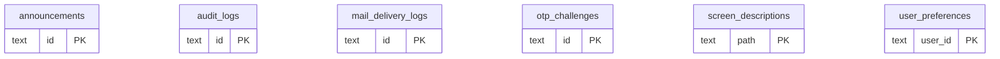

# DB 構造: ログ・OTP・画面表示

> このファイルは `packages/backend/scripts/db-docs/generate-db-docs.mjs` で自動生成しています。直接編集しないでください(更新方法は [DB 構造の概要](README.md#更新方法))。

監査ログ・メール送信ログ(DB_LOG)、OTP(DB_OTP)、お知らせ・画面説明・表示設定(DB_UI)。

## テーブル一覧

| テーブル | 名前 | DB | 説明 |
|---|---|---|---|
| [announcements](#announcements) | お知らせ | `DB_UI` | ダッシュボードの「システムからのお知らせ」(DB_UI) |
| [audit_logs](#audit_logs) | 監査ログ | `DB_LOG` | 登録・更新・削除などの操作の記録(変更前後の値を含む)(DB_LOG) |
| [mail_delivery_logs](#mail_delivery_logs) | メール送信ログ・送信待ち | `DB_LOG` | メール・Slack の送信待ちと送信結果。Cron が1分ごとに送信する(DB_LOG) |
| [otp_challenges](#otp_challenges) | OTP | `DB_OTP` | 取引先向けダウンロードの確認コードと、有効期限・試行回数(DB_OTP) |
| [screen_descriptions](#screen_descriptions) | 画面説明 | `DB_UI` | 画面ごとに見出しの下に表示する説明文(DB_UI) |
| [user_preferences](#user_preferences) | ユーザーの表示設定 | `DB_UI` | ユーザーごとの色・ダークモードの設定(DB_UI) |

## ER 図

主キー(PK)と外部キー(FK)の項目だけを表示しています。`_other_domain` は他の領域のテーブルです。

## テーブルの詳細

🔑 = 主キー、必須の ○ = 空にできない項目です。

### announcements(お知らせ)

ダッシュボードの「システムからのお知らせ」(DB_UI)

- DB: `DB_UI`

| 項目 | 型 | 必須 | 既定値 | 参照先 | 説明 |
|---|---|:---:|---|---|---|
| 🔑 `id` | 文字列 | ○ |  |  | ID(主キー) |
| `title` | 文字列 | ○ |  |  | 件名・タイトル |
| `body` | 文字列 | ○ | `` |  | 本文 |
| `publish_date` | 文字列 | ○ |  |  | YYYY-MM-DD。この日以降に表示 |
| `end_date` | 文字列 |  |  |  | 終了日 |
| `is_important` | 真偽値 | ○ | `false` |  | 重要なお知らせかどうか |
| `is_published` | 真偽値 | ○ | `true` |  | 公開中かどうか |
| `created_by` | 文字列 | ○ |  |  | 作成者(従業員番号) |
| `created_at` | 文字列 | ○ |  |  | 作成日時 |
| `updated_by` | 文字列 | ○ |  |  | 更新者(従業員番号) |
| `updated_at` | 文字列 | ○ |  |  | 更新日時 |

### audit_logs(監査ログ)

登録・更新・削除などの操作の記録(変更前後の値を含む)(DB_LOG)

- DB: `DB_LOG`

| 項目 | 型 | 必須 | 既定値 | 参照先 | 説明 |
|---|---|:---:|---|---|---|
| 🔑 `id` | 文字列 | ○ |  |  | ID(主キー) |
| `user_id` | 文字列 | ○ |  |  | ユーザー |
| `action` | 文字列 | ○ |  |  | 操作(申請・承認・差戻しなど) |
| `table_name` | 文字列 | ○ |  |  | 対象のテーブル |
| `record_id` | 文字列 | ○ |  |  | 対象のレコードのID |
| `old_values` | 文字列 |  |  |  | 変更前の値(JSON) |
| `new_values` | 文字列 |  |  |  | 変更後の値(JSON) |
| `performed_at` | 日時 | ○ |  |  | 実施日時 |

### mail_delivery_logs(メール送信ログ・送信待ち)

メール・Slack の送信待ちと送信結果。Cron が1分ごとに送信する(DB_LOG)

- DB: `DB_LOG`

| 項目 | 型 | 必須 | 既定値 | 参照先 | 説明 |
|---|---|:---:|---|---|---|
| 🔑 `id` | 文字列 | ○ |  |  | ID(主キー) |
| `type` | 文字列 | ○ | `email` |  | 種別 |
| `category` | 文字列 | ○ |  |  | 分類 |
| `document_id` | 文字列 | ○ |  |  | 伝票のID |
| `smtp_from` | 文字列 |  |  |  | 送信元のメールアドレス |
| `recipient_to` | 文字列 | ○ |  |  | 宛先(To) |
| `recipient_cc` | 文字列 |  |  |  | 宛先(CC) |
| `subject` | 文字列 | ○ |  |  | 件名 |
| `body` | 文字列 |  |  |  | 本文 |
| `attached_r2_path` | 文字列 |  |  |  | 添付ファイルの保存先(R2) |
| `status` | 文字列 | ○ |  |  | 状態 |
| `error_message` | 文字列 |  |  |  | エラーの内容 |
| `retry_count` | 整数 | ○ | `0` |  | 再送の回数 |
| `next_attempt_at` | 日時 |  |  |  | 次に送信を試す日時 |
| `performed_by_id` | 文字列 |  |  |  | 操作した人 |
| `performed_at` | 日時 | ○ |  |  | 実施日時 |

### otp_challenges(OTP)

取引先向けダウンロードの確認コードと、有効期限・試行回数(DB_OTP)

- DB: `DB_OTP`

| 項目 | 型 | 必須 | 既定値 | 参照先 | 説明 |
|---|---|:---:|---|---|---|
| 🔑 `id` | 文字列 | ○ |  |  | ID(主キー) |
| `document_type` | 文字列 | ○ | `sales_quote` |  | 帳票の種類 |
| `document_id` | 文字列 | ○ |  |  | 伝票のID |
| `attachment_id` | 文字列 | ○ |  |  | 対象の添付ファイルID |
| `email` | 文字列 | ○ |  |  | メールアドレス |
| `otp_code` | 文字列 | ○ |  |  | 4桁数字(平文。10分間の短命トークンのため試行回数制限で保護する) |
| `expires_at` | 日時 | ○ |  |  | 有効期限 |
| `attempt_count` | 整数 | ○ | `0` |  | 試行回数 |
| `verified_at` | 日時 |  |  |  | 検証成功時刻(単一使用のため成功後は再利用不可) |
| `created_at` | 日時 | ○ |  |  | 作成日時 |

### screen_descriptions(画面説明)

画面ごとに見出しの下に表示する説明文(DB_UI)

- DB: `DB_UI`

| 項目 | 型 | 必須 | 既定値 | 参照先 | 説明 |
|---|---|:---:|---|---|---|
| 🔑 `path` | 文字列 | ○ |  |  | 画面のパス(例: /sales/quotes) |
| `description_html` | 文字列 | ○ |  |  | サニタイズ済みHTML |
| `updated_by` | 文字列 | ○ |  |  | 更新者(従業員番号) |
| `updated_at` | 文字列 | ○ |  |  | 更新日時 |

### user_preferences(ユーザーの表示設定)

ユーザーごとの色・ダークモードの設定(DB_UI)

- DB: `DB_UI`

| 項目 | 型 | 必須 | 既定値 | 参照先 | 説明 |
|---|---|:---:|---|---|---|
| 🔑 `user_id` | 文字列 | ○ |  |  | ユーザー |
| `theme_mode` | 文字列 | ○ | `system` |  | system ／ light ／ dark |
| `accent_color` | 文字列 | ○ | `indigo` |  | 画面の主要色(パレット名) |
| `updated_at` | 文字列 | ○ |  |  | 更新日時 |
