# DB 構造: 業務マスタ

> このファイルは `packages/backend/scripts/db-docs/generate-db-docs.mjs` で自動生成しています。直接編集しないでください(更新方法は [DB 構造の概要](README.md#更新方法))。

取引先・商品・単位・勘定科目・倉庫・ロケーションなどのマスタ。

## テーブル一覧

| テーブル | 名前 | DB | 説明 |
|---|---|---|---|
| [accounts](#accounts) | 勘定科目 | `DB` | 仕訳・購買で使う勘定科目 |
| [business_locations](#business_locations) | 営業拠点 | `DB` | 自社の営業拠点(発注の納品場所などに使う) |
| [item_attachments](#item_attachments) | 商品の添付ファイル | `DB` | 商品に添付した図面・写真などのファイル(実体は R2) |
| [item_prices](#item_prices) | 商品単価 | `DB` | 商品の販売単価・仕入単価。取引先・数量・有効期間ごとに設定できる |
| [item_reorder_settings](#item_reorder_settings) | 発注点 | `DB` | 商品 × 倉庫ごとの発注点・安全在庫(欠品の自動提案に使う) |
| [item_structures](#item_structures) | 商品構成 | `DB` | 親商品を構成する子商品と数量(部品表) |
| [items](#items) | 商品(品目) | `DB` | 販売・購買・在庫で扱う商品。仕入品・販売品・サービスの区分、基本単位、バーコードなどを持つ |
| [locations](#locations) | ロケーション | `DB` | 倉庫内の保管場所(棚など) |
| [partner_attachments](#partner_attachments) | 取引先の添付ファイル | `DB` | 取引先に添付した契約書などのファイル(実体は R2) |
| [partner_bank_accounts](#partner_bank_accounts) | 取引先の振込先口座 | `DB` | 支払の振込先口座(全銀形式の振込ファイルの作成に使う)。1取引先が複数口座を持てる |
| [partner_contact_document_types](#partner_contact_document_types) | 取引先担当者の送付帳票 | `DB` | 取引先担当者ごとに、メールで送る帳票の種類 |
| [partner_contacts](#partner_contacts) | 取引先担当者 | `DB` | 取引先の担当者と連絡先。帳票のメール送信先にもなる |
| [partner_delivery_destinations](#partner_delivery_destinations) | 取引先の納品先 | `DB` | 取引先ごとの納品先(受注の納品先の選択に使う) |
| [partners](#partners) | 取引先 | `DB` | 得意先・仕入先・見込み客。与信限度額・締め日・支払条件・反社チェックなどを持つ |
| [projects](#projects) | プロジェクト | `DB` | 購買申請・発注で使うプロジェクト |
| [tax_categories](#tax_categories) | 消費税区分 | `DB` | 消費税の区分と税率(10%・8%・非課税など) |
| [unit_conversions](#unit_conversions) | 単位の換算 | `DB` | 単位どうしの換算率(例: 1箱 = 12個) |
| [units](#units) | 単位 | `DB` | 個・箱・kg などの単位 |
| [warehouse_attachments](#warehouse_attachments) | 倉庫の添付ファイル | `DB` | 倉庫に添付したファイル(実体は R2) |
| [warehouse_available_days](#warehouse_available_days) | 倉庫の稼働日 | `DB` | 倉庫の曜日ごとの稼働可否と時間帯 |
| [warehouse_contact_document_types](#warehouse_contact_document_types) | 倉庫担当者の送付帳票 | `DB` | 倉庫担当者ごとに、メールで送る帳票の種類(出荷指示書・入荷指示書) |
| [warehouse_contacts](#warehouse_contacts) | 倉庫担当者 | `DB` | 外部倉庫の担当者と連絡先(出荷指示書・入荷指示書の送付先) |
| [warehouses](#warehouses) | 倉庫 | `DB` | 自社倉庫・外部倉庫。住所・営業時間などを持つ |

## ER 図

主キー(PK)と外部キー(FK)の項目だけを表示しています。`_other_domain` は他の領域のテーブルです。

```mermaid
erDiagram
  accounts {
    text code PK
  }
  business_locations {
    text id PK
  }
  item_attachments {
    text id PK
    text item_id FK
  }
  item_prices {
    text id PK
    text item_id FK
    text partner_id FK
    text unit_code FK
  }
  item_reorder_settings {
    text id PK
    text item_id FK
    text warehouse_id FK
  }
  item_structures {
    text id PK
    text parent_item_id FK
    text child_item_id FK
  }
  items {
    text id PK
    text base_unit_code FK
    text account_code FK
    text supplier_id FK
  }
  locations {
    text id PK
    text warehouse_id FK
  }
  partner_attachments {
    text id PK
    text partner_id FK
  }
  partner_bank_accounts {
    text id PK
    text partner_id FK
  }
  partner_contact_document_types {
    text contact_id PK,FK
    text document_type PK
  }
  partner_contacts {
    text id PK
    text partner_id FK
    text internal_user_id FK
  }
  partner_delivery_destinations {
    text id PK
    text partner_id FK
  }
  partners {
    text id PK
  }
  projects {
    text id PK
  }
  tax_categories {
    text code PK
  }
  unit_conversions {
    text id PK
    text from_unit_code FK
    text to_unit_code FK
  }
  units {
    text code PK
  }
  warehouse_attachments {
    text id PK
    text warehouse_id FK
  }
  warehouse_available_days {
    text id PK
    text warehouse_id FK
  }
  warehouse_contact_document_types {
    text contact_id PK,FK
    text document_type PK
  }
  warehouse_contacts {
    text id PK
    text warehouse_id FK
  }
  warehouses {
    text id PK
  }
  users {
    text _other_domain
  }
  items ||--o{ item_attachments : "item_id"
  items ||--o{ item_prices : "item_id"
  partners |o--o{ item_prices : "partner_id"
  units ||--o{ item_prices : "unit_code"
  items ||--o{ item_reorder_settings : "item_id"
  warehouses ||--o{ item_reorder_settings : "warehouse_id"
  items ||--o{ item_structures : "parent_item_id"
  items ||--o{ item_structures : "child_item_id"
  units ||--o{ items : "base_unit_code"
  accounts |o--o{ items : "account_code"
  partners |o--o{ items : "supplier_id"
  warehouses ||--o{ locations : "warehouse_id"
  partners ||--o{ partner_attachments : "partner_id"
  partners ||--o{ partner_bank_accounts : "partner_id"
  partner_contacts ||--o{ partner_contact_document_types : "contact_id"
  partners ||--o{ partner_contacts : "partner_id"
  users |o--o{ partner_contacts : "internal_user_id"
  partners ||--o{ partner_delivery_destinations : "partner_id"
  units ||--o{ unit_conversions : "from_unit_code"
  units ||--o{ unit_conversions : "to_unit_code"
  warehouses ||--o{ warehouse_attachments : "warehouse_id"
  warehouses ||--o{ warehouse_available_days : "warehouse_id"
  warehouse_contacts ||--o{ warehouse_contact_document_types : "contact_id"
  warehouses ||--o{ warehouse_contacts : "warehouse_id"
```

## テーブルの詳細

🔑 = 主キー、必須の ○ = 空にできない項目です。

### accounts(勘定科目)

仕訳・購買で使う勘定科目

- DB: `DB`

| 項目 | 型 | 必須 | 既定値 | 参照先 | 説明 |
|---|---|:---:|---|---|---|
| 🔑 `code` | 文字列 | ○ |  |  | コード |
| `name` | 文字列 | ○ |  |  | 名称 |
| `external_mapping_code` | 文字列 |  |  |  | 会計ソフト側のコード |
| `status` | 文字列 | ○ | `temporary` |  | 状態 |
| `memo` | 文字列 |  |  |  | 備考 |
| `created_by` | 文字列 | ○ |  |  | 作成者(従業員番号) |
| `created_at` | 日時 | ○ |  |  | 作成日時 |
| `updated_by` | 文字列 | ○ |  |  | 更新者(従業員番号) |
| `updated_at` | 日時 | ○ |  |  | 更新日時 |

### business_locations(営業拠点)

自社の営業拠点(発注の納品場所などに使う)

- DB: `DB`

| 項目 | 型 | 必須 | 既定値 | 参照先 | 説明 |
|---|---|:---:|---|---|---|
| 🔑 `id` | 文字列 | ○ |  |  | ID(主キー) |
| `name` | 文字列 | ○ |  |  | 名称 |
| `postal_code` | 文字列 |  |  |  | 郵便番号 |
| `address` | 文字列 |  |  |  | 住所 |
| `phone_number` | 文字列 |  |  |  | 電話番号 |
| `status` | 文字列 | ○ | `temporary` |  | 状態 |
| `memo` | 文字列 |  |  |  | 備考 |
| `created_by` | 文字列 | ○ |  |  | 作成者(従業員番号) |
| `created_at` | 日時 | ○ |  |  | 作成日時 |
| `updated_by` | 文字列 | ○ |  |  | 更新者(従業員番号) |
| `updated_at` | 日時 | ○ |  |  | 更新日時 |

### item_attachments(商品の添付ファイル)

商品に添付した図面・写真などのファイル(実体は R2)

- DB: `DB`

| 項目 | 型 | 必須 | 既定値 | 参照先 | 説明 |
|---|---|:---:|---|---|---|
| 🔑 `id` | 文字列 | ○ |  |  | ID(主キー) |
| `item_id` | 文字列 | ○ |  | [items](#items).id | 商品 |
| `file_name` | 文字列 | ○ |  |  | ファイル名 |
| `storage_type` | 文字列 | ○ | `R2` |  | ファイルの保存方法(R2・外部URL) |
| `attachment_r2_path` | 文字列 |  |  |  | ファイルの保存先(R2 のキー) |
| `external_url` | 文字列 |  |  |  | 外部URL(R2 ではなく外部に置く場合) |
| `file_type` | 文字列 | ○ | `OTHER` |  | ファイルの種類(MIMEタイプ) |
| `uploaded_by_id` | 文字列 | ○ |  |  | 登録した人 |
| `uploaded_at` | 日時 | ○ |  |  | 登録日時 |

### item_prices(商品単価)

商品の販売単価・仕入単価。取引先・数量・有効期間ごとに設定できる

- DB: `DB`

| 項目 | 型 | 必須 | 既定値 | 参照先 | 説明 |
|---|---|:---:|---|---|---|
| 🔑 `id` | 文字列 | ○ |  |  | ID(主キー) |
| `item_id` | 文字列 | ○ |  | [items](#items).id | 商品 |
| `price_type` | 文字列 | ○ |  |  | 単価の種類(販売・仕入) |
| `partner_id` | 文字列 |  |  | [partners](#partners).id | 取引先 |
| `min_quantity` | 数値 | ○ | `0` |  | 適用する最小数量 |
| `unit_price` | 整数 | ○ |  |  | 単価 |
| `unit_code` | 文字列 | ○ |  | [units](#units).code | 単位 |
| `status` | 文字列 | ○ | `temporary` |  | 状態 |
| `valid_from` | 日時 | ○ |  |  | 有効期間の開始日 |
| `valid_to` | 日時 |  |  |  | 有効期間の終了日 |
| `created_by` | 文字列 | ○ |  |  | 作成者(従業員番号) |
| `created_at` | 日時 | ○ |  |  | 作成日時 |
| `updated_by` | 文字列 | ○ |  |  | 更新者(従業員番号) |
| `updated_at` | 日時 | ○ |  |  | 更新日時 |

### item_reorder_settings(発注点)

商品 × 倉庫ごとの発注点・安全在庫(欠品の自動提案に使う)

- DB: `DB`

| 項目 | 型 | 必須 | 既定値 | 参照先 | 説明 |
|---|---|:---:|---|---|---|
| 🔑 `id` | 文字列 | ○ |  |  | ID(主キー) |
| `item_id` | 文字列 | ○ |  | [items](#items).id | 商品 |
| `warehouse_id` | 文字列 | ○ |  | [warehouses](#warehouses).id | 倉庫 |
| `reorder_point` | 数値 | ○ | `0` |  | 発注点 |
| `safety_stock` | 数値 | ○ | `0` |  | 安全在庫 |
| `memo` | 文字列 |  |  |  | 備考 |
| `created_by` | 文字列 | ○ |  |  | 作成者(従業員番号) |
| `created_at` | 日時 | ○ |  |  | 作成日時 |
| `updated_by` | 文字列 | ○ |  |  | 更新者(従業員番号) |
| `updated_at` | 日時 | ○ |  |  | 更新日時 |

- 一意(重複不可): `item_id` + `warehouse_id`

### item_structures(商品構成)

親商品を構成する子商品と数量(部品表)

- DB: `DB`

| 項目 | 型 | 必須 | 既定値 | 参照先 | 説明 |
|---|---|:---:|---|---|---|
| 🔑 `id` | 文字列 | ○ |  |  | ID(主キー) |
| `parent_item_id` | 文字列 | ○ |  | [items](#items).id | 親商品 |
| `child_item_id` | 文字列 | ○ |  | [items](#items).id | 子商品(構成部品) |
| `quantity_required` | 数値 | ○ | `1` |  | 必要数量 |
| `revision` | 文字列 | ○ | `1.0` |  | 改訂番号 |
| `valid_from` | 日時 | ○ |  |  | 有効期間の開始日 |
| `valid_to` | 日時 |  |  |  | 有効期間の終了日 |
| `memo` | 文字列 |  |  |  | 備考 |
| `status` | 文字列 | ○ | `temporary` |  | 状態 |
| `created_by` | 文字列 | ○ |  |  | 作成者(従業員番号) |
| `created_at` | 日時 | ○ |  |  | 作成日時 |
| `updated_by` | 文字列 | ○ |  |  | 更新者(従業員番号) |
| `updated_at` | 日時 | ○ |  |  | 更新日時 |

### items(商品(品目))

販売・購買・在庫で扱う商品。仕入品・販売品・サービスの区分、基本単位、バーコードなどを持つ

- DB: `DB`

| 項目 | 型 | 必須 | 既定値 | 参照先 | 説明 |
|---|---|:---:|---|---|---|
| 🔑 `id` | 文字列 | ○ |  |  | ID(主キー) |
| `name` | 文字列 | ○ |  |  | 名称 |
| `is_purchased` | 真偽値 | ○ | `false` |  | 仕入品かどうか |
| `is_sales` | 真偽値 | ○ | `false` |  | 販売品かどうか |
| `is_service` | 真偽値 | ○ | `false` |  | サービス(在庫を持たない)かどうか |
| `base_unit_code` | 文字列 | ○ |  | [units](#units).code | 基本単位 |
| `tax_category_code` | 文字列 | ○ | `TAX_10` |  | 消費税区分 |
| `product_barcode` | 文字列 |  |  |  | 商品のバーコード |
| `account_code` | 文字列 |  |  | [accounts](#accounts).code | 勘定科目 |
| `original_purchased_item_id` | 文字列 |  |  |  | 元の仕入品 |
| `supplier_id` | 文字列 |  |  | [partners](#partners).id | 仕入先 |
| `supplier_part_number` | 文字列 |  |  |  | 仕入先の品番 |
| `status` | 文字列 | ○ | `temporary` |  | 状態 |
| `memo` | 文字列 |  |  |  | 備考 |
| `created_by` | 文字列 | ○ |  |  | 作成者(従業員番号) |
| `created_at` | 日時 | ○ |  |  | 作成日時 |
| `updated_by` | 文字列 | ○ |  |  | 更新者(従業員番号) |
| `updated_at` | 日時 | ○ |  |  | 更新日時 |

### locations(ロケーション)

倉庫内の保管場所(棚など)

- DB: `DB`

| 項目 | 型 | 必須 | 既定値 | 参照先 | 説明 |
|---|---|:---:|---|---|---|
| 🔑 `id` | 文字列 | ○ |  |  | ID(主キー) |
| `warehouse_id` | 文字列 | ○ |  | [warehouses](#warehouses).id | 倉庫 |
| `name` | 文字列 | ○ |  |  | 名称 |
| `memo` | 文字列 |  |  |  | 備考 |
| `status` | 文字列 | ○ | `temporary` |  | 状態 |
| `created_by` | 文字列 | ○ |  |  | 作成者(従業員番号) |
| `created_at` | 日時 | ○ |  |  | 作成日時 |
| `updated_by` | 文字列 | ○ |  |  | 更新者(従業員番号) |
| `updated_at` | 日時 | ○ |  |  | 更新日時 |

### partner_attachments(取引先の添付ファイル)

取引先に添付した契約書などのファイル(実体は R2)

- DB: `DB`

| 項目 | 型 | 必須 | 既定値 | 参照先 | 説明 |
|---|---|:---:|---|---|---|
| 🔑 `id` | 文字列 | ○ |  |  | ID(主キー) |
| `partner_id` | 文字列 | ○ |  | [partners](#partners).id | 取引先 |
| `file_name` | 文字列 | ○ |  |  | ファイル名 |
| `storage_type` | 文字列 | ○ | `R2` |  | ファイルの保存方法(R2・外部URL) |
| `attachment_r2_path` | 文字列 |  |  |  | ファイルの保存先(R2 のキー) |
| `external_url` | 文字列 |  |  |  | 外部URL(R2 ではなく外部に置く場合) |
| `file_type` | 文字列 | ○ | `OTHER` |  | ファイルの種類(MIMEタイプ) |
| `uploaded_by_id` | 文字列 | ○ |  |  | 登録した人 |
| `uploaded_at` | 日時 | ○ |  |  | 登録日時 |

### partner_bank_accounts(取引先の振込先口座)

支払の振込先口座(全銀形式の振込ファイルの作成に使う)。1取引先が複数口座を持てる

- DB: `DB`

| 項目 | 型 | 必須 | 既定値 | 参照先 | 説明 |
|---|---|:---:|---|---|---|
| 🔑 `id` | 文字列 | ○ |  |  | ID(主キー) |
| `partner_id` | 文字列 | ○ |  | [partners](#partners).id | 取引先 |
| `bank_name` | 文字列 | ○ |  |  | 銀行名 |
| `bank_code` | 文字列 |  |  |  | 全銀業界標準の金融機関コード(4桁)。手入力運用も想定しnullable |
| `branch_name` | 文字列 | ○ |  |  | 支店名 |
| `branch_code` | 文字列 |  |  |  | 支店コード(3桁) |
| `account_type` | 文字列 | ○ | `ORDINARY` |  | ORDINARY(普通)／CURRENT(当座)。全銀フォーマットの預金種目コード(1=普通/2=当座)への変換は ファイル生成時に行う |
| `account_number` | 文字列 | ○ |  |  | 口座番号 |
| `account_holder_name` | 文字列 | ○ |  |  | 受取人名(カナ)。全銀フォーマットは半角カナ30文字以内だが、桁数チェックはファイル生成時に行う |
| `is_default` | 真偽値 | ○ | `false` |  | 既定かどうか |
| `memo` | 文字列 |  |  |  | 備考 |
| `created_by` | 文字列 | ○ |  |  | 作成者(従業員番号) |
| `created_at` | 日時 | ○ |  |  | 作成日時 |
| `updated_by` | 文字列 | ○ |  |  | 更新者(従業員番号) |
| `updated_at` | 日時 | ○ |  |  | 更新日時 |

### partner_contact_document_types(取引先担当者の送付帳票)

取引先担当者ごとに、メールで送る帳票の種類

- DB: `DB`

| 項目 | 型 | 必須 | 既定値 | 参照先 | 説明 |
|---|---|:---:|---|---|---|
| 🔑 `contact_id` | 文字列 | ○ |  | [partner_contacts](#partner_contacts).id | 担当者(参照先のテーブルの担当者) |
| 🔑 `document_type` | 文字列 | ○ |  |  | 帳票の種類 |

- 主キー(複合): `contact_id` + `document_type`

### partner_contacts(取引先担当者)

取引先の担当者と連絡先。帳票のメール送信先にもなる

- DB: `DB`

| 項目 | 型 | 必須 | 既定値 | 参照先 | 説明 |
|---|---|:---:|---|---|---|
| 🔑 `id` | 文字列 | ○ |  |  | ID(主キー) |
| `partner_id` | 文字列 | ○ |  | [partners](#partners).id | 取引先 |
| `contact_type` | 文字列 | ○ |  |  | 連絡先の種別 |
| `internal_user_id` | 文字列 |  |  | [users](system.md#users).id | 自社側の担当ユーザー |
| `name` | 文字列 |  |  |  | 名称 |
| `email` | 文字列 |  |  |  | メールアドレス |
| `phone` | 文字列 |  |  |  | 電話番号 |
| `fax` | 文字列 |  |  |  | FAX番号 |
| `department_name` | 文字列 |  |  |  | 部署名 |
| `is_email_target` | 真偽値 | ○ | `true` |  | メール送信の対象かどうか |
| `memo` | 文字列 |  |  |  | 備考 |
| `status` | 文字列 | ○ | `temporary` |  | 状態 |
| `created_by` | 文字列 | ○ |  |  | 作成者(従業員番号) |
| `created_at` | 日時 | ○ |  |  | 作成日時 |
| `updated_by` | 文字列 | ○ |  |  | 更新者(従業員番号) |
| `updated_at` | 日時 | ○ |  |  | 更新日時 |

### partner_delivery_destinations(取引先の納品先)

取引先ごとの納品先(受注の納品先の選択に使う)

- DB: `DB`

| 項目 | 型 | 必須 | 既定値 | 参照先 | 説明 |
|---|---|:---:|---|---|---|
| 🔑 `id` | 文字列 | ○ |  |  | ID(主キー) |
| `partner_id` | 文字列 | ○ |  | [partners](#partners).id | 取引先 |
| `name` | 文字列 | ○ |  |  | 名称 |
| `postal_code` | 文字列 |  |  |  | 郵便番号 |
| `address` | 文字列 |  |  |  | 住所 |
| `phone` | 文字列 |  |  |  | 電話番号 |
| `memo` | 文字列 |  |  |  | 備考 |
| `status` | 文字列 | ○ | `active` |  | 状態 |
| `created_by` | 文字列 | ○ |  |  | 作成者(従業員番号) |
| `created_at` | 日時 | ○ |  |  | 作成日時 |
| `updated_by` | 文字列 | ○ |  |  | 更新者(従業員番号) |
| `updated_at` | 日時 | ○ |  |  | 更新日時 |

### partners(取引先)

得意先・仕入先・見込み客。与信限度額・締め日・支払条件・反社チェックなどを持つ

- DB: `DB`

| 項目 | 型 | 必須 | 既定値 | 参照先 | 説明 |
|---|---|:---:|---|---|---|
| 🔑 `id` | 文字列 | ○ |  |  | ID(主キー) |
| `name` | 文字列 | ○ |  |  | 名称 |
| `type` | 文字列 | ○ | `CUSTOMER` |  | 種別 |
| `postal_code` | 文字列 |  |  |  | 郵便番号 |
| `address` | 文字列 |  |  |  | 住所 |
| `phone` | 文字列 |  |  |  | 電話番号 |
| `fax` | 文字列 |  |  |  | FAX番号 |
| `credit_limit` | 整数 | ○ | `0` |  | 与信限度額 |
| `closing_day` | 整数 |  |  |  | 締め日 |
| `payment_month_offset` | 整数 |  |  |  | 支払月(締め日から何か月後か) |
| `payment_day` | 整数 |  |  |  | 支払日 |
| `payment_method` | 文字列 |  |  |  | 支払方法 |
| `qualified_invoice_number` | 文字列 |  |  |  | 適格請求書発行事業者の登録番号(T+13桁)と法人番号(13桁)。いずれも任意 |
| `corporate_number` | 文字列 |  |  |  | 法人番号 |
| `anti_social_check_status` | 文字列 |  | `UNCHECKED` |  | 反社会的勢力のチェック状況 |
| `anti_social_check_memo` | 文字列 |  |  |  | 反社会的勢力のチェックの備考 |
| `contract_date` | 日時 |  |  |  | 契約日 |
| `contract_valid_to` | 日時 |  |  |  | 契約の終了日 |
| `status` | 文字列 | ○ | `temporary` |  | 状態 |
| `memo` | 文字列 |  |  |  | 備考 |
| `created_by` | 文字列 | ○ |  |  | 作成者(従業員番号) |
| `created_at` | 日時 | ○ |  |  | 作成日時 |
| `updated_by` | 文字列 | ○ |  |  | 更新者(従業員番号) |
| `updated_at` | 日時 | ○ |  |  | 更新日時 |

### projects(プロジェクト)

購買申請・発注で使うプロジェクト

- DB: `DB`

| 項目 | 型 | 必須 | 既定値 | 参照先 | 説明 |
|---|---|:---:|---|---|---|
| 🔑 `id` | 文字列 | ○ |  |  | ID(主キー) |
| `name` | 文字列 | ○ |  |  | 名称 |
| `memo` | 文字列 |  |  |  | 備考 |
| `start_date` | 日時 |  |  |  | 開始日 |
| `end_date` | 日時 |  |  |  | 終了日 |
| `status` | 文字列 | ○ | `active` |  | 状態 |
| `created_by` | 文字列 | ○ |  |  | 作成者(従業員番号) |
| `created_at` | 日時 | ○ |  |  | 作成日時 |
| `updated_by` | 文字列 | ○ |  |  | 更新者(従業員番号) |
| `updated_at` | 日時 | ○ |  |  | 更新日時 |

### tax_categories(消費税区分)

消費税の区分と税率(10%・8%・非課税など)

- DB: `DB`

| 項目 | 型 | 必須 | 既定値 | 参照先 | 説明 |
|---|---|:---:|---|---|---|
| 🔑 `code` | 文字列 | ○ |  |  | コード |
| `name` | 文字列 | ○ |  |  | 名称 |
| `tax_type` | 文字列 | ○ |  |  | 税の扱い(税込・税抜など) |
| `tax_rate` | 数値 | ○ | `0` |  | 税率 |
| `valid_from` | 日時 |  |  |  | 有効期間の開始日 |
| `valid_to` | 日時 |  |  |  | 有効期間の終了日 |

### unit_conversions(単位の換算)

単位どうしの換算率(例: 1箱 = 12個)

- DB: `DB`

| 項目 | 型 | 必須 | 既定値 | 参照先 | 説明 |
|---|---|:---:|---|---|---|
| 🔑 `id` | 文字列 | ○ |  |  | ID(主キー) |
| `from_unit_code` | 文字列 | ○ |  | [units](#units).code | 換算元の単位 |
| `to_unit_code` | 文字列 | ○ |  | [units](#units).code | 換算先の単位 |
| `conversion_factor` | 数値 | ○ |  |  | 換算率 |
| `created_by` | 文字列 | ○ |  |  | 作成者(従業員番号) |
| `created_at` | 日時 | ○ |  |  | 作成日時 |
| `updated_by` | 文字列 | ○ |  |  | 更新者(従業員番号) |
| `updated_at` | 日時 | ○ |  |  | 更新日時 |

### units(単位)

個・箱・kg などの単位

- DB: `DB`

| 項目 | 型 | 必須 | 既定値 | 参照先 | 説明 |
|---|---|:---:|---|---|---|
| 🔑 `code` | 文字列 | ○ |  |  | コード |
| `name` | 文字列 | ○ |  |  | 名称 |
| `status` | 文字列 | ○ | `temporary` |  | 状態 |
| `created_by` | 文字列 | ○ |  |  | 作成者(従業員番号) |
| `created_at` | 日時 | ○ |  |  | 作成日時 |
| `updated_by` | 文字列 | ○ |  |  | 更新者(従業員番号) |
| `updated_at` | 日時 | ○ |  |  | 更新日時 |

### warehouse_attachments(倉庫の添付ファイル)

倉庫に添付したファイル(実体は R2)

- DB: `DB`

| 項目 | 型 | 必須 | 既定値 | 参照先 | 説明 |
|---|---|:---:|---|---|---|
| 🔑 `id` | 文字列 | ○ |  |  | ID(主キー) |
| `warehouse_id` | 文字列 | ○ |  | [warehouses](#warehouses).id | 倉庫 |
| `file_name` | 文字列 | ○ |  |  | ファイル名 |
| `storage_type` | 文字列 | ○ | `R2` |  | ファイルの保存方法(R2・外部URL) |
| `attachment_r2_path` | 文字列 |  |  |  | ファイルの保存先(R2 のキー) |
| `external_url` | 文字列 |  |  |  | 外部URL(R2 ではなく外部に置く場合) |
| `file_type` | 文字列 | ○ | `OTHER` |  | ファイルの種類(MIMEタイプ) |
| `uploaded_by_id` | 文字列 | ○ |  |  | 登録した人 |
| `uploaded_at` | 日時 | ○ |  |  | 登録日時 |

### warehouse_available_days(倉庫の稼働日)

倉庫の曜日ごとの稼働可否と時間帯

- DB: `DB`

| 項目 | 型 | 必須 | 既定値 | 参照先 | 説明 |
|---|---|:---:|---|---|---|
| 🔑 `id` | 文字列 | ○ |  |  | ID(主キー) |
| `warehouse_id` | 文字列 | ○ |  | [warehouses](#warehouses).id | 倉庫 |
| `available_day_of_week` | 文字列 | ○ |  |  | 曜日 |
| `time_slot_memo` | 文字列 |  |  |  | 時間帯の備考 |
| `created_by` | 文字列 | ○ |  |  | 作成者(従業員番号) |
| `created_at` | 日時 | ○ |  |  | 作成日時 |
| `updated_by` | 文字列 | ○ |  |  | 更新者(従業員番号) |
| `updated_at` | 日時 | ○ |  |  | 更新日時 |

### warehouse_contact_document_types(倉庫担当者の送付帳票)

倉庫担当者ごとに、メールで送る帳票の種類(出荷指示書・入荷指示書)

- DB: `DB`

| 項目 | 型 | 必須 | 既定値 | 参照先 | 説明 |
|---|---|:---:|---|---|---|
| 🔑 `contact_id` | 文字列 | ○ |  | [warehouse_contacts](#warehouse_contacts).id | 担当者(参照先のテーブルの担当者) |
| 🔑 `document_type` | 文字列 | ○ |  |  | 帳票の種類 |

- 主キー(複合): `contact_id` + `document_type`

### warehouse_contacts(倉庫担当者)

外部倉庫の担当者と連絡先(出荷指示書・入荷指示書の送付先)

- DB: `DB`

| 項目 | 型 | 必須 | 既定値 | 参照先 | 説明 |
|---|---|:---:|---|---|---|
| 🔑 `id` | 文字列 | ○ |  |  | ID(主キー) |
| `warehouse_id` | 文字列 | ○ |  | [warehouses](#warehouses).id | 倉庫 |
| `name` | 文字列 |  |  |  | 名称 |
| `email` | 文字列 |  |  |  | メールアドレス |
| `phone` | 文字列 |  |  |  | 電話番号 |
| `is_email_target` | 真偽値 | ○ | `true` |  | メール送信の対象かどうか |
| `memo` | 文字列 |  |  |  | 備考 |
| `status` | 文字列 | ○ | `temporary` |  | 状態 |
| `created_by` | 文字列 | ○ |  |  | 作成者(従業員番号) |
| `created_at` | 日時 | ○ |  |  | 作成日時 |
| `updated_by` | 文字列 | ○ |  |  | 更新者(従業員番号) |
| `updated_at` | 日時 | ○ |  |  | 更新日時 |

### warehouses(倉庫)

自社倉庫・外部倉庫。住所・営業時間などを持つ

- DB: `DB`

| 項目 | 型 | 必須 | 既定値 | 参照先 | 説明 |
|---|---|:---:|---|---|---|
| 🔑 `id` | 文字列 | ○ |  |  | ID(主キー) |
| `name` | 文字列 | ○ |  |  | 名称 |
| `postal_code` | 文字列 |  |  |  | 郵便番号 |
| `address` | 文字列 |  |  |  | 住所 |
| `phone_number` | 文字列 |  |  |  | 電話番号 |
| `fax_number` | 文字列 |  |  |  | FAX番号 |
| `email` | 文字列 |  |  |  | メールアドレス |
| `business_start_time` | 文字列 |  |  |  | 営業開始時刻 |
| `business_end_time` | 文字列 |  |  |  | 営業終了時刻 |
| `storage_restrictions` | 文字列 |  |  |  | 保管上の制約 |
| `warehouse_type` | 文字列 | ○ | `INTERNAL` |  | 自社倉庫/外部倉庫の区分。"INTERNAL"(自社)／ "EXTERNAL"(外部)。 |
| `status` | 文字列 | ○ | `temporary` |  | 状態 |
| `memo` | 文字列 |  |  |  | 備考 |
| `created_by` | 文字列 | ○ |  |  | 作成者(従業員番号) |
| `created_at` | 日時 | ○ |  |  | 作成日時 |
| `updated_by` | 文字列 | ○ |  |  | 更新者(従業員番号) |
| `updated_at` | 日時 | ○ |  |  | 更新日時 |
