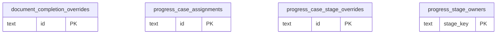

# DB 構造: 進捗管理

> このファイルは `packages/backend/scripts/db-docs/generate-db-docs.mjs` で自動生成しています。直接編集しないでください(更新方法は [DB 構造の概要](README.md#更新方法))。

進捗確認の工程の担当と、完了/進行中の手動設定。

## テーブル一覧

| テーブル | 名前 | DB | 説明 |
|---|---|---|---|
| [document_completion_overrides](#document_completion_overrides) | 伝票の完了設定 | `DB` | 伝票ごとの完了/進行中の手動設定。進捗確認の工程の状態に反映する |
| [progress_case_assignments](#progress_case_assignments) | 案件の工程の担当 | `DB` | 案件 × 工程ごとの担当者(既定の担当を上書きする) |
| [progress_case_stage_overrides](#progress_case_stage_overrides) | 案件の工程の完了設定 | `DB` | 案件 × 工程ごとの完了/進行中の手動設定 |
| [progress_stage_owners](#progress_stage_owners) | 工程の既定の担当 | `DB` | 進捗確認の工程ごとの既定の担当者 |

## ER 図

主キー(PK)と外部キー(FK)の項目だけを表示しています。`_other_domain` は他の領域のテーブルです。

## テーブルの詳細

🔑 = 主キー、必須の ○ = 空にできない項目です。

### document_completion_overrides(伝票の完了設定)

伝票ごとの完了/進行中の手動設定。進捗確認の工程の状態に反映する

- DB: `DB`

| 項目 | 型 | 必須 | 既定値 | 参照先 | 説明 |
|---|---|:---:|---|---|---|
| 🔑 `id` | 文字列 | ○ |  |  | ID(主キー) |
| `stage_key` | 文字列 | ○ |  |  | 工程(進捗確認の工程キー) |
| `document_id` | 文字列 | ○ |  |  | 伝票のID |
| `forced_state` | 文字列 | ○ |  |  | 手動で設定した状態(完了・進行中) |
| `created_by` | 文字列 | ○ |  |  | 作成者(従業員番号) |
| `created_at` | 日時 | ○ |  |  | 作成日時 |
| `updated_by` | 文字列 | ○ |  |  | 更新者(従業員番号) |
| `updated_at` | 日時 | ○ |  |  | 更新日時 |

- 一意(重複不可): `stage_key` + `document_id`

### progress_case_assignments(案件の工程の担当)

案件 × 工程ごとの担当者(既定の担当を上書きする)

- DB: `DB`

| 項目 | 型 | 必須 | 既定値 | 参照先 | 説明 |
|---|---|:---:|---|---|---|
| 🔑 `id` | 文字列 | ○ |  |  | ID(主キー) |
| `root_kind` | 文字列 | ○ |  |  | 案件の起点となる伝票の種類 |
| `root_id` | 文字列 | ○ |  |  | 案件の起点となる伝票のID |
| `stage_key` | 文字列 | ○ |  |  | 工程(進捗確認の工程キー) |
| `employee_number` | 文字列 | ○ |  |  | 従業員番号 |
| `created_by` | 文字列 | ○ |  |  | 作成者(従業員番号) |
| `created_at` | 日時 | ○ |  |  | 作成日時 |
| `updated_by` | 文字列 | ○ |  |  | 更新者(従業員番号) |
| `updated_at` | 日時 | ○ |  |  | 更新日時 |

- 一意(重複不可): `root_kind` + `root_id` + `stage_key`

### progress_case_stage_overrides(案件の工程の完了設定)

案件 × 工程ごとの完了/進行中の手動設定

- DB: `DB`

| 項目 | 型 | 必須 | 既定値 | 参照先 | 説明 |
|---|---|:---:|---|---|---|
| 🔑 `id` | 文字列 | ○ |  |  | ID(主キー) |
| `root_kind` | 文字列 | ○ |  |  | 案件の起点となる伝票の種類 |
| `root_id` | 文字列 | ○ |  |  | 案件の起点となる伝票のID |
| `stage_key` | 文字列 | ○ |  |  | 工程(進捗確認の工程キー) |
| `forced_state` | 文字列 | ○ |  |  | 手動で設定した状態(完了・進行中) |
| `created_by` | 文字列 | ○ |  |  | 作成者(従業員番号) |
| `created_at` | 日時 | ○ |  |  | 作成日時 |
| `updated_by` | 文字列 | ○ |  |  | 更新者(従業員番号) |
| `updated_at` | 日時 | ○ |  |  | 更新日時 |

- 一意(重複不可): `root_kind` + `root_id` + `stage_key`

### progress_stage_owners(工程の既定の担当)

進捗確認の工程ごとの既定の担当者

- DB: `DB`

| 項目 | 型 | 必須 | 既定値 | 参照先 | 説明 |
|---|---|:---:|---|---|---|
| 🔑 `stage_key` | 文字列 | ○ |  |  | 工程(進捗確認の工程キー) |
| `assignee_type` | 文字列 | ○ |  |  | 担当の種類(ユーザー・部署・ロール) |
| `assignee_ref` | 文字列 | ○ |  |  | 担当(ユーザー・部署・ロールのID) |
| `created_by` | 文字列 | ○ |  |  | 作成者(従業員番号) |
| `created_at` | 日時 | ○ |  |  | 作成日時 |
| `updated_by` | 文字列 | ○ |  |  | 更新者(従業員番号) |
| `updated_at` | 日時 | ○ |  |  | 更新日時 |
