# DB 構造: 購買

> このファイルは `packages/backend/scripts/db-docs/generate-db-docs.mjs` で自動生成しています。直接編集しないでください(更新方法は [DB 構造の概要](README.md#更新方法))。

購買申請・発注・仕入・支払。

## テーブル一覧

| テーブル | 名前 | DB | 説明 |
|---|---|---|---|
| [order_attachments](#order_attachments) | 発注の添付ファイル | `DB` | 発注書 PDF・添付ファイル(実体は R2、版を管理) |
| [order_items](#order_items) | 発注明細 | `DB` | 発注の明細(商品・数量・単価・金額) |
| [orders](#orders) | 発注 | `DB` | 発注のヘッダー(仕入先・発注日・納品場所・合計金額・承認状態・前払の有無など) |
| [payment_disbursements](#payment_disbursements) | 支払実績(支払の消込) | `DB` | 支払に対する実際の支払の記録(手動の消込) |
| [payment_header_items](#payment_header_items) | 支払明細 | `DB` | 支払に含める仕入・検収記録の一覧 |
| [payment_headers](#payment_headers) | 支払 | `DB` | 仕入先への支払のヘッダー(支払日・支払金額・消込の状態) |
| [purchase_recognition_attachments](#purchase_recognition_attachments) | 仕入の添付ファイル | `DB` | 仕入計上書 PDF・添付ファイル(実体は R2) |
| [purchase_recognition_history_logs](#purchase_recognition_history_logs) | 仕入の変更履歴 | `DB` | 仕入の変更内容の記録 |
| [purchase_recognition_items](#purchase_recognition_items) | 仕入明細 | `DB` | 仕入の明細(商品・数量・単価・金額) |
| [purchase_recognition_receipts](#purchase_recognition_receipts) | 仕入と検収の紐づけ | `DB` | 仕入と検収記録(入庫)の対応。同じ納品への二重支払を警告するために使う |
| [purchase_recognitions](#purchase_recognitions) | 仕入 | `DB` | 仕入(購買計上)のヘッダー(仕入先・計上日・合計金額・承認状態・支払の状態) |
| [purchase_request_attachments](#purchase_request_attachments) | 購買申請の添付ファイル | `DB` | 購買申請の参考資料(見積書 PDF など、実体は R2) |
| [purchase_request_items](#purchase_request_items) | 購買申請明細 | `DB` | 購買申請の明細(品目・数量・見積単価・希望納期) |
| [purchase_requests](#purchase_requests) | 購買申請 | `DB` | 購買申請のヘッダー(申請者・勘定科目・プロジェクト・承認状態など) |

## ER 図

主キー(PK)と外部キー(FK)の項目だけを表示しています。`_other_domain` は他の領域のテーブルです。

```mermaid
erDiagram
  order_attachments {
    text id PK
    text order_id FK
    text order_item_id FK
  }
  order_items {
    text id PK
    text order_id FK
    text purchase_request_item_id FK
    text sales_order_item_id FK
    text tax_category_code FK
    text account_code FK
  }
  orders {
    text id PK
    text request_id FK
    text partner_id FK
    text approval_flow_id FK
    text project_id FK
    text delivery_location_id FK
    text delivery_warehouse_id FK
  }
  payment_disbursements {
    text id PK
    text payment_header_id FK
  }
  payment_header_items {
    text id PK
    text payment_header_id FK
    text purchase_recognition_id FK
    text item_receipt_id FK
  }
  payment_headers {
    text id PK
    text partner_id FK
  }
  purchase_recognition_attachments {
    text id PK
    text purchase_recognition_id FK
  }
  purchase_recognition_history_logs {
    text id PK
    text purchase_recognition_id FK
  }
  purchase_recognition_items {
    text id PK
    text purchase_recognition_id FK
    text source_order_item_id FK
    text tax_category_code FK
    text account_code FK
  }
  purchase_recognition_receipts {
    text id PK
    text purchase_recognition_id FK
    text item_receipt_id FK
  }
  purchase_recognitions {
    text id PK
    text partner_id FK
    text order_id FK
    text approval_flow_id FK
    text project_id FK
  }
  purchase_request_attachments {
    text id PK
    text request_id FK
    text purchase_request_item_id FK
  }
  purchase_request_items {
    text id PK
    text request_id FK
    text sales_order_item_id FK
    text tax_category_code FK
    text account_code FK
  }
  purchase_requests {
    text id PK
    text department_surrogate_id FK
    text approval_flow_id FK
    text partner_id FK
    text project_id FK
  }
  accounts {
    text _other_domain
  }
  approval_flows {
    text _other_domain
  }
  business_locations {
    text _other_domain
  }
  departments {
    text _other_domain
  }
  item_receipt_headers {
    text _other_domain
  }
  partners {
    text _other_domain
  }
  projects {
    text _other_domain
  }
  sales_order_items {
    text _other_domain
  }
  tax_categories {
    text _other_domain
  }
  warehouses {
    text _other_domain
  }
  orders ||--o{ order_attachments : "order_id"
  order_items |o--o{ order_attachments : "order_item_id"
  orders |o--o{ order_items : "order_id"
  purchase_request_items |o--o{ order_items : "purchase_request_item_id"
  sales_order_items |o--o{ order_items : "sales_order_item_id"
  tax_categories |o--o{ order_items : "tax_category_code"
  accounts |o--o{ order_items : "account_code"
  purchase_requests |o--o{ orders : "request_id"
  partners |o--o{ orders : "partner_id"
  approval_flows |o--o{ orders : "approval_flow_id"
  projects |o--o{ orders : "project_id"
  business_locations |o--o{ orders : "delivery_location_id"
  warehouses |o--o{ orders : "delivery_warehouse_id"
  payment_headers ||--o{ payment_disbursements : "payment_header_id"
  payment_headers ||--o{ payment_header_items : "payment_header_id"
  purchase_recognitions |o--o{ payment_header_items : "purchase_recognition_id"
  item_receipt_headers |o--o{ payment_header_items : "item_receipt_id"
  partners ||--o{ payment_headers : "partner_id"
  purchase_recognitions ||--o{ purchase_recognition_attachments : "purchase_recognition_id"
  purchase_recognitions ||--o{ purchase_recognition_history_logs : "purchase_recognition_id"
  purchase_recognitions ||--o{ purchase_recognition_items : "purchase_recognition_id"
  order_items |o--o{ purchase_recognition_items : "source_order_item_id"
  tax_categories |o--o{ purchase_recognition_items : "tax_category_code"
  accounts |o--o{ purchase_recognition_items : "account_code"
  purchase_recognitions ||--o{ purchase_recognition_receipts : "purchase_recognition_id"
  item_receipt_headers ||--o{ purchase_recognition_receipts : "item_receipt_id"
  partners ||--o{ purchase_recognitions : "partner_id"
  orders |o--o{ purchase_recognitions : "order_id"
  approval_flows |o--o{ purchase_recognitions : "approval_flow_id"
  projects |o--o{ purchase_recognitions : "project_id"
  purchase_requests ||--o{ purchase_request_attachments : "request_id"
  purchase_request_items |o--o{ purchase_request_attachments : "purchase_request_item_id"
  purchase_requests ||--o{ purchase_request_items : "request_id"
  sales_order_items |o--o{ purchase_request_items : "sales_order_item_id"
  tax_categories |o--o{ purchase_request_items : "tax_category_code"
  accounts |o--o{ purchase_request_items : "account_code"
  departments ||--o{ purchase_requests : "department_surrogate_id"
  approval_flows |o--o{ purchase_requests : "approval_flow_id"
  partners |o--o{ purchase_requests : "partner_id"
  projects |o--o{ purchase_requests : "project_id"
```

## テーブルの詳細

🔑 = 主キー、必須の ○ = 空にできない項目です。

### order_attachments(発注の添付ファイル)

発注書 PDF・添付ファイル(実体は R2、版を管理)

- DB: `DB`

| 項目 | 型 | 必須 | 既定値 | 参照先 | 説明 |
|---|---|:---:|---|---|---|
| 🔑 `id` | 文字列 | ○ |  |  | ID(主キー) |
| `order_id` | 文字列 | ○ |  | [orders](#orders).id | 発注 |
| `order_item_id` | 文字列 |  |  | [order_items](#order_items).id | 発注明細 |
| `file_name` | 文字列 | ○ |  |  | ファイル名 |
| `attachment_r2_path` | 文字列 |  |  |  | ファイルの保存先(R2 のキー) |
| `file_type` | 文字列 | ○ | `OTHER` |  | ファイルの種類(MIMEタイプ) |
| `uploaded_by_id` | 文字列 | ○ |  |  | 登録した人 |
| `uploaded_at` | 日時 | ○ |  |  | 登録日時 |
| `storage_type` | 文字列 | ○ | `R2` |  | ファイルの保存方法(R2・外部URL) |
| `external_url` | 文字列 |  |  |  | 外部URL(R2 ではなく外部に置く場合) |

### order_items(発注明細)

発注の明細(商品・数量・単価・金額)

- DB: `DB`

| 項目 | 型 | 必須 | 既定値 | 参照先 | 説明 |
|---|---|:---:|---|---|---|
| 🔑 `id` | 文字列 | ○ |  |  | ID(主キー) |
| `order_id` | 文字列 |  |  | [orders](#orders).id | 発注 |
| `purchase_request_item_id` | 文字列 |  |  | [purchase_request_items](#purchase_request_items).id | 購買申請明細 |
| `item_id` | 文字列 |  |  |  | 商品 |
| `quantity` | 数値 | ○ |  |  | 数量 |
| `unit_price` | 整数 | ○ |  |  | 単価 |
| `memo` | 文字列 |  |  |  | 備考 |
| `sales_order_item_id` | 文字列 |  |  | [sales_order_items](sales.md#sales_order_items).id | 受注明細 |
| `item_name` | 文字列 |  |  |  | 品名(マスタに無い品目も入力できる) |
| `input_type` | 文字列 |  |  |  | 入力方法(マスタから選択・手入力) |
| `unit_code` | 文字列 |  |  |  | 単位 |
| `tax_category_code` | 文字列 |  |  | [tax_categories](master.md#tax_categories).code | 消費税区分 |
| `account_code` | 文字列 |  |  | [accounts](master.md#accounts).code | 勘定科目 |
| `sort_order` | 整数 | ○ | `0` |  | 表示順 |

### orders(発注)

発注のヘッダー(仕入先・発注日・納品場所・合計金額・承認状態・前払の有無など)

- DB: `DB`

| 項目 | 型 | 必須 | 既定値 | 参照先 | 説明 |
|---|---|:---:|---|---|---|
| 🔑 `id` | 文字列 | ○ |  |  | ID(主キー) |
| `request_id` | 文字列 |  |  | [purchase_requests](#purchase_requests).id | 承認申請 |
| `partner_id` | 文字列 |  |  | [partners](master.md#partners).id | 取引先 |
| `order_date` | 日時 | ○ |  |  | 発注日・受注日 |
| `order_type` | 文字列 | ○ | `REGULAR` |  | 発注の種類 |
| `status` | 文字列 | ○ | `DRAFT` |  | 状態 |
| `current_approval_layer` | 整数 | ○ | `1` |  | 承認中の段(何段目の承認待ちか) |
| `approval_flow_id` | 文字列 |  |  | [approval_flows](workflow.md#approval_flows).id | 使用中の承認フロー |
| `memo` | 文字列 |  |  |  | 備考 |
| `paid_at` | 日時 |  |  |  | 支払済みにした日時(前払) |
| `is_paid` | 真偽値 | ○ | `false` |  | 支払済み(前払)かどうか |
| `title` | 文字列 |  |  |  | 件名・タイトル |
| `total_amount` | 整数 | ○ | `0` |  | 合計金額 |
| `tax_amount` | 整数 | ○ | `0` |  | 消費税額 |
| `project_id` | 文字列 |  |  | [projects](master.md#projects).id | プロジェクト |
| `purchase_person_employee_number` | 文字列 |  |  |  | 購買担当者(従業員番号) |
| `input_person_employee_number` | 文字列 |  |  |  | 入力担当者(従業員番号) |
| `company_name` | 文字列 |  |  |  | 自社名(帳票の印字用) |
| `company_department` | 文字列 |  |  |  | 自社の部署名(帳票の印字用) |
| `company_address` | 文字列 |  |  |  | 自社の住所(帳票の印字用) |
| `company_tel` | 文字列 |  |  |  | 自社の電話番号(帳票の印字用) |
| `company_fax` | 文字列 |  |  |  | 自社のFAX番号(帳票の印字用) |
| `delivery_date` | 文字列 |  |  |  | 納期 |
| `delivery_place` | 文字列 |  |  |  | 納品場所 |
| `delivery_location_id` | 文字列 |  |  | [business_locations](master.md#business_locations).id | 発注の納品場所を「拠点用」「倉庫用」の2つの独立した選択欄から選べる ようにする(あわせて上のdeliveryPlace自由入力も引き続き使える)。選択時はdeliveryPlaceへ 名称をコピーする方式(表示上の実体は従来どおりdeliveryPlace1本のまま、FK列は選択状態の 保持・再表示用)。 |
| `delivery_warehouse_id` | 文字列 |  |  | [warehouses](master.md#warehouses).id | 納品先の倉庫 |
| `payment_terms` | 文字列 |  |  |  | 支払条件 |
| `order_document_r2_path` | 文字列 |  |  |  | 発行済み発注書PDFのR2キー(sales_orders.orderAcknowledgmentR2Pathと同型) |
| `created_by` | 文字列 | ○ |  |  | 作成者(従業員番号) |
| `created_at` | 日時 | ○ |  |  | 作成日時 |
| `updated_by` | 文字列 | ○ |  |  | 更新者(従業員番号) |
| `updated_at` | 日時 | ○ |  |  | 更新日時 |

### payment_disbursements(支払実績(支払の消込))

支払に対する実際の支払の記録(手動の消込)

- DB: `DB`

| 項目 | 型 | 必須 | 既定値 | 参照先 | 説明 |
|---|---|:---:|---|---|---|
| 🔑 `id` | 文字列 | ○ |  |  | ID(主キー) |
| `payment_header_id` | 文字列 | ○ |  | [payment_headers](#payment_headers).id | 支払 |
| `paid_date` | 日時 | ○ |  |  | 支払日 |
| `amount` | 整数 | ○ |  |  | 金額 |
| `method` | 文字列 | ○ | `BANK_TRANSFER` |  | BANK_TRANSFER=銀行振込、CASH=現金、OTHER=その他 |
| `memo` | 文字列 |  |  |  | 備考 |
| `reconciled_by_id` | 文字列 | ○ |  |  | 消込をした人 |
| `reconciled_at` | 日時 | ○ |  |  | 消込日時 |

### payment_header_items(支払明細)

支払に含める仕入・検収記録の一覧

- DB: `DB`

| 項目 | 型 | 必須 | 既定値 | 参照先 | 説明 |
|---|---|:---:|---|---|---|
| 🔑 `id` | 文字列 | ○ |  |  | ID(主キー) |
| `payment_header_id` | 文字列 | ○ |  | [payment_headers](#payment_headers).id | 支払 |
| `purchase_recognition_id` | 文字列 |  |  | [purchase_recognitions](#purchase_recognitions).id | 仕入 |
| `item_receipt_id` | 文字列 |  |  | [item_receipt_headers](inventory.md#item_receipt_headers).id | 入庫(検収記録) |
| `item_name` | 文字列 |  |  |  | 品名(マスタに無い品目も入力できる) |
| `amount` | 整数 | ○ |  |  | 金額 |
| `tax_amount` | 整数 | ○ |  |  | 消費税額 |
| `sort_order` | 整数 | ○ | `0` |  | 表示順 |

### payment_headers(支払)

仕入先への支払のヘッダー(支払日・支払金額・消込の状態)

- DB: `DB`

| 項目 | 型 | 必須 | 既定値 | 参照先 | 説明 |
|---|---|:---:|---|---|---|
| 🔑 `id` | 文字列 | ○ |  |  | ID(主キー) |
| `partner_id` | 文字列 | ○ |  | [partners](master.md#partners).id | 取引先 |
| `title` | 文字列 |  |  |  | 件名・タイトル |
| `payment_date` | 日時 | ○ |  |  | 支払予定日 |
| `mode` | 文字列 | ○ |  |  | PER_TRANSACTION=都度支払(対象仕入1件のみ)、PERIODIC=締め支払(複数仕入を集約) |
| `period_start` | 日時 |  |  |  | 対象期間の開始日 |
| `period_end` | 日時 |  |  |  | 対象期間の終了日 |
| `status` | 文字列 | ○ | `DRAFT` |  | 状態 |
| `total_amount` | 整数 | ○ | `0` |  | 合計金額 |
| `tax_amount` | 整数 | ○ | `0` |  | 消費税額 |
| `reconciled_amount` | 整数 | ○ | `0` |  | 手動消込(payment_disbursements)の合計額。都度再計算してここへ非正規化保存する |
| `reconciliation_status` | 文字列 | ○ | `UNRECONCILED` |  | 消込の状態 |
| `memo` | 文字列 |  |  |  | 備考 |
| `created_by` | 文字列 | ○ |  |  | 作成者(従業員番号) |
| `created_at` | 日時 | ○ |  |  | 作成日時 |
| `updated_by` | 文字列 | ○ |  |  | 更新者(従業員番号) |
| `updated_at` | 日時 | ○ |  |  | 更新日時 |

### purchase_recognition_attachments(仕入の添付ファイル)

仕入計上書 PDF・添付ファイル(実体は R2)

- DB: `DB`

| 項目 | 型 | 必須 | 既定値 | 参照先 | 説明 |
|---|---|:---:|---|---|---|
| 🔑 `id` | 文字列 | ○ |  |  | ID(主キー) |
| `purchase_recognition_id` | 文字列 | ○ |  | [purchase_recognitions](#purchase_recognitions).id | 仕入 |
| `file_name` | 文字列 | ○ |  |  | ファイル名 |
| `storage_type` | 文字列 | ○ | `R2` |  | ファイルの保存方法(R2・外部URL) |
| `attachment_r2_path` | 文字列 |  |  |  | ファイルの保存先(R2 のキー) |
| `external_url` | 文字列 |  |  |  | 外部URL(R2 ではなく外部に置く場合) |
| `file_type` | 文字列 | ○ | `OTHER` |  | ファイルの種類(MIMEタイプ) |
| `uploaded_by_id` | 文字列 | ○ |  |  | 登録した人 |
| `uploaded_at` | 日時 | ○ |  |  | 登録日時 |

### purchase_recognition_history_logs(仕入の変更履歴)

仕入の変更内容の記録

- DB: `DB`

| 項目 | 型 | 必須 | 既定値 | 参照先 | 説明 |
|---|---|:---:|---|---|---|
| 🔑 `id` | 文字列 | ○ |  |  | ID(主キー) |
| `purchase_recognition_id` | 文字列 | ○ |  | [purchase_recognitions](#purchase_recognitions).id | 仕入 |
| `version` | 整数 | ○ | `1` |  | 版(バージョン) |
| `action` | 文字列 | ○ |  |  | 操作(申請・承認・差戻しなど) |
| `snapshot_data` | 文字列 | ○ |  |  | 申請時点の内容(JSON) |
| `changed_by_id` | 文字列 | ○ |  |  | 変更した人 |
| `changed_at` | 日時 | ○ |  |  | 変更日時 |
| `comment` | 文字列 |  |  |  | コメント |

### purchase_recognition_items(仕入明細)

仕入の明細(商品・数量・単価・金額)

- DB: `DB`

| 項目 | 型 | 必須 | 既定値 | 参照先 | 説明 |
|---|---|:---:|---|---|---|
| 🔑 `id` | 文字列 | ○ |  |  | ID(主キー) |
| `purchase_recognition_id` | 文字列 | ○ |  | [purchase_recognitions](#purchase_recognitions).id | 仕入 |
| `source_order_item_id` | 文字列 |  |  | [order_items](#order_items).id | 発注単位/発注明細単位どちらでも仕入を起こせるようにするための参照列。 発注明細に紐付く場合、残数量チェック(is_purchase_recognition_requires_receipt設定により 発注数量 or 入荷済数量のどちらを基準にするか切替)に使う。 |
| `item_id` | 文字列 |  |  |  | 商品 |
| `item_name` | 文字列 |  |  |  | 品名(マスタに無い品目も入力できる) |
| `input_type` | 文字列 |  |  |  | 入力方法(マスタから選択・手入力) |
| `quantity` | 数値 | ○ |  |  | 数量 |
| `unit_price` | 整数 | ○ |  |  | 単価 |
| `amount` | 整数 | ○ |  |  | 金額 |
| `unit_code` | 文字列 |  |  |  | 単位 |
| `tax_category_code` | 文字列 |  |  | [tax_categories](master.md#tax_categories).code | 消費税区分 |
| `account_code` | 文字列 |  |  | [accounts](master.md#accounts).code | 勘定科目 |
| `sort_order` | 整数 | ○ | `0` |  | 表示順 |
| `memo` | 文字列 |  |  |  | 備考 |

### purchase_recognition_receipts(仕入と検収の紐づけ)

仕入と検収記録(入庫)の対応。同じ納品への二重支払を警告するために使う

- DB: `DB`

| 項目 | 型 | 必須 | 既定値 | 参照先 | 説明 |
|---|---|:---:|---|---|---|
| 🔑 `id` | 文字列 | ○ |  |  | ID(主キー) |
| `purchase_recognition_id` | 文字列 | ○ |  | [purchase_recognitions](#purchase_recognitions).id | 仕入 |
| `item_receipt_id` | 文字列 | ○ |  | [item_receipt_headers](inventory.md#item_receipt_headers).id | 入庫(検収記録) |

- 一意(重複不可): `purchase_recognition_id` + `item_receipt_id`

### purchase_recognitions(仕入)

仕入(購買計上)のヘッダー(仕入先・計上日・合計金額・承認状態・支払の状態)

- DB: `DB`

| 項目 | 型 | 必須 | 既定値 | 参照先 | 説明 |
|---|---|:---:|---|---|---|
| 🔑 `id` | 文字列 | ○ |  |  | ID(主キー) |
| `title` | 文字列 |  |  |  | 件名・タイトル |
| `partner_id` | 文字列 | ○ |  | [partners](master.md#partners).id | 取引先 |
| `order_id` | 文字列 |  |  | [orders](#orders).id | 発注 |
| `recognition_date` | 日時 | ○ |  |  | 仕入計上日 |
| `status` | 文字列 | ○ | `DRAFT` |  | 状態 |
| `document_type` | 文字列 | ○ | `PURCHASE` |  | 帳票の種類 |
| `original_recognition_id` | 文字列 |  |  |  | documentType!=PURCHASEの場合に対象とする元仕入伝票のid(参照目的のみ、FK制約なし) |
| `current_approval_layer` | 整数 | ○ | `1` |  | 承認中の段(何段目の承認待ちか) |
| `approval_flow_id` | 文字列 |  |  | [approval_flows](workflow.md#approval_flows).id | 使用中の承認フロー |
| `total_amount` | 整数 | ○ | `0` |  | 合計金額 |
| `tax_amount` | 整数 | ○ | `0` |  | 消費税額 |
| `memo` | 文字列 |  |  |  | 備考 |
| `company_name` | 文字列 |  |  |  | 自社名(帳票の印字用) |
| `company_department` | 文字列 |  |  |  | 自社の部署名(帳票の印字用) |
| `company_address` | 文字列 |  |  |  | 自社の住所(帳票の印字用) |
| `company_tel` | 文字列 |  |  |  | 自社の電話番号(帳票の印字用) |
| `company_fax` | 文字列 |  |  |  | 自社のFAX番号(帳票の印字用) |
| `payment_terms` | 文字列 |  |  |  | 支払条件 |
| `purchase_person_employee_number` | 文字列 |  |  |  | 購買担当者(従業員番号) |
| `input_person_employee_number` | 文字列 |  |  |  | 入力担当者(従業員番号) |
| `payment_status` | 文字列 | ○ | `UNPAID` |  | 支払管理(Phase5)からの消込状況。仕入計上と支払実行は別工程のため独立して持つ |
| `project_id` | 文字列 |  |  | [projects](master.md#projects).id | プロジェクト |
| `created_by` | 文字列 | ○ |  |  | 作成者(従業員番号) |
| `created_at` | 日時 | ○ |  |  | 作成日時 |
| `updated_by` | 文字列 | ○ |  |  | 更新者(従業員番号) |
| `updated_at` | 日時 | ○ |  |  | 更新日時 |

### purchase_request_attachments(購買申請の添付ファイル)

購買申請の参考資料(見積書 PDF など、実体は R2)

- DB: `DB`

| 項目 | 型 | 必須 | 既定値 | 参照先 | 説明 |
|---|---|:---:|---|---|---|
| 🔑 `id` | 文字列 | ○ |  |  | ID(主キー) |
| `request_id` | 文字列 | ○ |  | [purchase_requests](#purchase_requests).id | 承認申請 |
| `purchase_request_item_id` | 文字列 |  |  | [purchase_request_items](#purchase_request_items).id | 購買申請明細 |
| `file_name` | 文字列 | ○ |  |  | ファイル名 |
| `attachment_r2_path` | 文字列 |  |  |  | ファイルの保存先(R2 のキー) |
| `uploaded_by_id` | 文字列 | ○ |  |  | 登録した人 |
| `uploaded_at` | 日時 | ○ |  |  | 登録日時 |
| `storage_type` | 文字列 | ○ | `R2` |  | ファイルの保存方法(R2・外部URL) |
| `external_url` | 文字列 |  |  |  | 外部URL(R2 ではなく外部に置く場合) |

### purchase_request_items(購買申請明細)

購買申請の明細(品目・数量・見積単価・希望納期)

- DB: `DB`

| 項目 | 型 | 必須 | 既定値 | 参照先 | 説明 |
|---|---|:---:|---|---|---|
| 🔑 `id` | 文字列 | ○ |  |  | ID(主キー) |
| `request_id` | 文字列 | ○ |  | [purchase_requests](#purchase_requests).id | 承認申請 |
| `item_id` | 文字列 |  |  |  | 商品 |
| `quantity` | 数値 | ○ |  |  | 数量 |
| `estimated_unit_price` | 整数 | ○ |  |  | 見積単価 |
| `memo` | 文字列 |  |  |  | 備考 |
| `sales_order_item_id` | 文字列 |  |  | [sales_order_items](sales.md#sales_order_items).id | 受注明細 |
| `unit_code` | 文字列 |  |  |  | 単位 |
| `tax_category_code` | 文字列 |  |  | [tax_categories](master.md#tax_categories).code | 消費税区分 |
| `account_code` | 文字列 |  |  | [accounts](master.md#accounts).code | 勘定科目 |
| `sort_order` | 整数 | ○ | `0` |  | 表示順 |
| `item_name` | 文字列 |  |  |  | 品名(マスタに無い品目も入力できる) |
| `input_type` | 文字列 |  |  |  | 入力方法(マスタから選択・手入力) |

### purchase_requests(購買申請)

購買申請のヘッダー(申請者・勘定科目・プロジェクト・承認状態など)

- DB: `DB`

| 項目 | 型 | 必須 | 既定値 | 参照先 | 説明 |
|---|---|:---:|---|---|---|
| 🔑 `id` | 文字列 | ○ |  |  | ID(主キー) |
| `title` | 文字列 | ○ |  |  | 件名・タイトル |
| `department_surrogate_id` | 文字列 | ○ |  | [departments](system.md#departments).surrogate_id | 部署(内部ID) |
| `applicant_id` | 文字列 | ○ |  |  | 申請者(従業員番号) |
| `request_type` | 文字列 | ○ | `CONSUMABLE` |  | 申請の種類 |
| `status` | 文字列 | ○ |  |  | 状態 |
| `current_approval_layer` | 整数 | ○ | `1` |  | 承認中の段(何段目の承認待ちか) |
| `approval_flow_id` | 文字列 |  |  | [approval_flows](workflow.md#approval_flows).id | 使用中の承認フロー |
| `total_amount` | 整数 | ○ |  |  | 合計金額 |
| `memo` | 文字列 |  |  |  | 備考 |
| `partner_id` | 文字列 |  |  | [partners](master.md#partners).id | 取引先 |
| `partner_name` | 文字列 |  |  |  | 取引先名 |
| `partner_input_type` | 文字列 |  |  |  | "MASTER" ／ "DIRECT"。未設定はMASTER相当 |
| `project_id` | 文字列 |  |  | [projects](master.md#projects).id | プロジェクト |
| `input_person_employee_number` | 文字列 |  |  |  | 入力担当者(従業員番号) |
| `tax_amount` | 整数 |  |  |  | 消費税額 |
| `created_by` | 文字列 | ○ |  |  | 作成者(従業員番号) |
| `created_at` | 日時 | ○ |  |  | 作成日時 |
| `updated_by` | 文字列 | ○ |  |  | 更新者(従業員番号) |
| `updated_at` | 日時 | ○ |  |  | 更新日時 |
