# DB 構造: 販売

> このファイルは `packages/backend/scripts/db-docs/generate-db-docs.mjs` で自動生成しています。直接編集しないでください(更新方法は [DB 構造の概要](README.md#更新方法))。

見積・受注・売上・請求・入金。

## テーブル一覧

| テーブル | 名前 | DB | 説明 |
|---|---|---|---|
| [billing_headers](#billing_headers) | 請求 | `DB` | 得意先への請求のヘッダー(締め期間・請求日・支払期限・請求金額・消込の状態) |
| [billing_items](#billing_items) | 請求明細 | `DB` | 請求に含める売上の一覧 |
| [cash_receipt_advance_applications](#cash_receipt_advance_applications) | 前受金の充当 | `DB` | 単体入金の前受金を、売上に充当した記録 |
| [cash_receipts](#cash_receipts) | 入金(単体) | `DB` | 請求を介さない入金(前受金など) |
| [payment_receipts](#payment_receipts) | 入金(請求の消込) | `DB` | 請求に対する入金の記録(手動の消込) |
| [quote_attachments](#quote_attachments) | 見積の添付ファイル | `DB` | 見積書 PDF・添付ファイル(実体は R2) |
| [quote_history_logs](#quote_history_logs) | 見積の変更履歴 | `DB` | 見積の変更内容の記録 |
| [quote_items](#quote_items) | 見積明細 | `DB` | 見積の明細(商品・数量・単価・金額・税区分) |
| [quotes](#quotes) | 見積 | `DB` | 見積のヘッダー(得意先・件名・有効期限・合計金額・承認状態など)。版(バージョン)を管理する |
| [sales_invoice_attachments](#sales_invoice_attachments) | 売上の添付ファイル | `DB` | 売上関連書類 PDF・添付ファイル(実体は R2) |
| [sales_invoice_history_logs](#sales_invoice_history_logs) | 売上の変更履歴 | `DB` | 売上の変更内容の記録 |
| [sales_invoice_items](#sales_invoice_items) | 売上明細 | `DB` | 売上の明細(商品・数量・単価・金額) |
| [sales_invoices](#sales_invoices) | 売上 | `DB` | 売上のヘッダー(得意先・売上日・合計金額・承認状態・請求の状態など) |
| [sales_order_attachments](#sales_order_attachments) | 受注の添付ファイル | `DB` | 注文請書 PDF・添付ファイル(実体は R2) |
| [sales_order_history_logs](#sales_order_history_logs) | 受注の変更履歴 | `DB` | 受注の変更内容の記録 |
| [sales_order_item_reservations](#sales_order_item_reservations) | 受注明細の引当実績 | `DB` | 受注明細 × 倉庫の在庫の引当・出荷の記録(追跡用) |
| [sales_order_items](#sales_order_items) | 受注明細 | `DB` | 受注の明細(商品・数量・単価・金額) |
| [sales_orders](#sales_orders) | 受注 | `DB` | 受注のヘッダー(得意先・受注日・納品先・合計金額・承認状態など) |

## ER 図

主キー(PK)と外部キー(FK)の項目だけを表示しています。`_other_domain` は他の領域のテーブルです。

```mermaid
erDiagram
  billing_headers {
    text id PK
    text partner_id FK
  }
  billing_items {
    text id PK
    text billing_header_id FK
    text sales_invoice_id FK
    text tax_category_code FK
  }
  cash_receipt_advance_applications {
    text id PK
    text cash_receipt_id FK
    text sales_invoice_id FK
  }
  cash_receipts {
    text id PK
    text partner_id FK
    text billing_header_id FK
  }
  payment_receipts {
    text id PK
    text billing_header_id FK
    text cash_receipt_id FK
  }
  quote_attachments {
    text id PK
    text quote_id FK
  }
  quote_history_logs {
    text id PK
    text quote_id FK
  }
  quote_items {
    text id PK
    text quote_id FK
    text tax_category_code FK
  }
  quotes {
    text id PK
    text partner_id FK
    text approval_flow_id FK
    text project_id FK
  }
  sales_invoice_attachments {
    text id PK
    text sales_invoice_id FK
  }
  sales_invoice_history_logs {
    text id PK
    text sales_invoice_id FK
  }
  sales_invoice_items {
    text id PK
    text sales_invoice_id FK
    text source_order_item_id FK
    text tax_category_code FK
    text account_code FK
  }
  sales_invoices {
    text id PK
    text partner_id FK
    text sales_order_id FK
    text approval_flow_id FK
    text project_id FK
  }
  sales_order_attachments {
    text id PK
    text sales_order_id FK
  }
  sales_order_history_logs {
    text id PK
    text sales_order_id FK
  }
  sales_order_item_reservations {
    text id PK
    text sales_order_item_id FK
  }
  sales_order_items {
    text id PK
    text sales_order_id FK
    text source_quote_item_id FK
    text tax_category_code FK
    text account_code FK
  }
  sales_orders {
    text id PK
    text partner_id FK
    text source_quote_id FK
    text approval_flow_id FK
    text delivery_destination_id FK
    text project_id FK
  }
  accounts {
    text _other_domain
  }
  approval_flows {
    text _other_domain
  }
  partner_delivery_destinations {
    text _other_domain
  }
  partners {
    text _other_domain
  }
  projects {
    text _other_domain
  }
  tax_categories {
    text _other_domain
  }
  partners ||--o{ billing_headers : "partner_id"
  billing_headers ||--o{ billing_items : "billing_header_id"
  sales_invoices |o--o{ billing_items : "sales_invoice_id"
  tax_categories |o--o{ billing_items : "tax_category_code"
  cash_receipts ||--o{ cash_receipt_advance_applications : "cash_receipt_id"
  sales_invoices ||--o{ cash_receipt_advance_applications : "sales_invoice_id"
  partners ||--o{ cash_receipts : "partner_id"
  billing_headers |o--o{ cash_receipts : "billing_header_id"
  billing_headers ||--o{ payment_receipts : "billing_header_id"
  cash_receipts |o--o{ payment_receipts : "cash_receipt_id"
  quotes ||--o{ quote_attachments : "quote_id"
  quotes ||--o{ quote_history_logs : "quote_id"
  quotes ||--o{ quote_items : "quote_id"
  tax_categories |o--o{ quote_items : "tax_category_code"
  partners ||--o{ quotes : "partner_id"
  approval_flows |o--o{ quotes : "approval_flow_id"
  projects |o--o{ quotes : "project_id"
  sales_invoices ||--o{ sales_invoice_attachments : "sales_invoice_id"
  sales_invoices ||--o{ sales_invoice_history_logs : "sales_invoice_id"
  sales_invoices ||--o{ sales_invoice_items : "sales_invoice_id"
  sales_order_items |o--o{ sales_invoice_items : "source_order_item_id"
  tax_categories |o--o{ sales_invoice_items : "tax_category_code"
  accounts |o--o{ sales_invoice_items : "account_code"
  partners ||--o{ sales_invoices : "partner_id"
  sales_orders |o--o{ sales_invoices : "sales_order_id"
  approval_flows |o--o{ sales_invoices : "approval_flow_id"
  projects |o--o{ sales_invoices : "project_id"
  sales_orders ||--o{ sales_order_attachments : "sales_order_id"
  sales_orders ||--o{ sales_order_history_logs : "sales_order_id"
  sales_order_items ||--o{ sales_order_item_reservations : "sales_order_item_id"
  sales_orders ||--o{ sales_order_items : "sales_order_id"
  quote_items |o--o{ sales_order_items : "source_quote_item_id"
  tax_categories |o--o{ sales_order_items : "tax_category_code"
  accounts |o--o{ sales_order_items : "account_code"
  partners ||--o{ sales_orders : "partner_id"
  quotes |o--o{ sales_orders : "source_quote_id"
  approval_flows |o--o{ sales_orders : "approval_flow_id"
  partner_delivery_destinations |o--o{ sales_orders : "delivery_destination_id"
  projects |o--o{ sales_orders : "project_id"
```

## テーブルの詳細

🔑 = 主キー、必須の ○ = 空にできない項目です。

### billing_headers(請求)

得意先への請求のヘッダー(締め期間・請求日・支払期限・請求金額・消込の状態)

- DB: `DB`

| 項目 | 型 | 必須 | 既定値 | 参照先 | 説明 |
|---|---|:---:|---|---|---|
| 🔑 `id` | 文字列 | ○ |  |  | ID(主キー) |
| `partner_id` | 文字列 | ○ |  | [partners](master.md#partners).id | 取引先 |
| `title` | 文字列 |  |  |  | 件名・タイトル |
| `billing_date` | 日時 | ○ |  |  | 請求日 |
| `mode` | 文字列 | ○ |  |  | PER_TRANSACTION=都度請求(対象売上1件のみ)、PERIODIC=締め請求(複数売上を集約) |
| `period_start` | 日時 |  |  |  | 対象期間の開始日 |
| `period_end` | 日時 |  |  |  | 対象期間の終了日 |
| `status` | 文字列 | ○ | `DRAFT` |  | 状態 |
| `total_amount` | 整数 | ○ | `0` |  | 合計金額 |
| `tax_amount` | 整数 | ○ | `0` |  | 消費税額 |
| `reconciled_amount` | 整数 | ○ | `0` |  | 手動消込(payment_receipts)の合計額。都度再計算してここへ非正規化保存する |
| `reconciliation_status` | 文字列 | ○ | `UNRECONCILED` |  | 消込の状態 |
| `invoice_pdf_r2_path` | 文字列 |  |  |  | 請求書 PDF の保存先(R2) |
| `memo` | 文字列 |  |  |  | 備考 |
| `created_by` | 文字列 | ○ |  |  | 作成者(従業員番号) |
| `created_at` | 日時 | ○ |  |  | 作成日時 |
| `updated_by` | 文字列 | ○ |  |  | 更新者(従業員番号) |
| `updated_at` | 日時 | ○ |  |  | 更新日時 |

### billing_items(請求明細)

請求に含める売上の一覧

- DB: `DB`

| 項目 | 型 | 必須 | 既定値 | 参照先 | 説明 |
|---|---|:---:|---|---|---|
| 🔑 `id` | 文字列 | ○ |  |  | ID(主キー) |
| `billing_header_id` | 文字列 | ○ |  | [billing_headers](#billing_headers).id | 請求 |
| `sales_invoice_id` | 文字列 |  |  | [sales_invoices](#sales_invoices).id | 売上 |
| `amount` | 整数 | ○ |  |  | 金額 |
| `tax_amount` | 整数 | ○ |  |  | 消費税額 |
| `sort_order` | 整数 | ○ | `0` |  | 表示順 |
| `item_name` | 文字列 |  |  |  | 品名(マスタに無い品目も入力できる) |
| `quantity` | 数値 |  |  |  | 数量 |
| `unit_price` | 整数 |  |  |  | 単価 |
| `tax_category_code` | 文字列 |  |  | [tax_categories](master.md#tax_categories).code | 消費税区分 |

### cash_receipt_advance_applications(前受金の充当)

単体入金の前受金を、売上に充当した記録

- DB: `DB`

| 項目 | 型 | 必須 | 既定値 | 参照先 | 説明 |
|---|---|:---:|---|---|---|
| 🔑 `id` | 文字列 | ○ |  |  | ID(主キー) |
| `cash_receipt_id` | 文字列 | ○ |  | [cash_receipts](#cash_receipts).id | 単体入金 |
| `sales_invoice_id` | 文字列 | ○ |  | [sales_invoices](#sales_invoices).id | 売上 |
| `amount` | 整数 | ○ |  |  | 金額 |
| `applied_by_id` | 文字列 | ○ |  |  | 充当をした人 |
| `applied_at` | 日時 | ○ |  |  | 充当日時 |

### cash_receipts(入金(単体))

請求を介さない入金(前受金など)

- DB: `DB`

| 項目 | 型 | 必須 | 既定値 | 参照先 | 説明 |
|---|---|:---:|---|---|---|
| 🔑 `id` | 文字列 | ○ |  |  | ID(主キー) |
| `partner_id` | 文字列 | ○ |  | [partners](master.md#partners).id | 取引先 |
| `receipt_date` | 日時 | ○ |  |  | 入金日 |
| `amount` | 整数 | ○ |  |  | 金額 |
| `method` | 文字列 | ○ | `BANK_TRANSFER` |  | BANK_TRANSFER / CASH / OTHER(payment_receiptsと同じ) |
| `memo` | 文字列 |  |  |  | 備考 |
| `status` | 文字列 | ○ | `UNLINKED` |  | 状態 |
| `billing_header_id` | 文字列 |  |  | [billing_headers](#billing_headers).id | 請求 |
| `linked_at` | 日時 |  |  |  | 紐づけた日時 |
| `created_by` | 文字列 | ○ |  |  | 作成者(従業員番号) |
| `created_at` | 日時 | ○ |  |  | 作成日時 |
| `updated_by` | 文字列 | ○ |  |  | 更新者(従業員番号) |
| `updated_at` | 日時 | ○ |  |  | 更新日時 |

### payment_receipts(入金(請求の消込))

請求に対する入金の記録(手動の消込)

- DB: `DB`

| 項目 | 型 | 必須 | 既定値 | 参照先 | 説明 |
|---|---|:---:|---|---|---|
| 🔑 `id` | 文字列 | ○ |  |  | ID(主キー) |
| `billing_header_id` | 文字列 | ○ |  | [billing_headers](#billing_headers).id | 請求 |
| `received_date` | 日時 | ○ |  |  | 入庫日 |
| `amount` | 整数 | ○ |  |  | 金額 |
| `method` | 文字列 | ○ | `BANK_TRANSFER` |  | BANK_TRANSFER=銀行振込、CASH=現金、OTHER=その他 |
| `memo` | 文字列 |  |  |  | 備考 |
| `cash_receipt_id` | 文字列 |  |  | [cash_receipts](#cash_receipts).id | 単体入金 |
| `reconciled_by_id` | 文字列 | ○ |  |  | 消込をした人 |
| `reconciled_at` | 日時 | ○ |  |  | 消込日時 |

### quote_attachments(見積の添付ファイル)

見積書 PDF・添付ファイル(実体は R2)

- DB: `DB`

| 項目 | 型 | 必須 | 既定値 | 参照先 | 説明 |
|---|---|:---:|---|---|---|
| 🔑 `id` | 文字列 | ○ |  |  | ID(主キー) |
| `quote_id` | 文字列 | ○ |  | [quotes](#quotes).id | 見積 |
| `file_name` | 文字列 | ○ |  |  | ファイル名 |
| `storage_type` | 文字列 | ○ | `R2` |  | ファイルの保存方法(R2・外部URL) |
| `attachment_r2_path` | 文字列 |  |  |  | ファイルの保存先(R2 のキー) |
| `external_url` | 文字列 |  |  |  | 外部URL(R2 ではなく外部に置く場合) |
| `file_type` | 文字列 | ○ | `OTHER` |  | ファイルの種類(MIMEタイプ) |
| `uploaded_by_id` | 文字列 | ○ |  |  | 登録した人 |
| `uploaded_at` | 日時 | ○ |  |  | 登録日時 |

### quote_history_logs(見積の変更履歴)

見積の変更内容の記録

- DB: `DB`

| 項目 | 型 | 必須 | 既定値 | 参照先 | 説明 |
|---|---|:---:|---|---|---|
| 🔑 `id` | 文字列 | ○ |  |  | ID(主キー) |
| `quote_id` | 文字列 | ○ |  | [quotes](#quotes).id | 見積 |
| `version` | 整数 | ○ | `1` |  | 版(バージョン) |
| `action` | 文字列 | ○ |  |  | 操作(申請・承認・差戻しなど) |
| `snapshot_data` | 文字列 | ○ |  |  | 申請時点の内容(JSON) |
| `changed_by_id` | 文字列 | ○ |  |  | 変更した人 |
| `changed_at` | 日時 | ○ |  |  | 変更日時 |
| `comment` | 文字列 |  |  |  | コメント |

### quote_items(見積明細)

見積の明細(商品・数量・単価・金額・税区分)

- DB: `DB`

| 項目 | 型 | 必須 | 既定値 | 参照先 | 説明 |
|---|---|:---:|---|---|---|
| 🔑 `id` | 文字列 | ○ |  |  | ID(主キー) |
| `quote_id` | 文字列 | ○ |  | [quotes](#quotes).id | 見積 |
| `item_id` | 文字列 |  |  |  | 商品 |
| `item_name` | 文字列 |  |  |  | 品名(マスタに無い品目も入力できる) |
| `input_type` | 文字列 |  |  |  | 入力方法(マスタから選択・手入力) |
| `quantity` | 数値 | ○ |  |  | 数量 |
| `unit_price` | 整数 | ○ |  |  | 単価 |
| `cost_price` | 整数 |  |  |  | 原価 |
| `amount` | 整数 | ○ |  |  | 金額 |
| `unit_code` | 文字列 |  |  |  | 単位 |
| `tax_category_code` | 文字列 |  |  | [tax_categories](master.md#tax_categories).code | 消費税区分 |
| `sort_order` | 整数 | ○ | `0` |  | 表示順 |
| `memo` | 文字列 |  |  |  | 備考 |

### quotes(見積)

見積のヘッダー(得意先・件名・有効期限・合計金額・承認状態など)。版(バージョン)を管理する

- DB: `DB`

| 項目 | 型 | 必須 | 既定値 | 参照先 | 説明 |
|---|---|:---:|---|---|---|
| 🔑 `id` | 文字列 | ○ |  |  | ID(主キー) |
| `title` | 文字列 |  |  |  | 件名・タイトル |
| `partner_id` | 文字列 | ○ |  | [partners](master.md#partners).id | 取引先 |
| `quote_date` | 日時 | ○ |  |  | 見積日 |
| `valid_until` | 日時 |  |  |  | 有効期限 |
| `status` | 文字列 | ○ | `DRAFT` |  | 状態 |
| `current_approval_layer` | 整数 | ○ | `1` |  | 承認中の段(何段目の承認待ちか) |
| `approval_flow_id` | 文字列 |  |  | [approval_flows](workflow.md#approval_flows).id | 使用中の承認フロー |
| `total_amount` | 整数 | ○ | `0` |  | 合計金額 |
| `tax_amount` | 整数 | ○ | `0` |  | 消費税額 |
| `memo` | 文字列 |  |  |  | 備考 |
| `terms` | 文字列 |  |  |  | 取引条件 |
| `company_name` | 文字列 |  |  |  | 自社名(帳票の印字用) |
| `company_department` | 文字列 |  |  |  | 自社の部署名(帳票の印字用) |
| `company_address` | 文字列 |  |  |  | 自社の住所(帳票の印字用) |
| `company_tel` | 文字列 |  |  |  | 自社の電話番号(帳票の印字用) |
| `company_fax` | 文字列 |  |  |  | 自社のFAX番号(帳票の印字用) |
| `delivery_date` | 文字列 |  |  |  | 納期 |
| `delivery_place` | 文字列 |  |  |  | 納品場所 |
| `payment_terms` | 文字列 |  |  |  | 支払条件 |
| `sales_person_employee_number` | 文字列 |  |  |  | 営業担当者(従業員番号) |
| `input_person_employee_number` | 文字列 |  |  |  | 入力担当者(従業員番号) |
| `project_id` | 文字列 |  |  | [projects](master.md#projects).id | プロジェクト |
| `created_by` | 文字列 | ○ |  |  | 作成者(従業員番号) |
| `created_at` | 日時 | ○ |  |  | 作成日時 |
| `updated_by` | 文字列 | ○ |  |  | 更新者(従業員番号) |
| `updated_at` | 日時 | ○ |  |  | 更新日時 |

### sales_invoice_attachments(売上の添付ファイル)

売上関連書類 PDF・添付ファイル(実体は R2)

- DB: `DB`

| 項目 | 型 | 必須 | 既定値 | 参照先 | 説明 |
|---|---|:---:|---|---|---|
| 🔑 `id` | 文字列 | ○ |  |  | ID(主キー) |
| `sales_invoice_id` | 文字列 | ○ |  | [sales_invoices](#sales_invoices).id | 売上 |
| `file_name` | 文字列 | ○ |  |  | ファイル名 |
| `storage_type` | 文字列 | ○ | `R2` |  | ファイルの保存方法(R2・外部URL) |
| `attachment_r2_path` | 文字列 |  |  |  | ファイルの保存先(R2 のキー) |
| `external_url` | 文字列 |  |  |  | 外部URL(R2 ではなく外部に置く場合) |
| `file_type` | 文字列 | ○ | `OTHER` |  | ファイルの種類(MIMEタイプ) |
| `uploaded_by_id` | 文字列 | ○ |  |  | 登録した人 |
| `uploaded_at` | 日時 | ○ |  |  | 登録日時 |

### sales_invoice_history_logs(売上の変更履歴)

売上の変更内容の記録

- DB: `DB`

| 項目 | 型 | 必須 | 既定値 | 参照先 | 説明 |
|---|---|:---:|---|---|---|
| 🔑 `id` | 文字列 | ○ |  |  | ID(主キー) |
| `sales_invoice_id` | 文字列 | ○ |  | [sales_invoices](#sales_invoices).id | 売上 |
| `version` | 整数 | ○ | `1` |  | 版(バージョン) |
| `action` | 文字列 | ○ |  |  | 操作(申請・承認・差戻しなど) |
| `snapshot_data` | 文字列 | ○ |  |  | 申請時点の内容(JSON) |
| `changed_by_id` | 文字列 | ○ |  |  | 変更した人 |
| `changed_at` | 日時 | ○ |  |  | 変更日時 |
| `comment` | 文字列 |  |  |  | コメント |

### sales_invoice_items(売上明細)

売上の明細(商品・数量・単価・金額)

- DB: `DB`

| 項目 | 型 | 必須 | 既定値 | 参照先 | 説明 |
|---|---|:---:|---|---|---|
| 🔑 `id` | 文字列 | ○ |  |  | ID(主キー) |
| `sales_invoice_id` | 文字列 | ○ |  | [sales_invoices](#sales_invoices).id | 売上 |
| `source_order_item_id` | 文字列 |  |  | [sales_order_items](#sales_order_items).id | 受注単位/受注明細単位どちらでも売上を起こせるようにするための参照列。 受注明細に紐付く場合、残数量チェック(is_sales_invoice_requires_shipment設定により 受注数量 or 出荷済数量のどちらを基準にするか切替)に使う。 |
| `item_id` | 文字列 |  |  |  | 商品 |
| `item_name` | 文字列 |  |  |  | 品名(マスタに無い品目も入力できる) |
| `input_type` | 文字列 |  |  |  | 入力方法(マスタから選択・手入力) |
| `quantity` | 数値 | ○ |  |  | 数量 |
| `unit_price` | 整数 | ○ |  |  | 単価 |
| `cost_price` | 整数 |  |  |  | 原価 |
| `amount` | 整数 | ○ |  |  | 金額 |
| `unit_code` | 文字列 |  |  |  | 単位 |
| `tax_category_code` | 文字列 |  |  | [tax_categories](master.md#tax_categories).code | 消費税区分 |
| `account_code` | 文字列 |  |  | [accounts](master.md#accounts).code | 勘定科目 |
| `sort_order` | 整数 | ○ | `0` |  | 表示順 |
| `memo` | 文字列 |  |  |  | 備考 |

### sales_invoices(売上)

売上のヘッダー(得意先・売上日・合計金額・承認状態・請求の状態など)

- DB: `DB`

| 項目 | 型 | 必須 | 既定値 | 参照先 | 説明 |
|---|---|:---:|---|---|---|
| 🔑 `id` | 文字列 | ○ |  |  | ID(主キー) |
| `title` | 文字列 |  |  |  | 件名・タイトル |
| `partner_id` | 文字列 | ○ |  | [partners](master.md#partners).id | 取引先 |
| `sales_order_id` | 文字列 |  |  | [sales_orders](#sales_orders).id | 受注 |
| `invoice_date` | 日時 | ○ |  |  | 売上日 |
| `status` | 文字列 | ○ | `DRAFT` |  | 状態 |
| `document_type` | 文字列 | ○ | `SALE` |  | 帳票の種類 |
| `original_invoice_id` | 文字列 |  |  |  | documentType!=SALEの場合に対象とする元売上伝票のid(参照目的のみ、FK制約なし) |
| `current_approval_layer` | 整数 | ○ | `1` |  | 承認中の段(何段目の承認待ちか) |
| `approval_flow_id` | 文字列 |  |  | [approval_flows](workflow.md#approval_flows).id | 使用中の承認フロー |
| `total_amount` | 整数 | ○ | `0` |  | 合計金額 |
| `tax_amount` | 整数 | ○ | `0` |  | 消費税額 |
| `memo` | 文字列 |  |  |  | 備考 |
| `company_name` | 文字列 |  |  |  | 自社名(帳票の印字用) |
| `company_department` | 文字列 |  |  |  | 自社の部署名(帳票の印字用) |
| `company_address` | 文字列 |  |  |  | 自社の住所(帳票の印字用) |
| `company_tel` | 文字列 |  |  |  | 自社の電話番号(帳票の印字用) |
| `company_fax` | 文字列 |  |  |  | 自社のFAX番号(帳票の印字用) |
| `payment_terms` | 文字列 |  |  |  | 支払条件 |
| `sales_person_employee_number` | 文字列 |  |  |  | 営業担当者(従業員番号) |
| `input_person_employee_number` | 文字列 |  |  |  | 入力担当者(従業員番号) |
| `billing_status` | 文字列 | ○ | `UNBILLED` |  | 請求管理(Phase4)からの消込状況。売上計上と請求発行は別工程のため独立して持つ |
| `project_id` | 文字列 |  |  | [projects](master.md#projects).id | プロジェクト |
| `created_by` | 文字列 | ○ |  |  | 作成者(従業員番号) |
| `created_at` | 日時 | ○ |  |  | 作成日時 |
| `updated_by` | 文字列 | ○ |  |  | 更新者(従業員番号) |
| `updated_at` | 日時 | ○ |  |  | 更新日時 |

### sales_order_attachments(受注の添付ファイル)

注文請書 PDF・添付ファイル(実体は R2)

- DB: `DB`

| 項目 | 型 | 必須 | 既定値 | 参照先 | 説明 |
|---|---|:---:|---|---|---|
| 🔑 `id` | 文字列 | ○ |  |  | ID(主キー) |
| `sales_order_id` | 文字列 | ○ |  | [sales_orders](#sales_orders).id | 受注 |
| `file_name` | 文字列 | ○ |  |  | ファイル名 |
| `storage_type` | 文字列 | ○ | `R2` |  | ファイルの保存方法(R2・外部URL) |
| `attachment_r2_path` | 文字列 |  |  |  | ファイルの保存先(R2 のキー) |
| `external_url` | 文字列 |  |  |  | 外部URL(R2 ではなく外部に置く場合) |
| `file_type` | 文字列 | ○ | `OTHER` |  | ファイルの種類(MIMEタイプ) |
| `uploaded_by_id` | 文字列 | ○ |  |  | 登録した人 |
| `uploaded_at` | 日時 | ○ |  |  | 登録日時 |

### sales_order_history_logs(受注の変更履歴)

受注の変更内容の記録

- DB: `DB`

| 項目 | 型 | 必須 | 既定値 | 参照先 | 説明 |
|---|---|:---:|---|---|---|
| 🔑 `id` | 文字列 | ○ |  |  | ID(主キー) |
| `sales_order_id` | 文字列 | ○ |  | [sales_orders](#sales_orders).id | 受注 |
| `version` | 整数 | ○ | `1` |  | 版(バージョン) |
| `action` | 文字列 | ○ |  |  | 操作(申請・承認・差戻しなど) |
| `snapshot_data` | 文字列 | ○ |  |  | 申請時点の内容(JSON) |
| `changed_by_id` | 文字列 | ○ |  |  | 変更した人 |
| `changed_at` | 日時 | ○ |  |  | 変更日時 |
| `comment` | 文字列 |  |  |  | コメント |

### sales_order_item_reservations(受注明細の引当実績)

受注明細 × 倉庫の在庫の引当・出荷の記録(追跡用)

- DB: `DB`

| 項目 | 型 | 必須 | 既定値 | 参照先 | 説明 |
|---|---|:---:|---|---|---|
| 🔑 `id` | 文字列 | ○ |  |  | ID(主キー) |
| `sales_order_item_id` | 文字列 | ○ |  | [sales_order_items](#sales_order_items).id | 受注明細 |
| `warehouse_id` | 文字列 | ○ |  |  | 倉庫 |
| `reserved_quantity` | 数値 | ○ |  |  | 引当数量 |
| `created_at` | 日時 | ○ |  |  | 作成日時 |
| `updated_at` | 日時 | ○ |  |  | 更新日時 |

### sales_order_items(受注明細)

受注の明細(商品・数量・単価・金額)

- DB: `DB`

| 項目 | 型 | 必須 | 既定値 | 参照先 | 説明 |
|---|---|:---:|---|---|---|
| 🔑 `id` | 文字列 | ○ |  |  | ID(主キー) |
| `sales_order_id` | 文字列 | ○ |  | [sales_orders](#sales_orders).id | 受注 |
| `source_quote_item_id` | 文字列 |  |  | [quote_items](#quote_items).id | どの見積明細に由来するかの表示用トレーサビリティ。消込判定には使わない |
| `item_id` | 文字列 |  |  |  | 商品 |
| `item_name` | 文字列 |  |  |  | 品名(マスタに無い品目も入力できる) |
| `input_type` | 文字列 |  |  |  | 入力方法(マスタから選択・手入力) |
| `quantity` | 数値 | ○ |  |  | 数量 |
| `unit_price` | 整数 | ○ |  |  | 単価 |
| `cost_price` | 整数 |  |  |  | 原価 |
| `amount` | 整数 | ○ |  |  | 金額 |
| `unit_code` | 文字列 |  |  |  | 単位 |
| `tax_category_code` | 文字列 |  |  | [tax_categories](master.md#tax_categories).code | 消費税区分 |
| `account_code` | 文字列 |  |  | [accounts](master.md#accounts).code | 勘定科目 |
| `sort_order` | 整数 | ○ | `0` |  | 表示順 |
| `memo` | 文字列 |  |  |  | 備考 |
| `warehouse_allocation_request` | 文字列 |  |  |  | 受注フォームでユーザーが指定した倉庫×数量の内訳リクエスト(JSON配列、 例: [{"warehouseId":"WH-1","quantity":6}])。未指定(null)なら引当実行時に自動でFIFO割当する |
| `backordered_quantity` | 数値 | ○ | `0` |  | 倉庫単位の引当で確保しきれなかった残数量(バックオーダー)。承認自体は ブロックしない(与信警告と同じ非ブロッキング方針)。 |

### sales_orders(受注)

受注のヘッダー(得意先・受注日・納品先・合計金額・承認状態など)

- DB: `DB`

| 項目 | 型 | 必須 | 既定値 | 参照先 | 説明 |
|---|---|:---:|---|---|---|
| 🔑 `id` | 文字列 | ○ |  |  | ID(主キー) |
| `title` | 文字列 |  |  |  | 件名・タイトル |
| `partner_id` | 文字列 | ○ |  | [partners](master.md#partners).id | 取引先 |
| `source_quote_id` | 文字列 |  |  | [quotes](#quotes).id | 元の見積 |
| `order_date` | 日時 | ○ |  |  | 発注日・受注日 |
| `status` | 文字列 | ○ | `DRAFT` |  | 状態 |
| `current_approval_layer` | 整数 | ○ | `1` |  | 承認中の段(何段目の承認待ちか) |
| `approval_flow_id` | 文字列 |  |  | [approval_flows](workflow.md#approval_flows).id | 使用中の承認フロー |
| `total_amount` | 整数 | ○ | `0` |  | 合計金額 |
| `tax_amount` | 整数 | ○ | `0` |  | 消費税額 |
| `memo` | 文字列 |  |  |  | 備考 |
| `terms` | 文字列 |  |  |  | 取引条件 |
| `company_name` | 文字列 |  |  |  | 自社名(帳票の印字用) |
| `company_department` | 文字列 |  |  |  | 自社の部署名(帳票の印字用) |
| `company_address` | 文字列 |  |  |  | 自社の住所(帳票の印字用) |
| `company_tel` | 文字列 |  |  |  | 自社の電話番号(帳票の印字用) |
| `company_fax` | 文字列 |  |  |  | 自社のFAX番号(帳票の印字用) |
| `delivery_date` | 文字列 |  |  |  | 納期 |
| `delivery_place` | 文字列 |  |  |  | 納品場所 |
| `delivery_destination_id` | 文字列 |  |  | [partner_delivery_destinations](master.md#partner_delivery_destinations).id | 取引先ごとの複数納品先(partner_delivery_destinations)からの選択 (あわせて上のdeliveryPlace自由入力も引き続き使える。選択時は名称をコピーする方式) |
| `payment_terms` | 文字列 |  |  |  | 支払条件 |
| `sales_person_employee_number` | 文字列 |  |  |  | 営業担当者(従業員番号) |
| `input_person_employee_number` | 文字列 |  |  |  | 入力担当者(従業員番号) |
| `order_acknowledgment_r2_path` | 文字列 |  |  |  | 発行済み注文請書PDFのR2キー(SALES_ORDERS_BUCKET。分離前の既存分はQUATES_BUCKET、orders/プレフィックス) |
| `shipment_status` | 文字列 | ○ | `NOT_SHIPPED` |  | 出荷指示/出庫との消込により算出される出荷進捗。承認ワークフローの statusとは別概念(NOT_SHIPPED/PARTIALLY_SHIPPED/SHIPPED)。 |
| `prepaid_at` | 日時 |  |  |  | 入金済みにした日時(前受) |
| `is_prepaid` | 真偽値 | ○ | `false` |  | 前受・前払かどうか |
| `project_id` | 文字列 |  |  | [projects](master.md#projects).id | プロジェクト |
| `created_by` | 文字列 | ○ |  |  | 作成者(従業員番号) |
| `created_at` | 日時 | ○ |  |  | 作成日時 |
| `updated_by` | 文字列 | ○ |  |  | 更新者(従業員番号) |
| `updated_at` | 日時 | ○ |  |  | 更新日時 |
