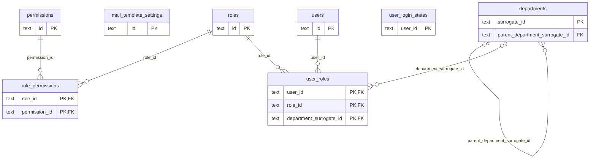

# DB 構造: システム管理

> このファイルは `packages/backend/scripts/db-docs/generate-db-docs.mjs` で自動生成しています。直接編集しないでください(更新方法は [DB 構造の概要](README.md#更新方法))。

ユーザー・部署・ロール・権限と、メール送信・帳票の設定。

## テーブル一覧

| テーブル | 名前 | DB | 説明 |
|---|---|---|---|
| [departments](#departments) | 部署 | `DB` | 組織の部署。上位の部署と有効期間を持てる |
| [mail_template_settings](#mail_template_settings) | メール送信・帳票の設定 | `DB` | 帳票の種類ごとのメールの件名・本文・宛先(CC/BCC)、帳票テンプレート、ファイル名 |
| [permissions](#permissions) | 権限 | `DB` | 画面(resource)と操作(一覧・登録・更新・削除など)の組み合わせ |
| [role_permissions](#role_permissions) | ロールの権限 | `DB` | ロールに与える権限の一覧 |
| [roles](#roles) | ロール | `DB` | 権限をまとめる役割(例: 営業担当、経理)。ユーザーに部署ごとに割り当てる |
| [user_login_states](#user_login_states) | ログインの状態 | `DB` | ユーザーごとの、続けてログインに失敗した回数・一時的なロックの期限・ログインを無効にする時刻(ログアウト・無効化・パスワード変更) |
| [user_roles](#user_roles) | ユーザーの所属 | `DB` | ユーザー × 部署 × ロールの割り当て。1人が複数の部署・ロールを持てる |
| [users](#users) | ユーザー | `DB` | システムにログインするユーザー。従業員番号・メールアドレスでログインする |

## ER 図

主キー(PK)と外部キー(FK)の項目だけを表示しています。`_other_domain` は他の領域のテーブルです。

## テーブルの詳細

🔑 = 主キー、必須の ○ = 空にできない項目です。

### departments(部署)

組織の部署。上位の部署と有効期間を持てる

- DB: `DB`

| 項目 | 型 | 必須 | 既定値 | 参照先 | 説明 |
|---|---|:---:|---|---|---|
| 🔑 `surrogate_id` | 文字列 | ○ |  |  | 内部ID(コードを変更しても変わらない識別子) |
| `id` | 文字列 | ○ |  |  | ID(主キー) |
| `name` | 文字列 | ○ |  |  | 名称 |
| `parent_department_surrogate_id` | 文字列 |  |  | [departments](#departments).surrogate_id | 上位の部署(内部ID) |
| `memo` | 文字列 |  |  |  | 備考 |
| `valid_from` | 日時 | ○ |  |  | 有効期間の開始日 |
| `valid_to` | 日時 |  |  |  | 有効期間の終了日 |
| `created_by` | 文字列 | ○ |  |  | 作成者(従業員番号) |
| `created_at` | 日時 | ○ |  |  | 作成日時 |
| `updated_by` | 文字列 | ○ |  |  | 更新者(従業員番号) |
| `updated_at` | 日時 | ○ |  |  | 更新日時 |

### mail_template_settings(メール送信・帳票の設定)

帳票の種類ごとのメールの件名・本文・宛先(CC/BCC)、帳票テンプレート、ファイル名

- DB: `DB`

| 項目 | 型 | 必須 | 既定値 | 参照先 | 説明 |
|---|---|:---:|---|---|---|
| 🔑 `id` | 文字列 | ○ |  |  | ID(主キー) |
| `name` | 文字列 | ○ |  |  | 名称 |
| `smtp_from` | 文字列 |  |  |  | 送信元のメールアドレス |
| `cc_address` | 文字列 |  |  |  | CC のメールアドレス |
| `bcc_address` | 文字列 |  |  |  | BCC のメールアドレス |
| `subject_template` | 文字列 | ○ |  |  | 件名のひな形 |
| `body_template` | 文字列 | ○ |  |  | 本文のひな形 |
| `report_template_path` | 文字列 |  |  |  | 帳票テンプレートの保存先(R2) |
| `report_layout_path` | 文字列 |  |  |  | 帳票テンプレートを変換したレイアウトの保存先(R2) |
| `report_layout_status` | 文字列 |  |  |  | 帳票テンプレートの変換の状態 |
| `report_layout_error` | 文字列 |  |  |  | 帳票テンプレートの変換のエラー |
| `file_name_prefix` | 文字列 |  |  |  | 帳票PDFのファイル名プレフィックス(「プレフィックス_伝票番号.pdf」)。nullは既定の日本語名 |
| `updated_at` | 日時 | ○ |  |  | 更新日時 |
| `updated_by` | 文字列 |  |  |  | 更新者(従業員番号) |

### permissions(権限)

画面(resource)と操作(一覧・登録・更新・削除など)の組み合わせ

- DB: `DB`

| 項目 | 型 | 必須 | 既定値 | 参照先 | 説明 |
|---|---|:---:|---|---|---|
| 🔑 `id` | 文字列 | ○ |  |  | ID(主キー) |
| `resource` | 文字列 | ○ |  |  | 画面(権限の単位) |
| `action` | 文字列 | ○ |  |  | 操作(申請・承認・差戻しなど) |
| `name` | 文字列 | ○ |  |  | 名称 |
| `description` | 文字列 |  |  |  | 説明 |

### role_permissions(ロールの権限)

ロールに与える権限の一覧

- DB: `DB`

| 項目 | 型 | 必須 | 既定値 | 参照先 | 説明 |
|---|---|:---:|---|---|---|
| 🔑 `role_id` | 文字列 | ○ |  | [roles](#roles).id | ロール |
| 🔑 `permission_id` | 文字列 | ○ |  | [permissions](#permissions).id | 権限 |

- 主キー(複合): `role_id` + `permission_id`

### roles(ロール)

権限をまとめる役割(例: 営業担当、経理)。ユーザーに部署ごとに割り当てる

- DB: `DB`

| 項目 | 型 | 必須 | 既定値 | 参照先 | 説明 |
|---|---|:---:|---|---|---|
| 🔑 `id` | 文字列 | ○ |  |  | ID(主キー) |
| `name` | 文字列 | ○ |  |  | 名称 |
| `description` | 文字列 |  |  |  | 説明 |
| `created_at` | 日時 | ○ |  |  | 作成日時 |

### user_login_states(ログインの状態)

ユーザーごとの、続けてログインに失敗した回数・一時的なロックの期限・ログインを無効にする時刻(ログアウト・無効化・パスワード変更)

- DB: `DB`

| 項目 | 型 | 必須 | 既定値 | 参照先 | 説明 |
|---|---|:---:|---|---|---|
| 🔑 `user_id` | 文字列 | ○ |  |  | ユーザー |
| `failed_count` | 整数 | ○ | `0` |  | 続けてログインに失敗した回数(成功・ロックで0に戻す) |
| `last_failed_at` | 日時 |  |  |  |  |
| `locked_until` | 日時 |  |  |  | 一時的なロックの期限(無効化できない初期のシステム管理者だけに使う) |
| `sessions_valid_after` | 日時 |  |  |  | この時刻より前に発行したログイン(セッション)は無効(無効化・パスワード変更・ログアウトで更新する) |

### user_roles(ユーザーの所属)

ユーザー × 部署 × ロールの割り当て。1人が複数の部署・ロールを持てる

- DB: `DB`

| 項目 | 型 | 必須 | 既定値 | 参照先 | 説明 |
|---|---|:---:|---|---|---|
| 🔑 `user_id` | 文字列 | ○ |  | [users](#users).id | ユーザー |
| 🔑 `role_id` | 文字列 | ○ |  | [roles](#roles).id | ロール |
| 🔑 `department_surrogate_id` | 文字列 |  |  | [departments](#departments).surrogate_id | 部署(内部ID) |

- 主キー(複合): `user_id` + `role_id` + `department_surrogate_id`

### users(ユーザー)

システムにログインするユーザー。従業員番号・メールアドレスでログインする

- DB: `DB`

| 項目 | 型 | 必須 | 既定値 | 参照先 | 説明 |
|---|---|:---:|---|---|---|
| 🔑 `id` | 文字列 | ○ |  |  | ID(主キー) |
| `employee_number` | 文字列 | ○ |  |  | 従業員番号 |
| `email` | 文字列 | ○ |  |  | メールアドレス |
| `name` | 文字列 | ○ |  |  | 名称 |
| `password_hash` | 文字列 |  |  |  | パスワードのハッシュ値 |
| `is_active` | 真偽値 | ○ | `true` |  | 有効かどうか |
| `slack_user_id` | 文字列 |  |  |  | SlackメンバーID。BotがこのIDへDM送信する(channel指定にuser IDをそのまま使える)。 |
| `notification_channel` | 文字列 | ○ | `email` |  | 通知方法('email'／'slack')。プロフィール画面で本人が選択。 |
| `created_at` | 日時 | ○ |  |  | 作成日時 |
| `updated_at` | 日時 | ○ |  |  | 更新日時 |

- 一意(重複不可): `employee_number`、`email`
