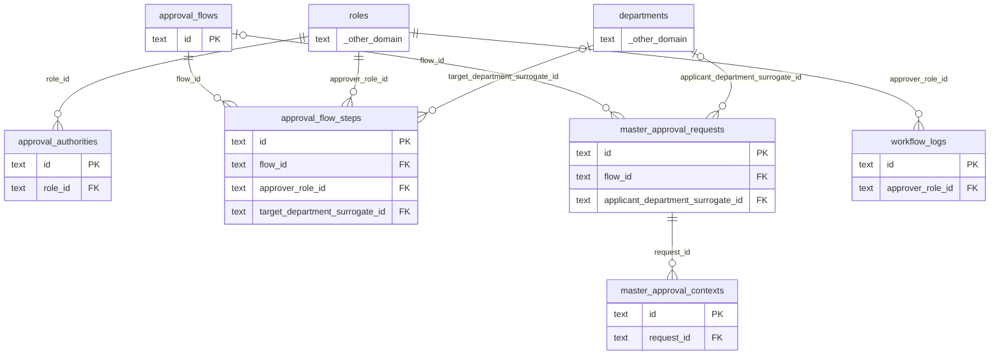

# DB 構造: 承認ワークフロー

> このファイルは `packages/backend/scripts/db-docs/generate-db-docs.mjs` で自動生成しています。直接編集しないでください(更新方法は [DB 構造の概要](README.md#更新方法))。

承認フロー・承認権限・承認申請と、その履歴。

## テーブル一覧

| テーブル | 名前 | DB | 説明 |
|---|---|---|---|
| [approval_authorities](#approval_authorities) | 承認権限 | `DB` | 申請の種類ごとに、承認できるロールと金額の上限 |
| [approval_flow_steps](#approval_flow_steps) | 承認フローの段 | `DB` | 承認フローの各段(何段目を、どのロール・ユーザーが承認するか) |
| [approval_flows](#approval_flows) | 承認フロー | `DB` | 申請の種類・金額の範囲・条件ごとの承認経路 |
| [master_approval_contexts](#master_approval_contexts) | 承認申請の審査情報 | `DB` | 承認申請に付ける審査用の情報(契約の種類・期間、反社会的勢力のチェック、図面・仕様の備考など) |
| [master_approval_requests](#master_approval_requests) | 承認申請 | `DB` | マスタ・伝票の承認申請。対象の種類(target_type)と対象ID、申請内容のスナップショット、現在の段を持つ |
| [workflow_logs](#workflow_logs) | 承認の履歴 | `DB` | 申請・承認・差戻し・取下げなどの操作の記録 |

## ER 図

主キー(PK)と外部キー(FK)の項目だけを表示しています。`_other_domain` は他の領域のテーブルです。

## テーブルの詳細

🔑 = 主キー、必須の ○ = 空にできない項目です。

### approval_authorities(承認権限)

申請の種類ごとに、承認できるロールと金額の上限

- DB: `DB`

| 項目 | 型 | 必須 | 既定値 | 参照先 | 説明 |
|---|---|:---:|---|---|---|
| 🔑 `id` | 文字列 | ○ |  |  | ID(主キー) |
| `role_id` | 文字列 | ○ |  | [roles](system.md#roles).id | ロール |
| `request_type` | 文字列 | ○ |  |  | 申請の種類 |
| `max_amount` | 整数 | ○ |  |  | 金額の上限 |
| `memo` | 文字列 |  |  |  | 備考 |

### approval_flow_steps(承認フローの段)

承認フローの各段(何段目を、どのロール・ユーザーが承認するか)

- DB: `DB`

| 項目 | 型 | 必須 | 既定値 | 参照先 | 説明 |
|---|---|:---:|---|---|---|
| 🔑 `id` | 文字列 | ○ |  |  | ID(主キー) |
| `flow_id` | 文字列 | ○ |  | [approval_flows](#approval_flows).id | 承認フロー |
| `step_order` | 整数 | ○ |  |  | 段の順番 |
| `approver_role_id` | 文字列 | ○ |  | [roles](system.md#roles).id | 承認者のロール |
| `target_department_surrogate_id` | 文字列 |  |  | [departments](system.md#departments).surrogate_id | 対象の部署(内部ID) |
| `step_name` | 文字列 |  |  |  | 段の名前 |
| `memo` | 文字列 |  |  |  | 備考 |

### approval_flows(承認フロー)

申請の種類・金額の範囲・条件ごとの承認経路

- DB: `DB`

| 項目 | 型 | 必須 | 既定値 | 参照先 | 説明 |
|---|---|:---:|---|---|---|
| 🔑 `id` | 文字列 | ○ |  |  | ID(主キー) |
| `name` | 文字列 | ○ |  |  | 名称 |
| `request_type` | 文字列 | ○ |  |  | 申請の種類 |
| `min_amount` | 整数 | ○ | `0` |  | 金額の下限 |
| `max_amount` | 整数 | ○ |  |  | 金額の上限 |
| `is_active` | 真偽値 | ○ | `true` |  | 有効かどうか |
| `match_field` | 文字列 |  |  |  | フローを選ぶ条件の項目名 |
| `match_value` | 文字列 |  |  |  | フローを選ぶ条件の値 |

### master_approval_contexts(承認申請の審査情報)

承認申請に付ける審査用の情報(契約の種類・期間、反社会的勢力のチェック、図面・仕様の備考など)

- DB: `DB`

| 項目 | 型 | 必須 | 既定値 | 参照先 | 説明 |
|---|---|:---:|---|---|---|
| 🔑 `id` | 文字列 | ○ |  |  | ID(主キー) |
| `request_id` | 文字列 | ○ |  | [master_approval_requests](#master_approval_requests).id | 承認申請 |
| `anti_social_check_status` | 文字列 |  |  |  | 反社会的勢力のチェック状況 |
| `anti_social_check_memo` | 文字列 |  |  |  | 反社会的勢力のチェックの備考 |
| `contract_type` | 文字列 |  |  |  | 契約の種類 |
| `contract_valid_from` | 日時 |  |  |  | 契約の開始日 |
| `contract_valid_to` | 日時 |  |  |  | 契約の終了日 |
| `contract_memo` | 文字列 |  |  |  | 契約の備考 |
| `drawing_number` | 文字列 |  |  |  | 図面番号 |
| `specification_memo` | 文字列 |  |  |  | 仕様の備考 |
| `general_memo` | 文字列 |  |  |  | 一般の備考 |
| `created_by` | 文字列 | ○ |  |  | 作成者(従業員番号) |
| `created_at` | 日時 | ○ |  |  | 作成日時 |
| `updated_by` | 文字列 | ○ |  |  | 更新者(従業員番号) |
| `updated_at` | 日時 | ○ |  |  | 更新日時 |

### master_approval_requests(承認申請)

マスタ・伝票の承認申請。対象の種類(target_type)と対象ID、申請内容のスナップショット、現在の段を持つ

- DB: `DB`

| 項目 | 型 | 必須 | 既定値 | 参照先 | 説明 |
|---|---|:---:|---|---|---|
| 🔑 `id` | 文字列 | ○ |  |  | ID(主キー) |
| `target_type` | 文字列 | ○ |  |  | 承認の対象の種類 |
| `target_id` | 文字列 | ○ |  |  | 承認の対象のID |
| `request_type` | 文字列 | ○ |  |  | 申請の種類 |
| `status` | 文字列 | ○ |  |  | 状態 |
| `flow_id` | 文字列 |  |  | [approval_flows](#approval_flows).id | 承認フロー |
| `applicant_department_surrogate_id` | 文字列 |  |  | [departments](system.md#departments).surrogate_id | 申請部署(申請者が複数の部署に所属する場合に選んだ部署、内部ID) |
| `applicant_id` | 文字列 | ○ |  |  | 申請者(従業員番号) |
| `approver_id` | 文字列 |  |  |  | 承認者(ユーザー) |
| `comment` | 文字列 |  |  |  | コメント |
| `attachment_r2_path` | 文字列 |  |  |  | ファイルの保存先(R2 のキー) |
| `memo` | 文字列 |  |  |  | 備考 |
| `created_at` | 日時 | ○ |  |  | 作成日時 |
| `updated_at` | 日時 | ○ |  |  | 更新日時 |

### workflow_logs(承認の履歴)

申請・承認・差戻し・取下げなどの操作の記録

- DB: `DB`

| 項目 | 型 | 必須 | 既定値 | 参照先 | 説明 |
|---|---|:---:|---|---|---|
| 🔑 `id` | 文字列 | ○ |  |  | ID(主キー) |
| `target_type` | 文字列 | ○ |  |  | 承認の対象の種類 |
| `target_id` | 文字列 | ○ |  |  | 承認の対象のID |
| `approver_id` | 文字列 |  |  |  | 承認者(ユーザー) |
| `approver_role_id` | 文字列 | ○ |  | [roles](system.md#roles).id | 承認者のロール |
| `layer` | 整数 | ○ |  |  | 段 |
| `status` | 文字列 | ○ |  |  | 状態 |
| `comment` | 文字列 |  |  |  | コメント |
| `performed_at` | 日時 |  |  |  | 実施日時 |
| `request_id` | 文字列 |  |  |  | 承認申請 |
