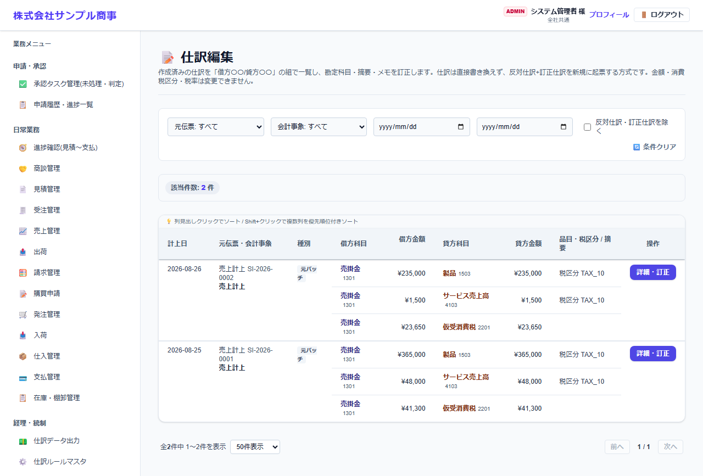
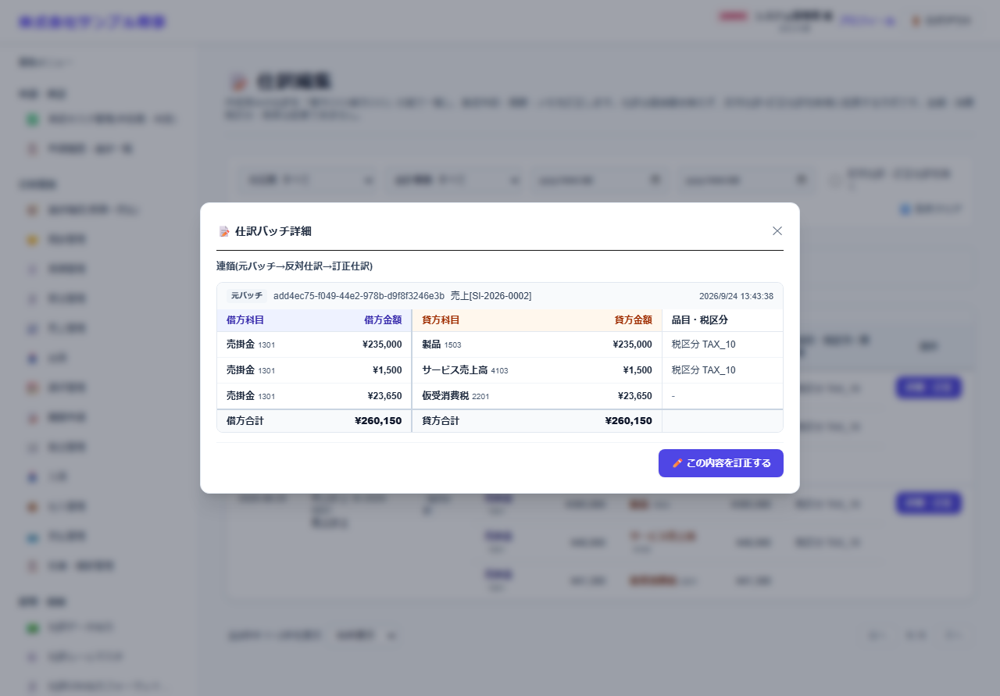
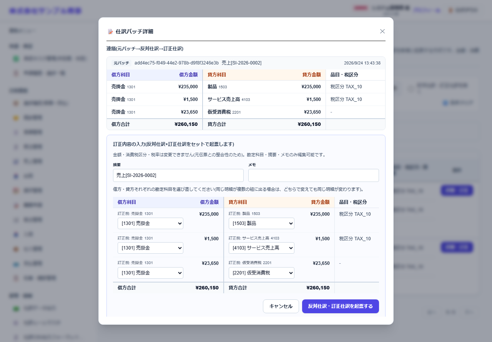

# 仕訳編集

[マニュアルの一覧](../README.md) > 経理・統制 > 仕訳編集

作成済みの仕訳の勘定科目・摘要・メモを訂正します。仕訳は直接書き換えず、元の仕訳を打ち消す反対仕訳と、訂正した仕訳を新しく作る方式です。**金額・消費税区分・税率は変更できません**。

- **開き方**: メニューの **経理・統制** > **仕訳編集**
- **対象**: 全員
- 一覧・検索・並び替え・CSV・承認の共通の操作は、[共通の操作](../basics/common-operations.md) を参照してください。

一覧は、仕訳を「借方科目・借方金額・貸方科目・貸方金額」の組で1行ずつ表示します。1つの仕訳(伝票1件分)の組は、計上日・元伝票・種別の欄をまとめて表示します。

1. 元伝票・会計事象・期間で絞り込み、訂正する仕訳を探します。**反対仕訳・訂正仕訳を除く** で、訂正前の元の仕訳だけを表示できます。
2. 一覧の **詳細・訂正** を押すと、仕訳の詳細(元の仕訳・反対仕訳・訂正仕訳のつながり)が表示されます。

   

   **この内容を訂正する** を押すと、組ごとに借方・貸方の勘定科目を選び直せます。

   

3. 訂正すると、元の仕訳を打ち消す反対仕訳と、訂正後の仕訳が作られます(元の仕訳は残ります)。

- 金額を直したい場合は、元の伝票(売上・仕入など)を赤伝などで訂正してから、仕訳にし直してください。
