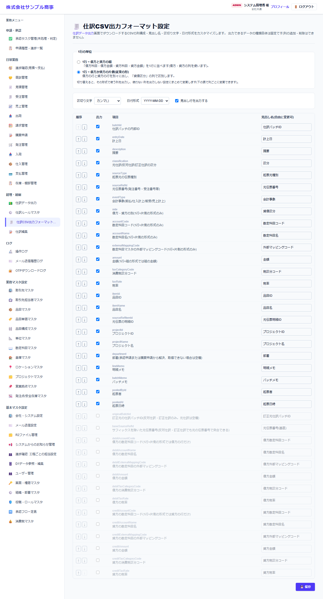

# 仕訳CSV出力フォーマット設定

[マニュアルの一覧](../README.md) > 経理・統制 > 仕訳CSV出力フォーマット設定

仕訳データ出力の CSV を、使っている会計ソフトに合わせて設定します。出力できるデータの種類は決まっていて、項目の追加・削除はできません。

- **開き方**: メニューの **経理・統制** > **仕訳CSV出力フォーマット設定**
- **対象**: 全員
- 一覧・検索・並び替え・CSV・承認の共通の操作は、[共通の操作](../basics/common-operations.md) を参照してください。

| 設定 | 内容 |
|---|---|
| 1行の単位 | **借方と貸方の組**(借方科目・借方金額・貸方科目・貸方金額を1行に並べる)か、**借方か貸方の片側**(従来の形。「貸借区分」の列で区別する)かを選びます。切り替えると、その形で使う列の「出力」がまとめて切り替わります |
| 区切り文字 | カンマ・タブなど |
| 日付形式 | YYYY-MM-DD・YYYY/MM/DD など |
| 見出し行を出力する | 1行目に見出しを出すかどうか |
| 順序(↑↓) | 列の並び順を変えます |
| 出力 | チェックを外した項目は出力しません |
| 見出し名 | 1行目の見出しを、会計ソフトに合わせて自由に変えられます |
