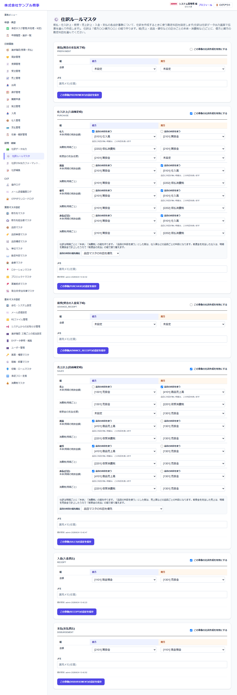

# 仕訳ルールマスタ

[マニュアルの一覧](../README.md) > 経理・統制 > 仕訳ルールマスタ

取引(会計事象)ごとに、仕訳で使う借方・貸方の勘定科目を設定します。

- **開き方**: メニューの **経理・統制** > **仕訳ルールマスタ**
- **対象**: 全員
- 一覧・検索・並び替え・CSV・承認の共通の操作は、[共通の操作](../basics/common-operations.md) を参照してください。

会計事象ごとに枠が分かれています。

| 会計事象 | いつ仕訳にするか |
|---|---|
| 前払(PREPAYMENT) | 発注で前払の支払が完了した時 |
| 仕入計上(PURCHASE) | 仕入が確定した時 |
| 前受(ADVANCE_RECEIPT) | 受注・単体入金で前受の入金が完了した時 |
| 売上計上(SALES) | 売上が確定した時 |
| 入金・支払 | 請求の入金・支払の消込をした時 |

## 仕訳の組

仕訳は「借方〇〇/貸方〇〇」の組(借方と貸方が同じ金額)を並べて作ります。設定は、この組ごとに借方・貸方の勘定科目を選ぶ表になっています。

| 会計事象 | 組 | 設定の例(借方 / 貸方) |
|---|---|---|
| 前払・前受・入金・支払 | 金額 | 前払: 前渡金 / 現金預金 |
| 売上計上 | 売上・返品・値引・赤伝(訂正)ごとの「本体」「消費税」 | 売上の本体: 売掛金 / 売上高(品目の科目) |
| | 前受金の充当(売上のみ) | 前受金 / 売掛金 |
| 仕入計上 | 仕入・返品・値引・赤伝(訂正)ごとの「本体」「消費税」 | 仕入の消費税: 仮払消費税 / 買掛金 |
| | 前渡金の充当(仕入のみ) | 買掛金 / 前渡金 |

- 売上・仕入は、伝票の明細1行ごとに「本体」と「消費税」の組を作ります。例えば明細が2行の売上は、「売掛金/売上高(品目A)」「売掛金/仮受消費税」「売掛金/売上高(品目B)」「売掛金/仮受消費税」の4組になります。
- 前受金(前渡金)を充当した売上(仕入)は、明細をいったん売掛金(買掛金)で計上し、充当した金額を「前受金の充当」(「前渡金の充当」)の組で振り替えます。
- 返品・値引・赤伝(訂正)は、区分ごとに科目を変えられます(例: 値引だけ「売上値引高」にする)。

## 設定する

1. **この事象の仕訳作成を有効にする** にチェックを入れます(チェックが無い事象は、仕訳にしません)。
2. 組ごとに、**借方** と **貸方** の勘定科目を選びます。
   - 売上・仕入の「本体」で **品目の科目を使う** にチェックした側は、品目マスタ(明細)の勘定科目を使います。選んだ勘定科目は、品目に科目が無い明細に使います。
   - 「前受金の充当」「前渡金の充当」は任意です。設定しないまま充当すると、仕訳を作るときにエラーになります。
3. 仕入・売上では、**品目の科目の優先順位**(品目マスタの科目を優先するか、伝票のヘッダーの科目を優先するか)を選べます。
4. **この事象(〇〇)の設定を保存** を押します。有効にする場合、「本体」「消費税」の組は借方・貸方の両方が必要です。

- 勘定科目は、[勘定科目マスタ](../master/accounts.md) で登録したものから選びます。
