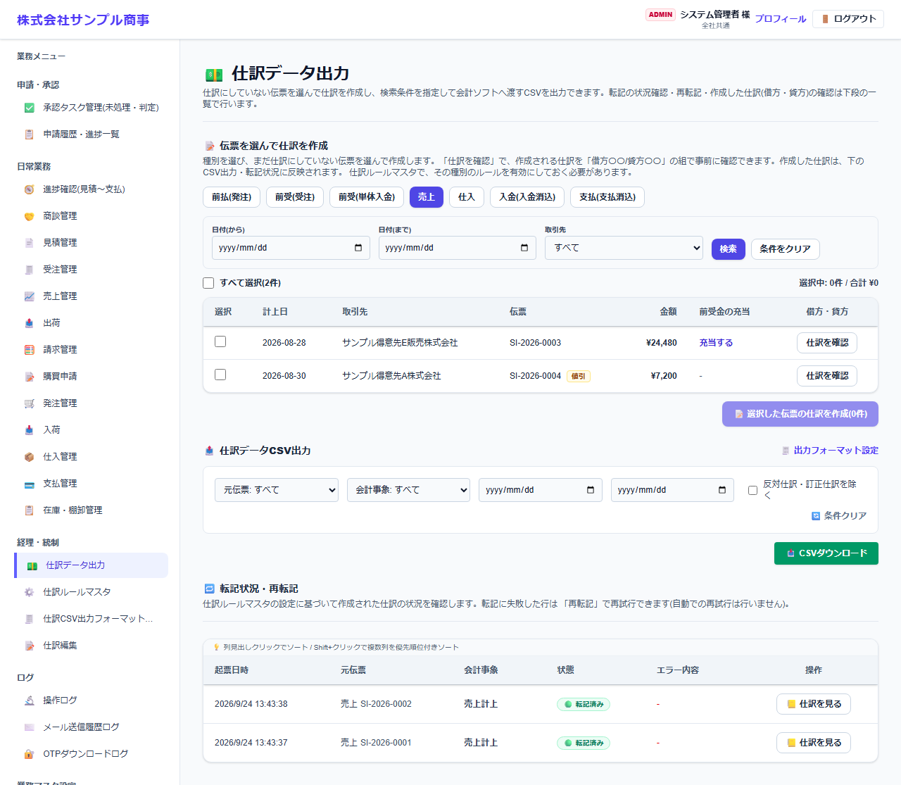
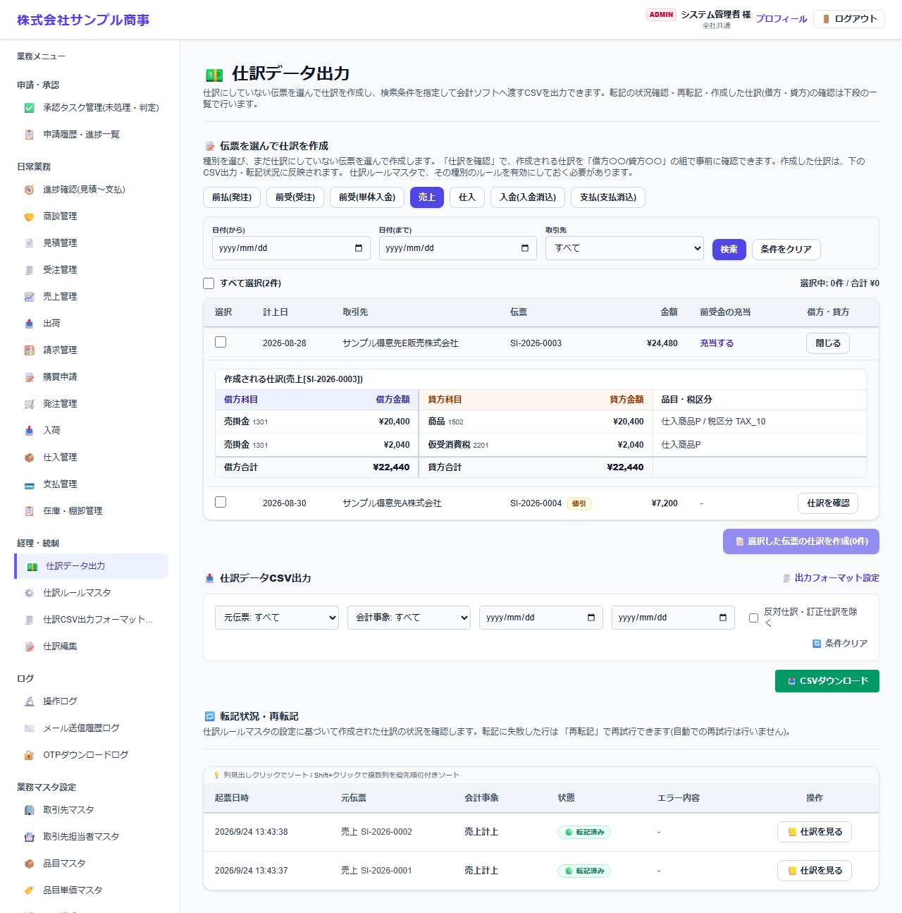
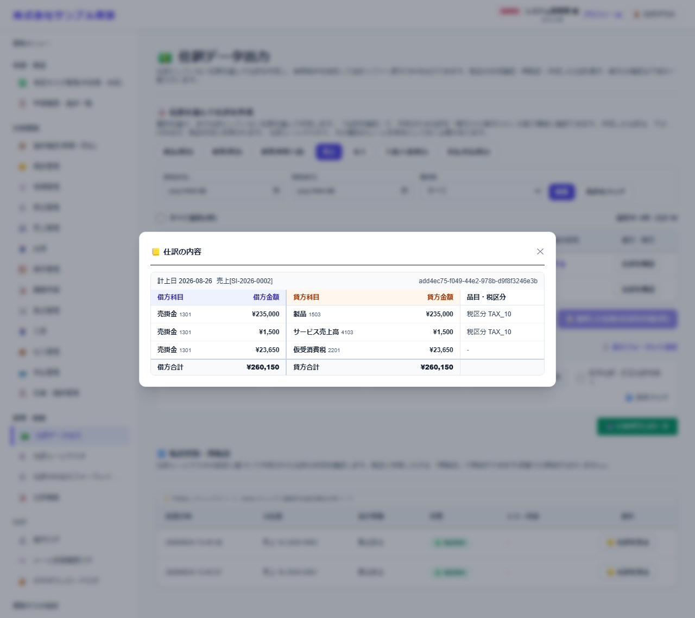

# 仕訳データ出力

[マニュアルの一覧](../README.md) > 経理・統制 > 仕訳データ出力

承認済みの伝票から仕訳を作り、会計ソフトに取り込む CSV を出力します。

- **開き方**: メニューの **経理・統制** > **仕訳データ出力**
- **対象**: 全員
- 一覧・検索・並び替え・CSV・承認の共通の操作は、[共通の操作](../basics/common-operations.md) を参照してください。

## 1. 伝票を選んで仕訳を作る

1. 上のタブで伝票の種類を選びます(前払(発注)・前受(受注)・前受(単体入金)・売上・仕入・入金(請求消込)・支払(支払消込))。
2. 日付・取引先で絞り込み、**検索** を押します。まだ仕訳にしていない伝票が表示されます。
3. 各行の **仕訳を確認** を押すと、作成される仕訳を「借方〇〇/貸方〇〇」の組で確認できます(この時点では保存しません)。

   

4. 仕訳にする伝票を選び、**選択した伝票の仕訳を作成** を押します。

- どの勘定科目で仕訳にするかは、[仕訳ルールマスタ](journal-rules.md) で設定します。ルールが無効の種類は、仕訳にできません。
- 売上・仕入は、明細1行ごとに「本体」「消費税」の組になります。前受金を充当した売上は、充当した金額が「前受金/売掛金」の組で付きます。

## 2. 仕訳データを CSV で出力する

元伝票・会計事象・期間で絞り込み、**CSVダウンロード** を押します。**反対仕訳・訂正仕訳を除く** で、取消・訂正の仕訳を出力しないようにできます。
列の並び・見出し・区切り文字や、1行を「借方と貸方の組」にするか「借方か貸方の片側」にするかは、**出力フォーマット設定**([仕訳CSV出力フォーマット設定](journal-export-format.md))で変えられます。

## 3. 転記状況・再転記

伝票から仕訳を作る処理の状況(成功・失敗とエラーの内容)を確認します。失敗した行は **再転記** で作り直します(自動では再試行しません)。
作成済みの行の **仕訳を見る** で、作成した仕訳を借方・貸方の組で確認できます。

