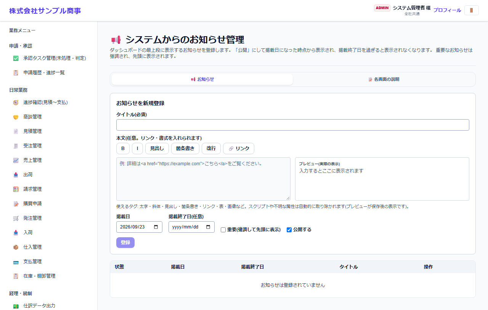
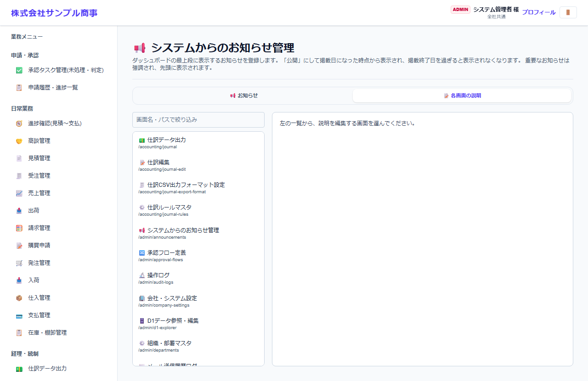

# システムからのお知らせ管理

[マニュアルの一覧](../README.md) > 基本マスタ設定 > システムからのお知らせ管理

ダッシュボードに表示するお知らせと、各画面の見出しの下に表示する説明文を登録します。

- **開き方**: メニューの **基本マスタ設定** > **システムからのお知らせ管理**
- **対象**: 管理者
- 一覧・検索・並び替え・CSV・承認の共通の操作は、[共通の操作](../basics/common-operations.md) を参照してください。

## お知らせ

| 項目 | 内容 |
|---|---|
| タイトル * | |
| 本文 | 太字・斜体・見出し・箇条書き・改行・リンクが使えます。右にプレビューが表示されます |
| 掲載日・掲載終了日 | 掲載日から、掲載終了日まで表示します(終了日が空なら、ずっと表示) |
| 重要(強調して先頭に表示) | |
| 公開する | チェックを外すと、登録しても表示しません |

## 各画面の説明

画面を選んで、見出しの下に表示する説明文を登録します。登録しない画面は、既定の説明が表示されます。
