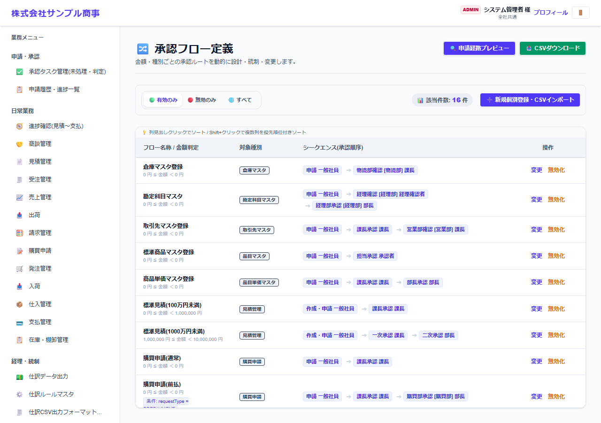
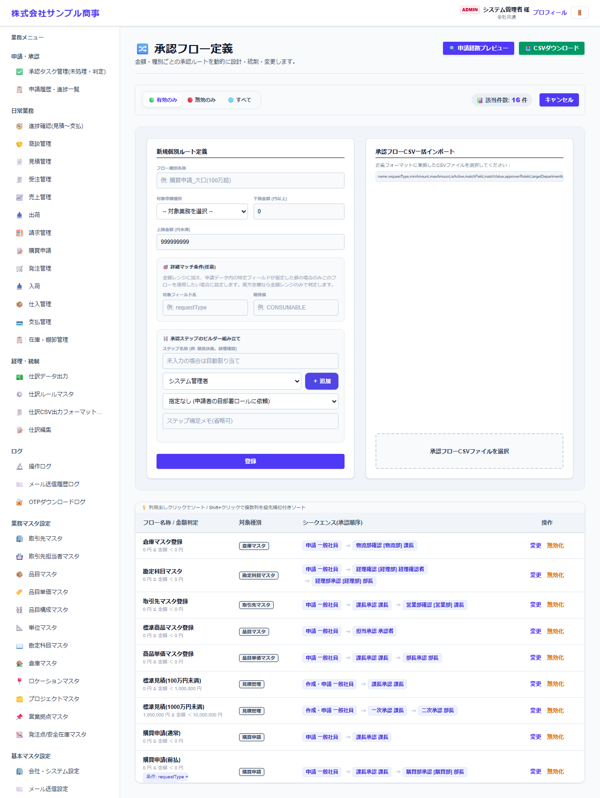
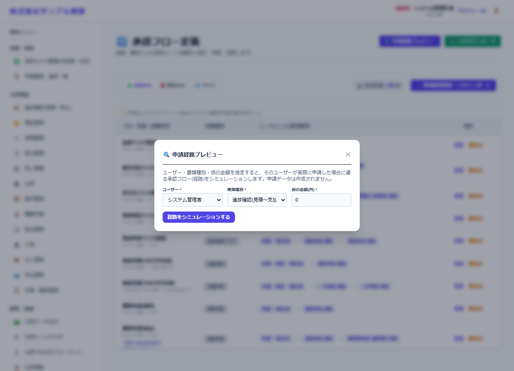

# 承認フロー定義

[マニュアルの一覧](../README.md) > 基本マスタ設定 > 承認フロー定義

申請の種類・金額ごとに、承認の経路(何段で、どのロールが承認するか)を設定します。

- **開き方**: メニューの **基本マスタ設定** > **承認フロー定義**
- **対象**: 管理者
- 一覧・検索・並び替え・CSV・承認の共通の操作は、[共通の操作](../basics/common-operations.md) を参照してください。

## 一覧

1行が1つのフローです。**フロー名称 / 金額判定**・**対象種類**・**シーケンス(承認順序)** が表示されます。

## 登録する

**新規個別登録・CSVインポート** を押します。

| 項目 | 説明 |
|---|---|
| フロー名称・対象(申請の種類) | 例: 見積、受注、購買申請、取引先マスタ登録 |
| 金額の範囲 | この金額の範囲の申請に使います(金額によって経路を変えられます) |
| 条件(任意) | 特定の条件(例: 購買区分が前払)の申請だけに使うフロー |
| 承認の段 | 段ごとに、承認するロール(と部署)を設定します |

- 同じ申請の種類に複数のフローがある場合は、金額の範囲で候補を絞り、条件が一致するフローを優先して使います。
- 各段の承認者は、申請者(または申請時に選んだ申請部署)の部署と、設定したロールから決まります。

## 申請経路プレビュー

**申請経路プレビュー** で、ユーザー・申請種別・仮の金額を指定して **経路をシミュレーションする** と、そのユーザーが申請した場合の承認経路を確認できます(申請データは作られません)。組織の変更の後などの確認に使います。
