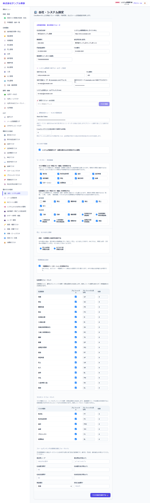

# 会社・システム設定

[マニュアルの一覧](../README.md) > 基本マスタ設定 > 会社・システム設定

会社の情報、メール・Slack の送信の設定、承認機能・監査ログの有効/無効など、システム全体の設定を行います。

- **開き方**: メニューの **基本マスタ設定** > **会社・システム設定**
- **対象**: 管理者
- 一覧・検索・並び替え・CSV・承認の共通の操作は、[共通の操作](../basics/common-operations.md) を参照してください。

## 主な設定

| 区分 | 内容 |
|---|---|
| 企業識別情報・基本環境パラメータ | 会社名・システムの URL(メールのリンクに使う)・郵便番号・住所・電話・FAX・登録番号(インボイス制度)。帳票の発行元として印字されます。**消費税の端数処理**(切り捨て・四捨五入・切り上げ。初期値は切り捨て)もここで選びます |
| システム通知用 SMTP メールサーバ設定 | メールの送信に使うサーバー(ホスト名・ポート・ユーザー名・パスワード・送信元)。**接続テストメールの送信** で届くか確認できます |
| 通知送信キュー・Slack 連携設定 | Slack の Bot トークン(承認の通知を Slack で送る場合)、Cron で1回に送る件数 |
| 承認機能 | マスタ・伝票・在庫の操作ごとに、承認機能を使うかどうか |
| 監査ログ | 操作ログを記録するかどうか |
| ログイン・パスワード | ログインの失敗回数の上限。**パスワードの最小文字数**(8〜64文字)と**必ず含める文字**(英大文字・英小文字・数字・記号) |
| 業務の設定 | 売上は出荷済みの数量まで・仕入は入庫済みの数量まで、にするかどうか、一覧のページング など |
| OTP ダウンロード | 取引先向けダウンロードの確認コードの桁数・有効期限・試行回数、送り先を取引先担当者に限るか |
| 振込元(ファームバンキング) | 全銀形式の振込ファイルに使う、委託者・振込元の銀行口座 |

- SMTP のパスワードと Slack の Bot トークンは、保存した値を画面に表示しません。設定済みの場合は、入力欄に「設定済み(変更する時だけ入力)」と出ます。変更する時だけ新しい値を入力してください(空欄のまま保存すると、今の値がそのまま残ります)。
- 承認機能を途中で有効にすると、それ以降の登録・変更から申請になります。
- 消費税は、伝票(請求書)ごとに、税率(10%・8%)ごとの合計へ1回だけ、選んだ方法で端数処理します(インボイス制度の要件)。
  請求書は、まとめた売上ごとではなく、請求書全体で税率ごとに1回計算するため、売上の消費税の合計と数円違うことがあります。
  端数処理を変更すると、変更後に保存した伝票から適用されます。保存済みの伝票の消費税は変わりませんが、帳票 PDF の税率別の内訳は
  作り直した時点の設定で計算するため、変更前の伝票では合計と内訳が1円違うことがあります。
- パスワードのルールは、本人がパスワードを変更する時(プロフィール・初回の変更)と、パスワードを忘れた時の再設定で確かめます。
  管理者が「ユーザー管理」でパスワードを入力する場合(登録・編集・CSV 取込)は確かめません。
  ユーザーの登録でパスワードを空欄にすると、ルールを満たす初期パスワード(12文字以上)を自動で作ります。
  ルールを厳しくしても、今のパスワードはそのまま使えます(次に変更する時から適用します)。最初の管理者の登録は、8文字以上のままです。
