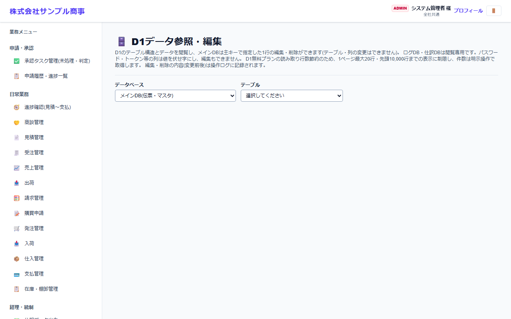

# D1データ参照・編集

[マニュアルの一覧](../README.md) > 基本マスタ設定 > D1データ参照・編集

データベース(D1)のテーブルとデータを、画面で参照・編集します。**通常の業務では使いません**。データの調査や、画面から直せないデータの修正に使います。

- **開き方**: メニューの **基本マスタ設定** > **D1データ参照・編集**
- **対象**: 管理者
- 一覧・検索・並び替え・CSV・承認の共通の操作は、[共通の操作](../basics/common-operations.md) を参照してください。

1. **データベース** と **テーブル** を選びます。
2. データが1ページ20行ずつ表示されます(先頭の10,000行まで)。

- 業務データの DB は、行の編集・削除ができます(テーブル・列の変更はできません)。ログ・仕訳の DB は閲覧だけです。
- パスワード・トークンの列は伏せ字になり、編集できません。
- 編集・削除の内容は操作ログに記録されます。**直接の編集は、伝票の整合性を壊すおそれがある**ので、十分に注意してください。
- テーブルと項目の意味は、[DB 構造](../../database/README.md) を参照してください。
