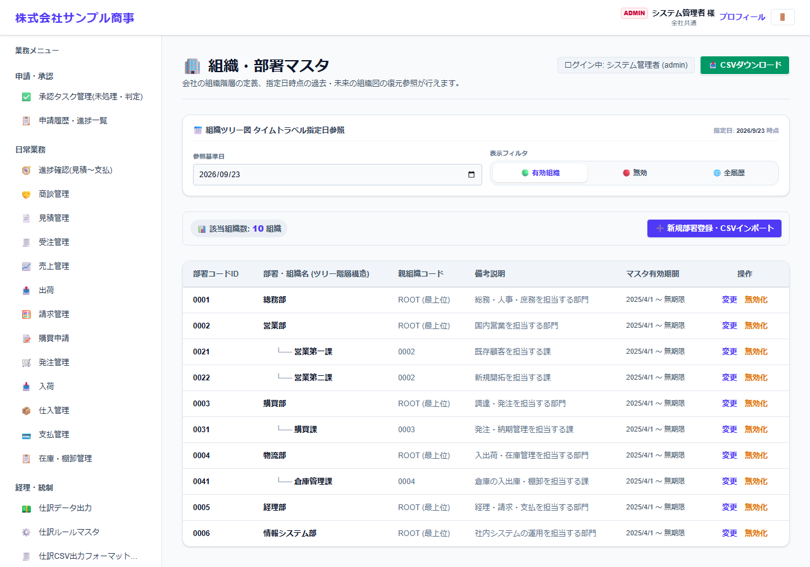
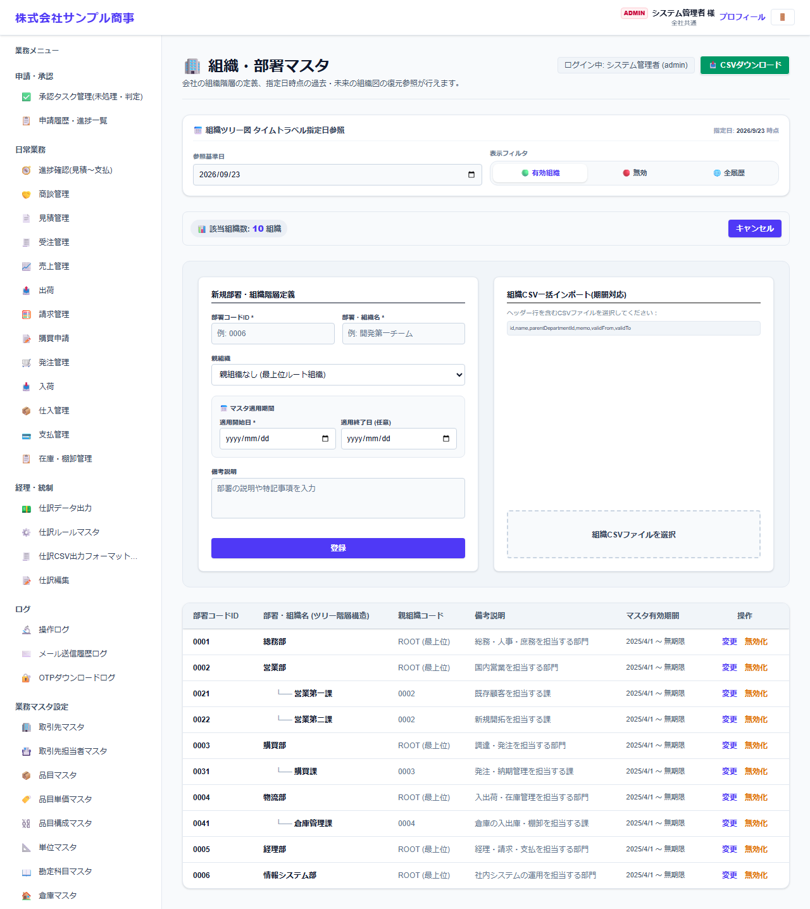

# 組織・部署マスタ

[マニュアルの一覧](../README.md) > 基本マスタ設定 > 組織・部署マスタ

会社の組織(部署と上下関係)を登録します。部署には有効期間があり、組織の変更の前後を管理できます。

- **開き方**: メニューの **基本マスタ設定** > **組織・部署マスタ**
- **対象**: 管理者
- 一覧・検索・並び替え・CSV・承認の共通の操作は、[共通の操作](../basics/common-operations.md) を参照してください。

- **参照基準日** を変えると、その日時点の組織を表示します(組織の変更の予定・過去の組織の確認)。
- **表示フィルタ** で、有効な組織・無効・全組織を切り替えます。
- 一覧は、上位の部署の下に下位の部署がツリーで表示されます。

## 登録する

**新規部署登録・CSVインポート** を押します。

部署コード・部署名・上位の部署・有効期間(開始日・終了日)・備考を入力します。
