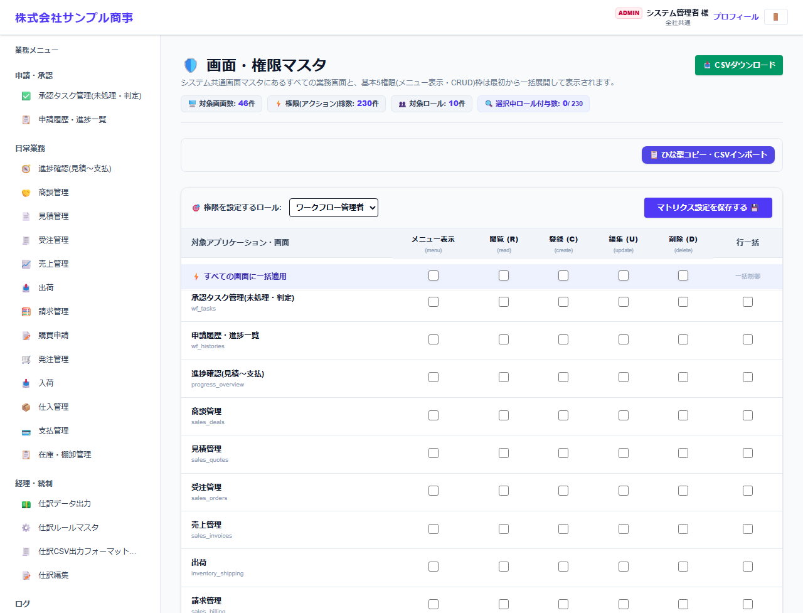

# 画面・権限マスタ

[マニュアルの一覧](../README.md) > 基本マスタ設定 > 画面・権限マスタ

ロールごとに、どの画面で何ができるか(メニュー表示・閲覧・登録・編集・削除)を設定します。

- **開き方**: メニューの **基本マスタ設定** > **画面・権限マスタ**
- **対象**: 管理者
- 一覧・検索・並び替え・CSV・承認の共通の操作は、[共通の操作](../basics/common-operations.md) を参照してください。

1. **権限を設定するロール** を選びます。
2. 画面ごとに、**メニュー表示**・**閲覧(R)**・**登録(C)**・**編集(U)**・**削除(D)** にチェックを入れます。**行一括** でその画面の全部、**すべての画面に一括適用** で全画面の同じ列をまとめて切り替えます。
3. **マトリクス設定を保存する** を押します。

- **メニュー表示** が無い画面は、メニューに出ず、開くこともできません。
- **ひな型コピー・CSVインポート** で、別のロールの設定を写したり、CSV で一括設定したりできます。
- ロール `admin`(システム管理者)は、設定に関係なくすべての画面を使えます。
- 権限の枠(画面 × 操作)は、画面の定義から自動で作られます。
