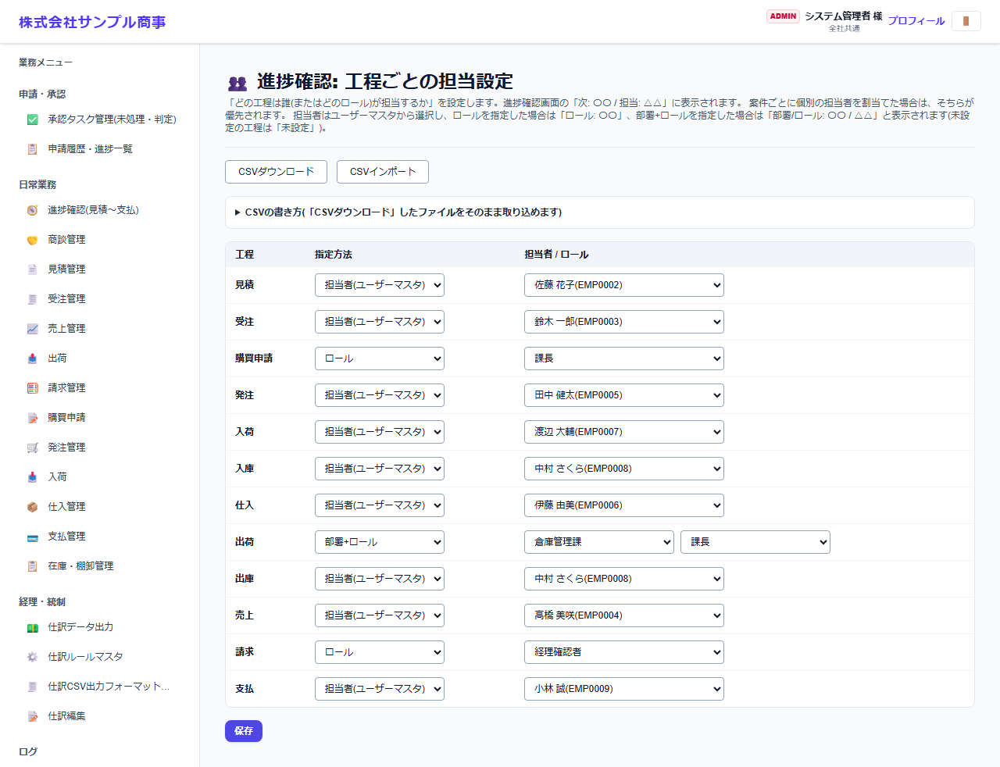

# 進捗確認: 工程ごとの担当設定

[マニュアルの一覧](../README.md) > 基本マスタ設定 > 進捗確認: 工程ごとの担当設定

進捗確認の画面の工程(見積・受注・購買申請・発注・入荷・入庫・仕入・出荷・出庫・売上・請求・支払)ごとに、既定の担当を設定します。

- **開き方**: メニューの **基本マスタ設定** > **進捗確認: 工程ごとの担当設定**
- **対象**: 管理者
- 一覧・検索・並び替え・CSV・承認の共通の操作は、[共通の操作](../basics/common-operations.md) を参照してください。

工程ごとに **指定方法** を選び、担当を選んで **保存** を押します。

| 指定方法 | 担当の表示 |
|---|---|
| 担当者(ユーザーマスタ) | ユーザー名 |
| ロール | 「ロール: 〇〇」 |
| 部署+ロール | 「部署 / ロール: 〇〇 / △△」 |

- 案件ごとに担当を変えたい場合は、進捗確認の画面で個別に割り当てます。
- **CSVダウンロード**・**CSVインポート** で一括設定できます(書き方は **CSVの書き方** を開くと表示されます)。
