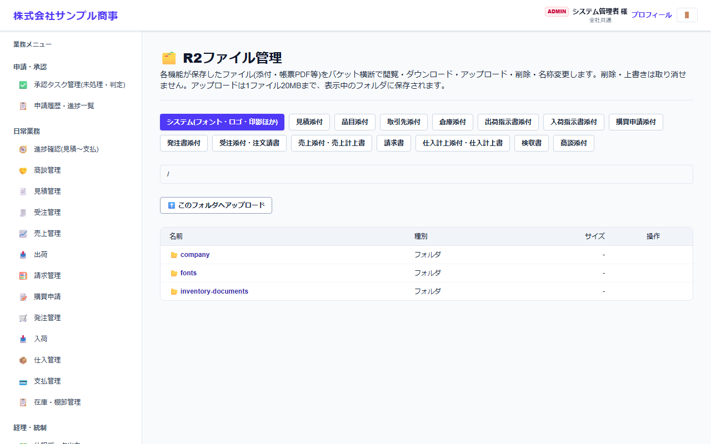

# R2ファイル管理

[マニュアルの一覧](../README.md) > 基本マスタ設定 > R2ファイル管理

システムに保存されているファイル(添付ファイル・帳票 PDF・フォントなど)を、保存場所(バケット)ごとに確認します。

- **開き方**: メニューの **基本マスタ設定** > **R2ファイル管理**
- **対象**: 管理者
- 一覧・検索・並び替え・CSV・承認の共通の操作は、[共通の操作](../basics/common-operations.md) を参照してください。

- 上のボタンで保存場所(システムフォント・ロゴ・印影、見積添付、発注添付 など)を切り替えます。
- フォルダを開いて、ファイルのダウンロード・アップロード・削除・名前の変更ができます。アップロードは1ファイル 20MB までです。
- **削除・上書きは元に戻せません**。業務の画面から使われているファイルは、消さないでください。
