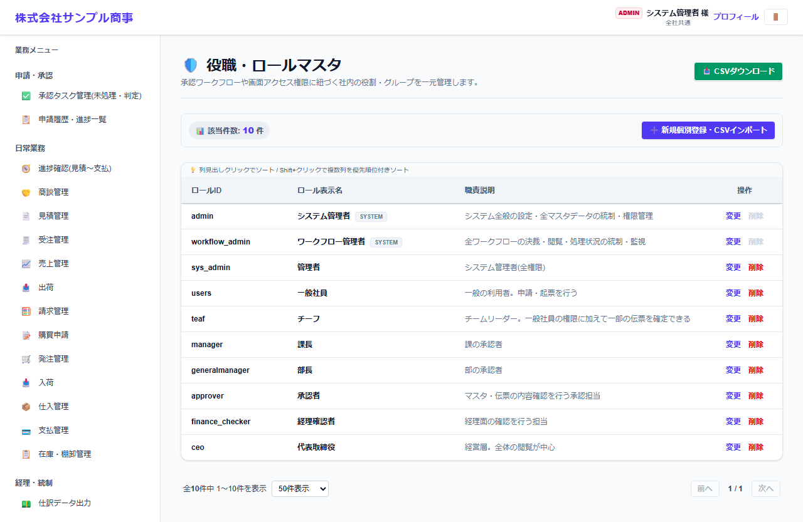
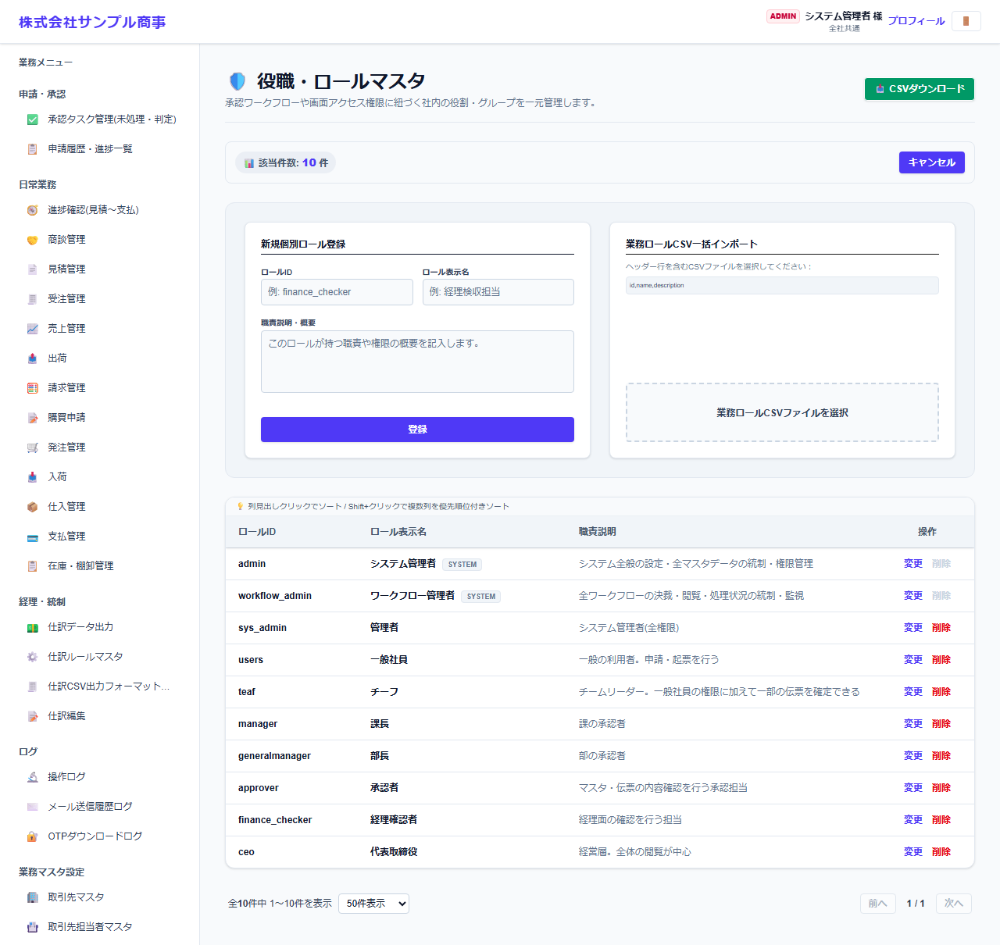

# 役職・ロールマスタ

[マニュアルの一覧](../README.md) > 基本マスタ設定 > 役職・ロールマスタ

権限のまとまりである「ロール」(例: 一般社員・課長・経理確認者)を登録します。ユーザーには、部署ごとにロールを割り当てます。

- **開き方**: メニューの **基本マスタ設定** > **役職・ロールマスタ**
- **対象**: 管理者
- 一覧・検索・並び替え・CSV・承認の共通の操作は、[共通の操作](../basics/common-operations.md) を参照してください。

- `admin`(システム管理者)と `workflow_admin`(ワークフロー管理者)は、システムが使うロール(SYSTEM)で、削除できません。
- 承認フローでは、「どのロールが承認するか」を設定します。

## 登録する

ロールID・ロール表示名・職責の説明を入力します。登録したロールの権限は、**画面・権限マスタ** で設定します。
