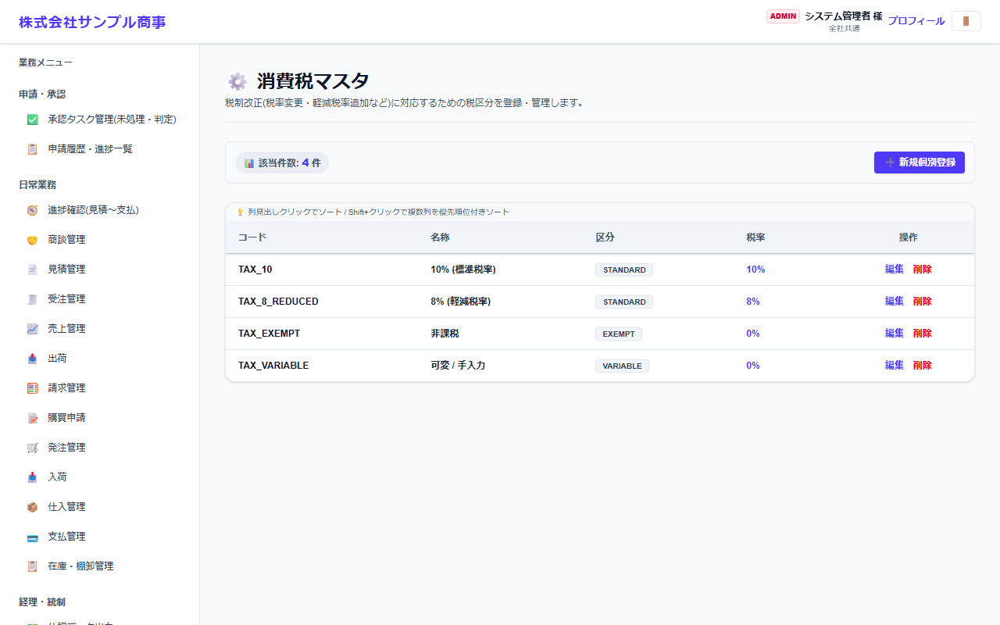
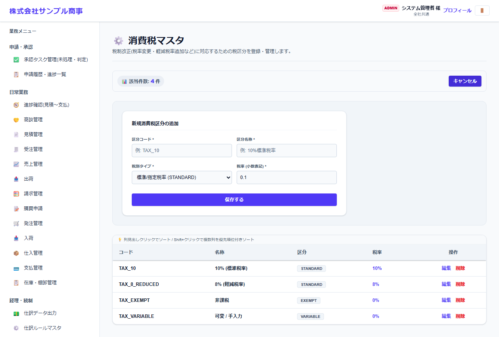

# 消費税マスタ

[マニュアルの一覧](../README.md) > 基本マスタ設定 > 消費税マスタ

消費税の区分と税率を登録します。品目・伝票の明細で選ぶ税区分になります。

- **開き方**: メニューの **基本マスタ設定** > **消費税マスタ**
- **対象**: 管理者
- 一覧・検索・並び替え・CSV・承認の共通の操作は、[共通の操作](../basics/common-operations.md) を参照してください。

| 区分 | 内容 |
|---|---|
| STANDARD | 標準税率(10%)・軽減税率(8%) |
| EXEMPT | 非課税 |
| VARIABLE | 可変(伝票で税率を手入力する) |

## 登録する

コード・名称・区分・税率を入力します。税率の改正に備えて、新しい区分を追加して使い分けます。
