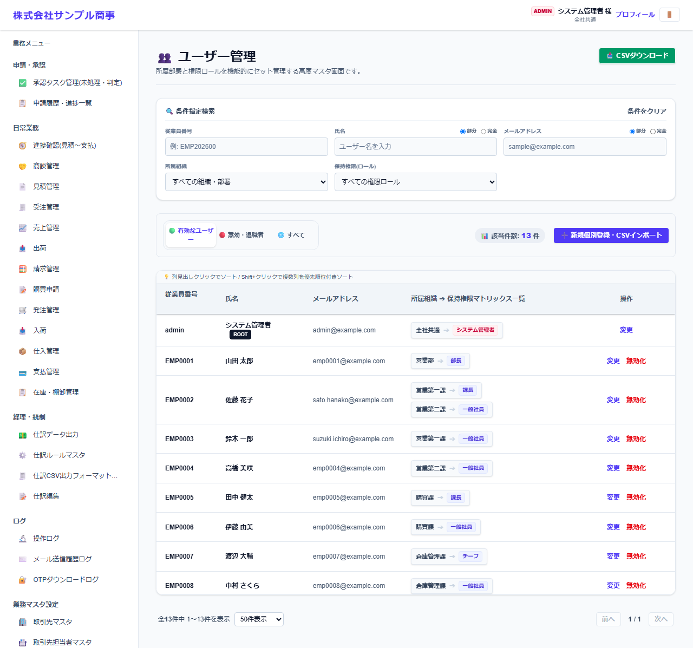
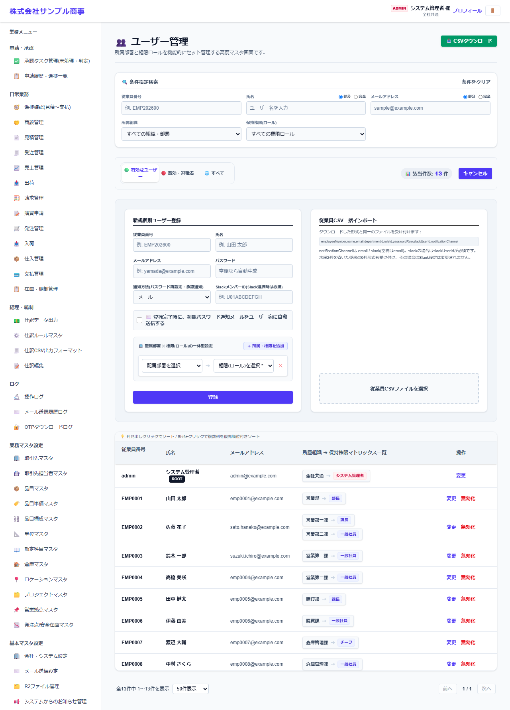

# ユーザー管理

[マニュアルの一覧](../README.md) > 基本マスタ設定 > ユーザー管理

システムを使うユーザーを登録し、所属する部署とロール(権限)を割り当てます。

- **開き方**: メニューの **基本マスタ設定** > **ユーザー管理**
- **対象**: 管理者
- 一覧・検索・並び替え・CSV・承認の共通の操作は、[共通の操作](../basics/common-operations.md) を参照してください。

## 一覧

従業員番号・氏名・メールアドレス・所属組織・ロールで絞り込めます。タブで **有効なユーザー**・**無効・退職者**・**すべて** を切り替えます。

## 登録する

**新規個別登録・CSVインポート** を押します。

| 項目 | 説明 |
|---|---|
| 従業員番号・氏名・メールアドレス | ログインに使います |
| パスワード | 空欄にすると自動で作ります。最初のログインで変更を求められます |
| 通知方法・SlackメンバーID | 承認の通知の受け取り方(本人もプロフィールで変えられます) |
| 登録完了時に、初期パスワード通知メールをユーザー宛に自動送信する | |
| 配属部署 × 権限(ロール)の一括設定 | **+ 所属・権限を追加** で、部署とロールの組み合わせを複数登録できます(兼務) |

- 退職などで使わなくなったユーザーは **無効化** します。
- 画面ごとの権限は、ロールに対して **画面・権限マスタ** で設定します。
