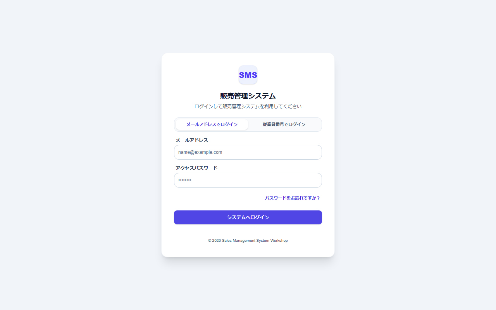
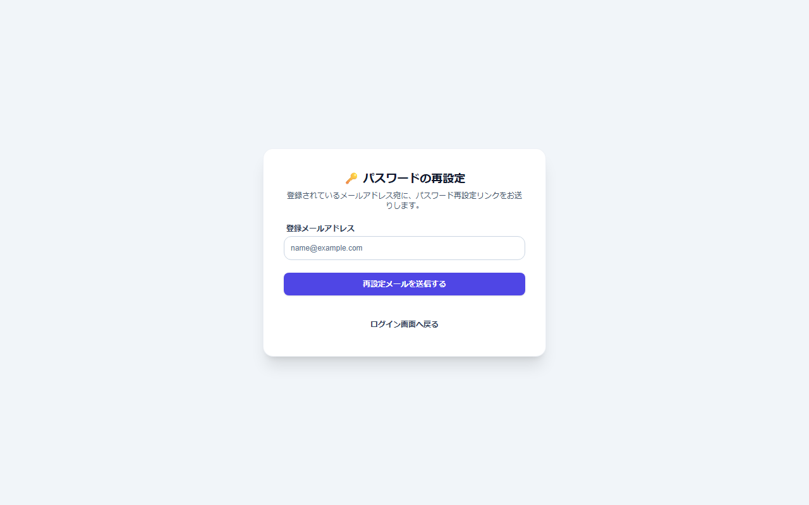

# ログイン・ログアウト・パスワード

[マニュアルの一覧](../README.md) > はじめに > ログイン・ログアウト・パスワード

## ログインする

ブラウザでシステムの URL を開くと、ログイン画面が表示されます。

1. ログインの方法を選びます。
   - **メールアドレスでログイン**: 登録したメールアドレスを入力します。
   - **従業員番号でログイン**: 従業員番号を入力します。
2. **アクセスパスワード**を入力します。
3. **システムへログイン**を押します。ダッシュボードが表示されます。

- ログインの状態は24時間保たれます。時間が過ぎると、次の操作でログイン画面に戻ります。
- 管理者が作成したばかりのユーザーは、最初のログインでパスワードの変更を求められます。画面の案内に従って、新しいパスワードを設定してください。

## パスワードを忘れた場合

ログイン画面の **パスワードをお忘れですか?** を押すと、再設定の画面が表示されます。

登録したメールアドレスを入力して送信すると、パスワードを再設定するためのリンクがメールで届きます。リンクを開いて、新しいパスワードを設定してください。

- メールが届かない場合は、システム管理者に連絡してください。

## ログアウトする

画面右上の **🚪 ログアウト**(**プロフィール** の右。スマートフォンでは 🚪 のアイコンだけ)を押すと、ログアウトしてログイン画面に戻ります。共用のパソコン・スマートフォンでは、使い終わったら必ずログアウトしてください。

## はじめて使う時(システム管理者)

ユーザーが1人も登録されていない状態でシステムを開くと、**初期設定:最初の管理者登録**の画面が表示されます。
初期設定用のトークン(構築した人が設定した値)と、管理者の従業員番号・氏名・メールアドレス・パスワードを入力して、最初の管理者を作成します。
作成した管理者の従業員番号が `admin` の場合、ログインはメールアドレスで行います(推測されやすいため、従業員番号 `admin` ではログインできません)。
作成した後の設定の順番は、[README の3-7](../../../README.md#3-7-初期設定をする) を参照してください。
