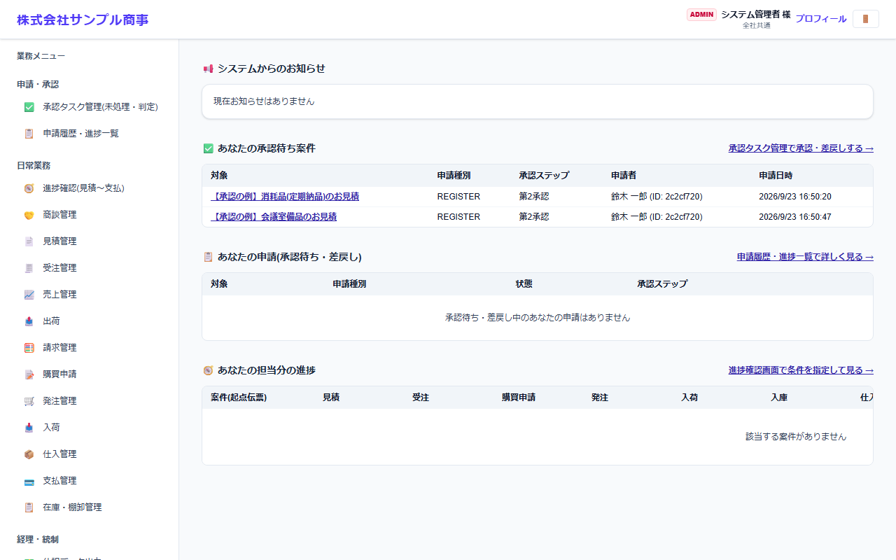
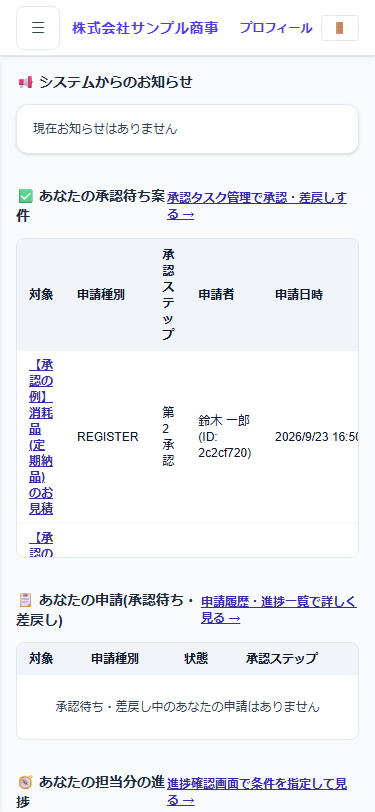
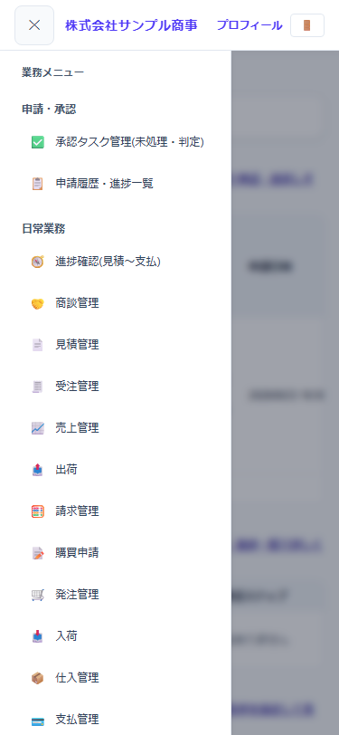
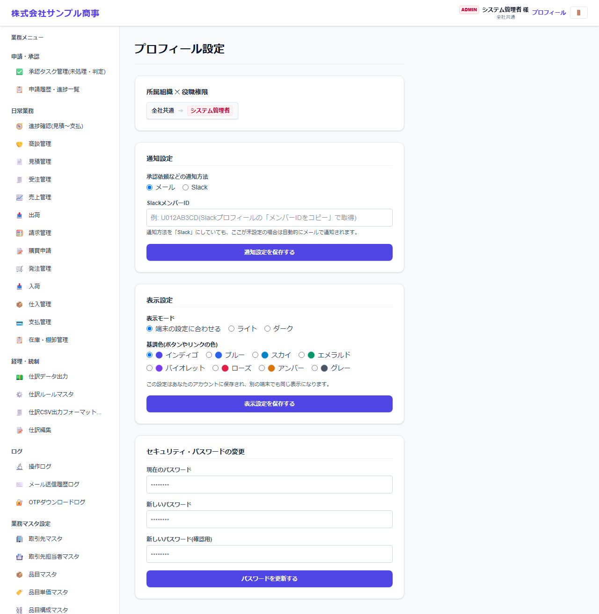

# 画面の見方(ダッシュボード・メニュー・プロフィール)

[マニュアルの一覧](../README.md) > はじめに > 画面の見方

## ダッシュボード

ログインすると、最初にダッシュボードが表示されます。

| 場所 | 内容 |
|---|---|
| 左上 | 会社名(会社・システム設定で登録した名前) |
| 右上 | ログイン中のユーザー名と所属、**プロフィール**(自分の設定)、**🚪 ログアウト** |
| 左側 | **業務メニュー**。使える画面だけが表示されます(ロールの権限で決まります) |
| システムからのお知らせ | 管理者が登録したお知らせ |
| あなたの承認待ち案件 | あなたが承認する番になっている申請。**承認タスク管理で承認・差戻しする →** から処理します |
| あなたの申請(承認待ち・差戻し) | あなたが出した申請のうち、承認待ち・差戻しのもの |
| あなたの担当分の進捗 | あなたが担当する案件の、見積から支払までの進み具合 |

## メニュー

左側のメニューは、業務の種類ごとにまとまっています。

| 見出し | 主な画面 |
|---|---|
| 申請・承認 | 承認タスク管理、申請履歴・進捗一覧 |
| 日常業務 | 進捗確認、商談・見積・受注・売上・出荷・請求、購買申請・発注・入荷・仕入・支払、在庫・棚卸 |
| 経理・統制 | 仕訳データ出力、仕訳ルール、仕訳 CSV の出力形式、仕訳編集 |
| ログ | 操作ログ、メール送信履歴、OTP ダウンロードログ(管理者) |
| 業務マスタ設定 | 取引先・品目・単位・勘定科目・倉庫・ロケーションなどのマスタ |
| 基本マスタ設定 | 会社・システム設定、ユーザー、権限、部署、ロール、承認フローなど(管理者) |

使えない画面は、メニューに表示されません。必要な画面が無い場合は、システム管理者に権限を依頼してください。

## スマートフォンで使う

スマートフォンでは、メニューは画面の左上の **☰** から開きます。

| ダッシュボード | メニューを開いたところ |
|---|---|
|  |  |

- メニューの画面を選ぶと、メニューは自動で閉じます。**✕** でも閉じられます。
- 倉庫での入荷・出荷では、スマートフォンのカメラで QR コード・バーコードを読み取れます(入荷・出荷のマニュアルを参照)。

## プロフィール(自分の設定)

画面右上の **プロフィール** から開きます。

| 項目 | 内容 |
|---|---|
| 所属組織 × 役職権限 | あなたの部署とロール(変更は管理者が行います) |
| 通知設定 | 承認依頼などの通知を、**メール**か **Slack** で受け取るかを選びます。Slack の場合は、Slack のメンバーIDを入力します(未入力ならメールで届きます) |
| 表示設定 | **表示モード**(端末の設定に合わせる・ライト・ダーク)と、**基調色**(ボタンやリンクの色)を選びます。別の端末でも同じ見た目になります |
| パスワードの変更 | 今のパスワードと新しいパスワードを入力して変更します |
