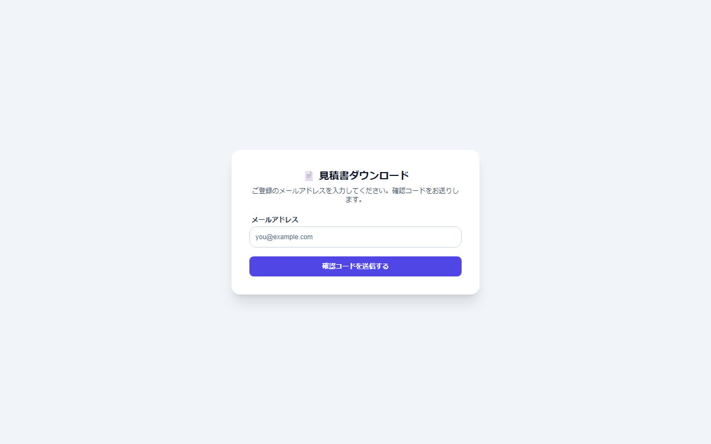

# 書類のダウンロード(取引先・外部倉庫の方向け)

[マニュアルの一覧](../README.md) > 取引先・外部倉庫の方向け > 書類のダウンロード(取引先・外部倉庫の方向け)

見積書・注文請書・納品書・請求書・発注書・検収書・出荷指示書・入荷指示書などを、メールで届いたリンクからダウンロードする方法です。**ログインは不要です**。

- **開き方**: 取引先・外部倉庫の方向け
- **対象**: 取引先・外部倉庫の方
- 一覧・検索・並び替え・CSV・承認の共通の操作は、[共通の操作](../basics/common-operations.md) を参照してください。

1. メールに書かれたリンクを開きます。
2. **確認コードを送信** を押すと、登録されたメールアドレスに確認コード(数字)が届きます。
3. 届いた確認コードを入力して、ダウンロードします。

- 確認コードには有効期限と、入力できる回数の上限があります。期限が切れた場合は、もう一度送信してください。
- リンクや確認コードは、他の人に転送しないでください。
