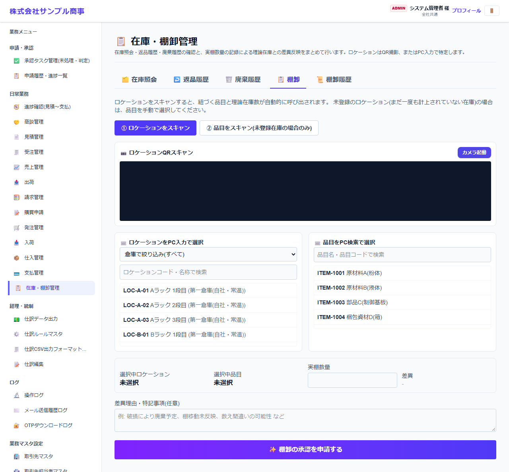
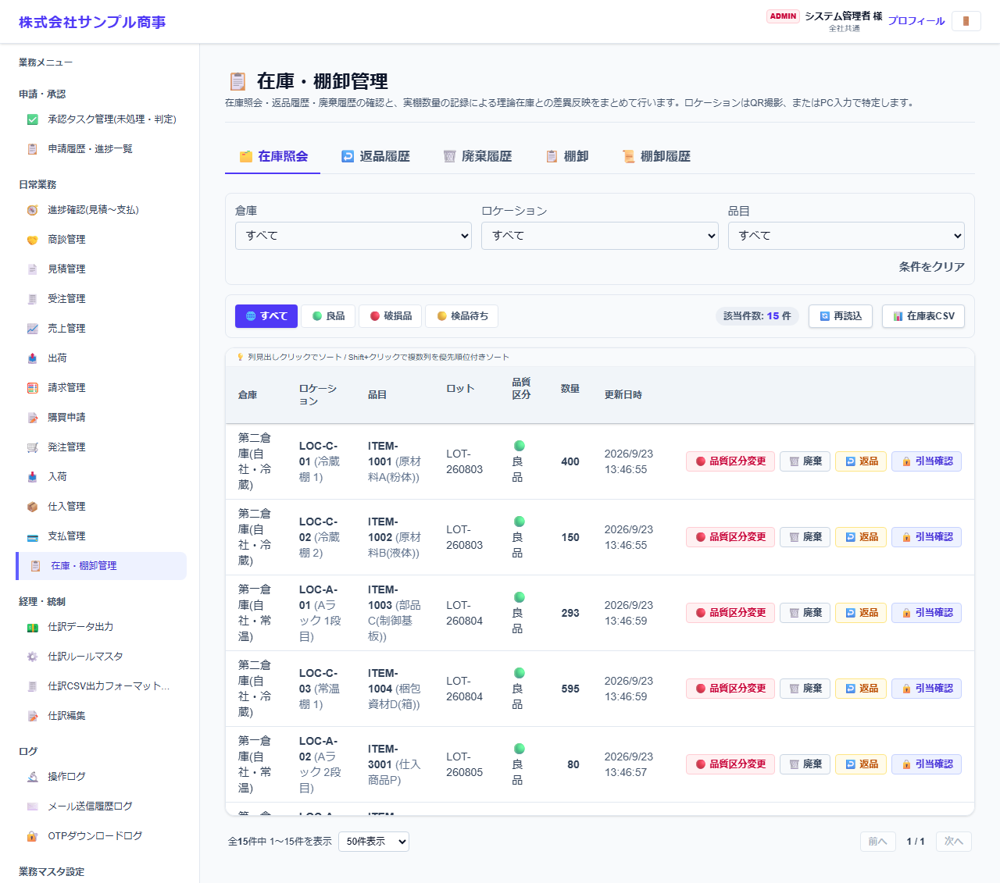
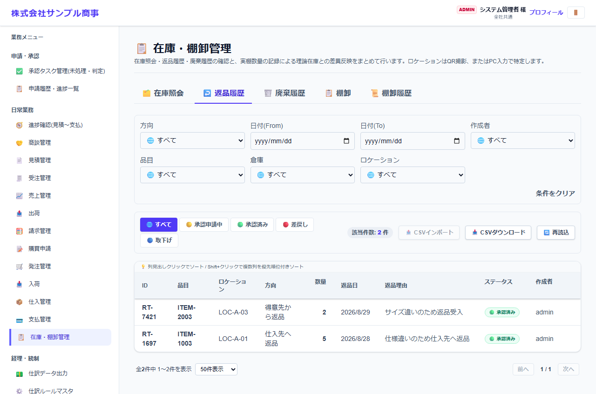
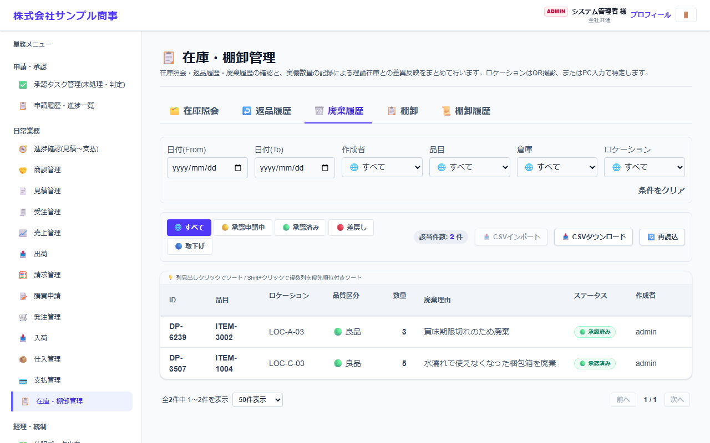
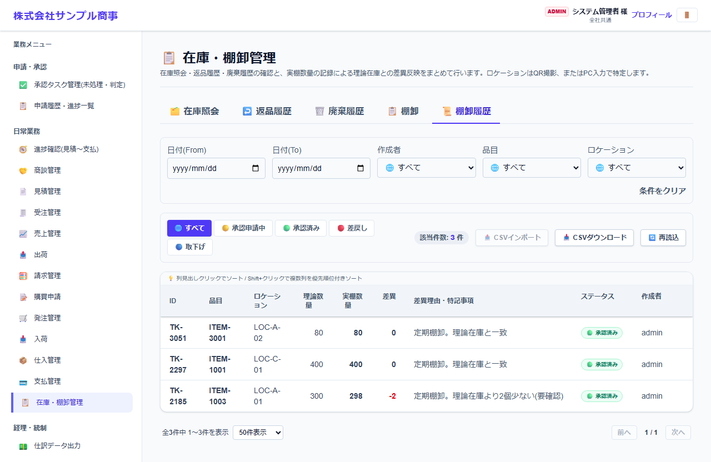

# 在庫・棚卸管理

[マニュアルの一覧](../README.md) > 日常業務 > 在庫・棚卸管理

在庫の照会と、棚卸(実際の数との差の調整)、品質区分の変更・廃棄・返品の記録を確認します。

- **開き方**: メニューの **日常業務** > **在庫・棚卸管理**
- **対象**: 全員
- 一覧・検索・並び替え・CSV・承認の共通の操作は、[共通の操作](../basics/common-operations.md) を参照してください。

画面の上のタブで作業を切り替えます。

## 棚卸

1. **① ロケーションをスキャン** で棚の QR コードを読み取ります(スマートフォンのカメラ、またはパソコンの一覧から選択)。
2. 品目を選ぶと、システム上の在庫数(理論在庫)が表示されます。まだ在庫が無い品目は **② 品目をスキャン** で選びます。
3. 実際に数えた数(**実棚数量**)を入力します。差があれば **差異** が表示されます。
4. 差異の理由(破損・棚移動の誤り・数え間違いの可能性など)を入力して、**棚卸確定** を押します。

## 在庫照会

品目・倉庫・ロケーション・ロット・品質区分(良品・破損品・検品待ち)ごとの在庫数を確認します。
在庫照会の画面から、品質区分の変更・廃棄・返品を登録できます(承認機能を使う場合は申請になります)。

## 履歴

| 返品履歴 | 廃棄履歴 | 棚卸履歴 |
|---|---|---|
|  |  |  |

- **返品**: 仕入先へ返品(在庫が減る)・得意先から返品(在庫が増える)の両方を記録します。
- **廃棄**: 在庫を最終的に処分します。
