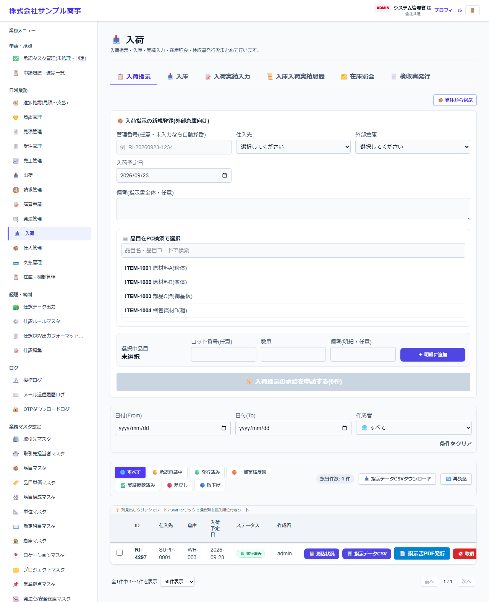
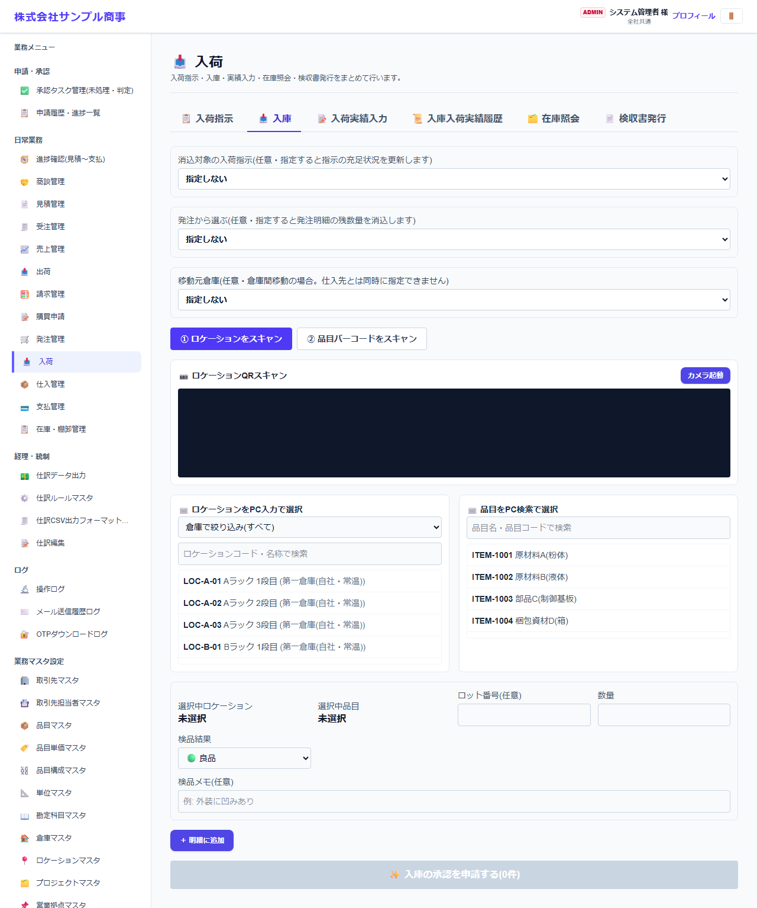
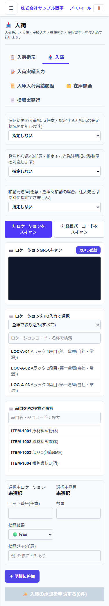
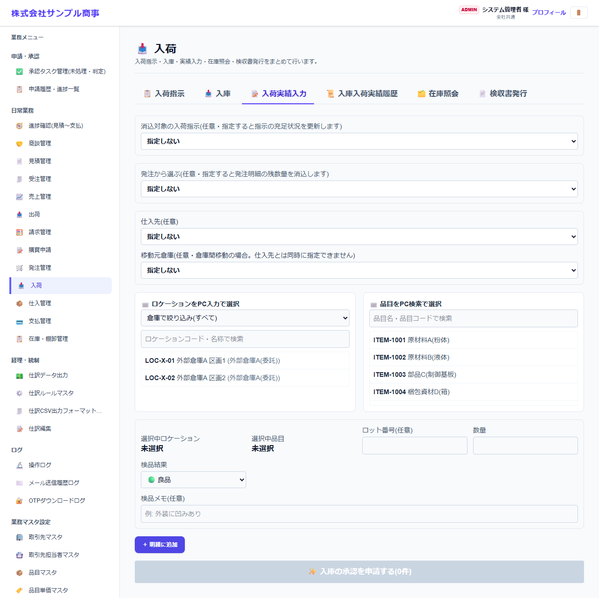
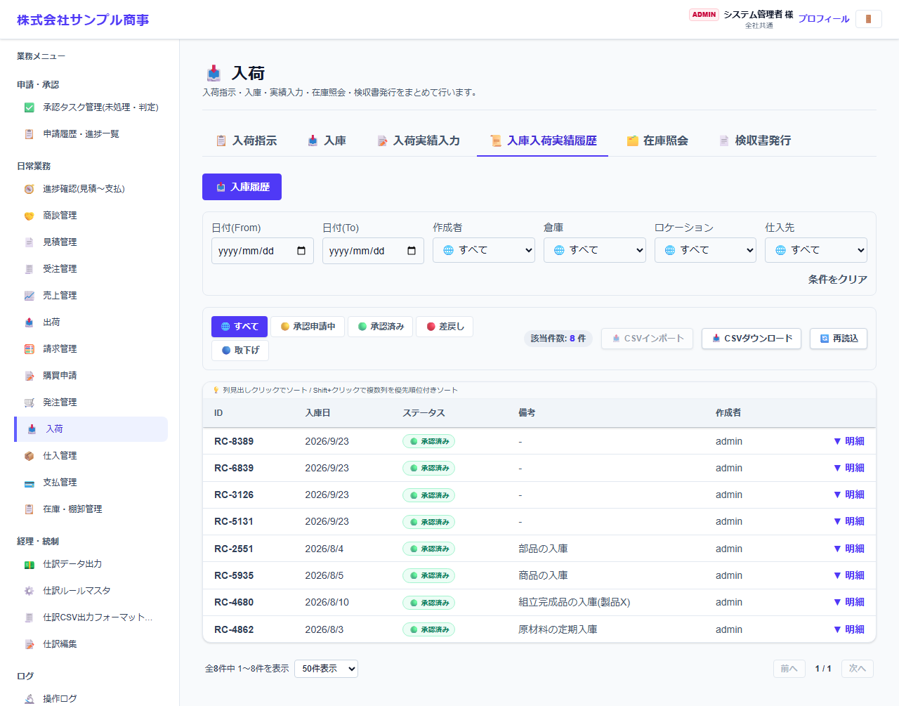
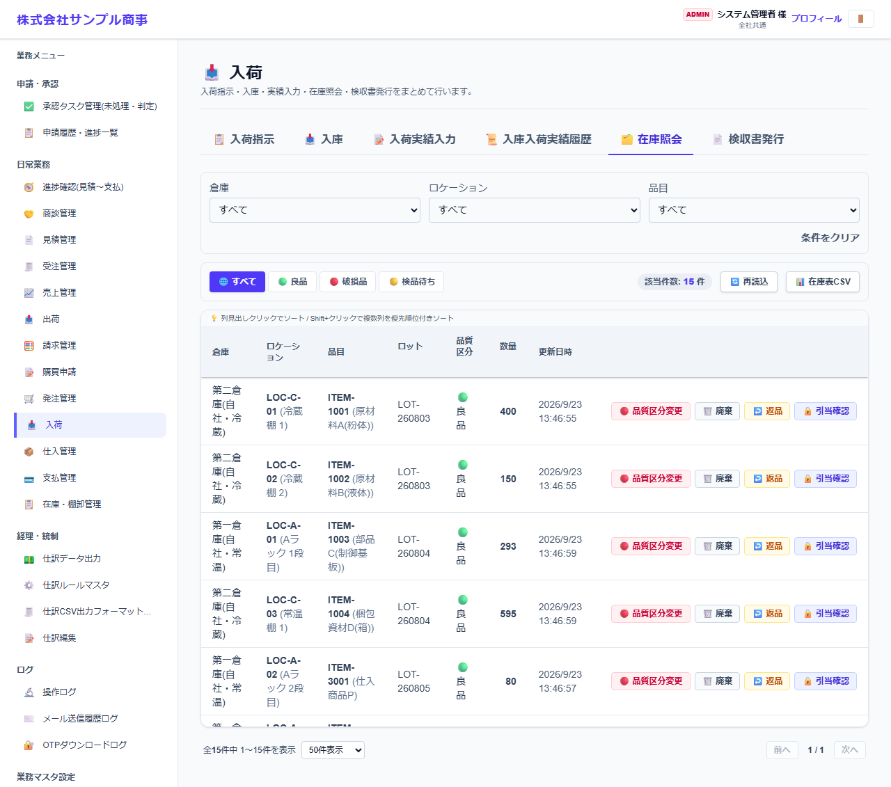
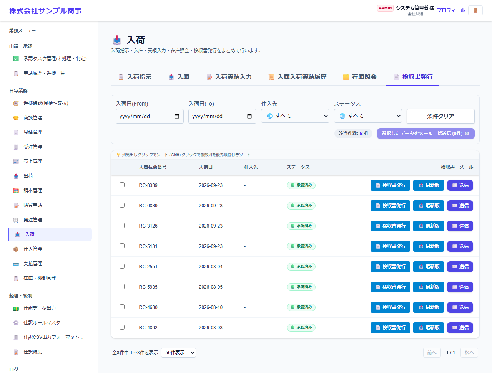

# 入荷

[マニュアルの一覧](../README.md) > 日常業務 > 入荷

仕入先からの入荷を受け付けて、在庫に入れます(入庫)。外部倉庫を使う場合は、入荷指示書を送り、実績を入力します。検収書の発行もここで行います。

- **開き方**: メニューの **日常業務** > **入荷**
- **対象**: 全員
- 一覧・検索・並び替え・CSV・承認の共通の操作は、[共通の操作](../basics/common-operations.md) を参照してください。

画面の上のタブで作業を切り替えます。

| タブ | 内容 |
|---|---|
| 入荷指示 | 外部倉庫へ、入荷の予定(仕入先・品目・数量・予定日)を指示します |
| 入庫 | 自社倉庫で、届いた品目を在庫に入れます(スマートフォンのスキャン可) |
| 入荷実績入力 | 外部倉庫から届いた入荷の実績を入力します |
| 入庫入荷実績履歴 | これまでの入庫・入荷の記録。差戻しの修正・再申請もここから行います |
| 在庫照会 | 今の在庫 |
| 検収書発行 | 入庫の記録から、仕入先に送る検収書を発行します |

## 入荷指示(外部倉庫向け)

1. 仕入先・外部倉庫・入荷予定日を選びます。**発注から選ぶ** で、発注の明細を引き継げます。
2. **品目をPC検索で選択** で品目を選び、ロット番号・数量を入れて **明細に追加** を押します。
3. **入荷指示を発行** を押します。外部倉庫の担当者に、入荷指示書(PDF)をメールで送れます。

## 入庫(自社倉庫)

1. 入れる場所(ロケーション)と品目を選びます。
   - **スマートフォン**: **① ロケーションQRをスキャン** → **カメラ起動** で、棚に貼った QR コードを読み取ります。続けて **② 品目バーコードをスキャン** で品目のバーコードを読み取ります。読み取った結果は、カメラの映像のすぐ下に表示されます。
   - **パソコン**: **ロケーションをPC入力で選択**・**品目をPC検索で選択** から選びます。
2. ロット番号・数量・検品結果(良品・破損・検品待ち)を入れて、明細に追加します。
3. 仕入先、または **移動元倉庫**(倉庫間の移動の場合)を選びます。**発注から選ぶ** で発注と紐づけられます。
4. 確定します(承認機能を使う場合は申請になります)。

| スマートフォンでの入庫 |
|---|
|  |

- カメラで読み取れない時は、パソコンと同じく一覧から選べます。

## 入荷実績入力(外部倉庫)

外部倉庫から届いた実績(品目・数量)を入力します。対象の入荷指示を選ぶと、指示の残りの数量が消し込まれます。

## 入庫入荷実績履歴・在庫照会・検収書発行

| 入庫入荷実績履歴 | 在庫照会 |
|---|---|
|  |  |

- **入庫入荷実績履歴**: 日付・作成者・倉庫・ロケーション・仕入先・状態で絞り込みます。行を開くと明細が表示され、差し戻された記録は **修正して再申請** できます。倉庫間の移動には **🔁 倉庫間移動** の印が付きます。
- **在庫照会**: 品目・倉庫・ロケーション・ロット・品質区分ごとの在庫数を確認します。

- **検収書発行**: 承認済みの入庫から検収書(PDF)を作り、仕入先に送ります。
