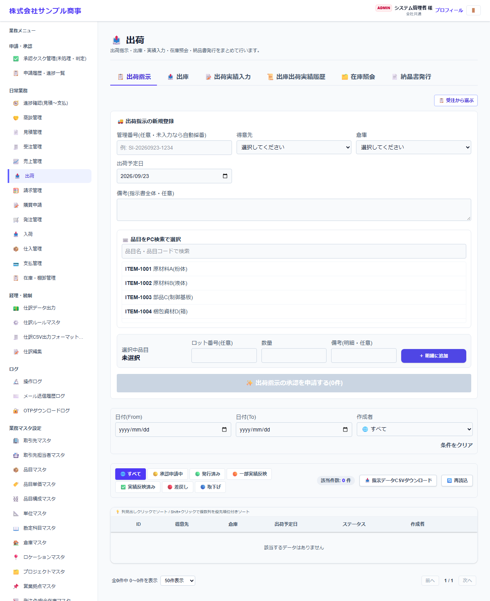
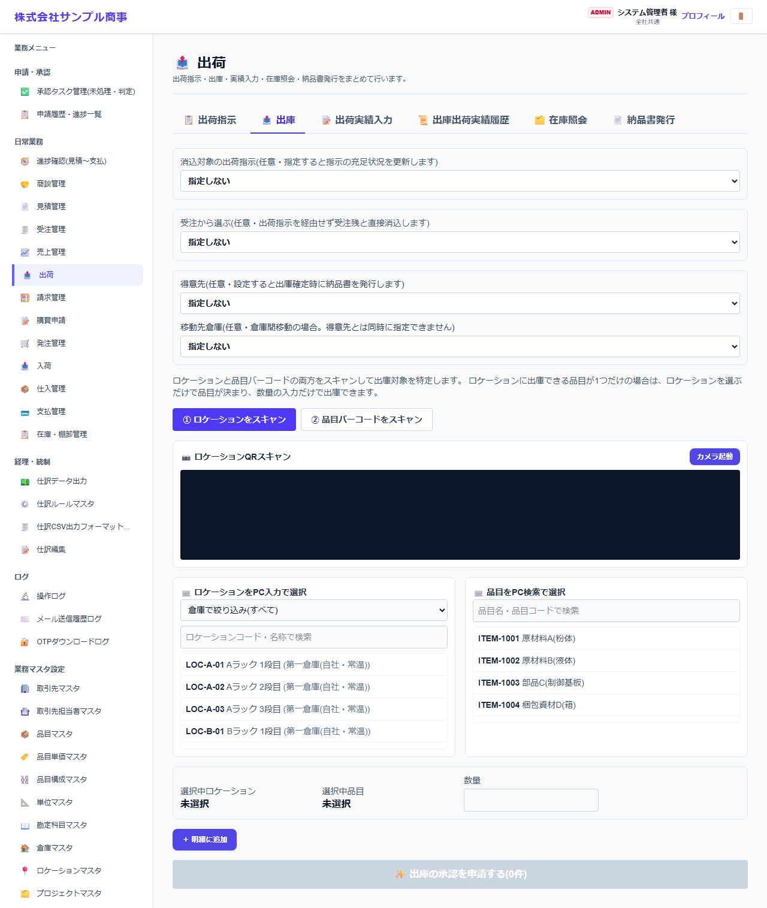
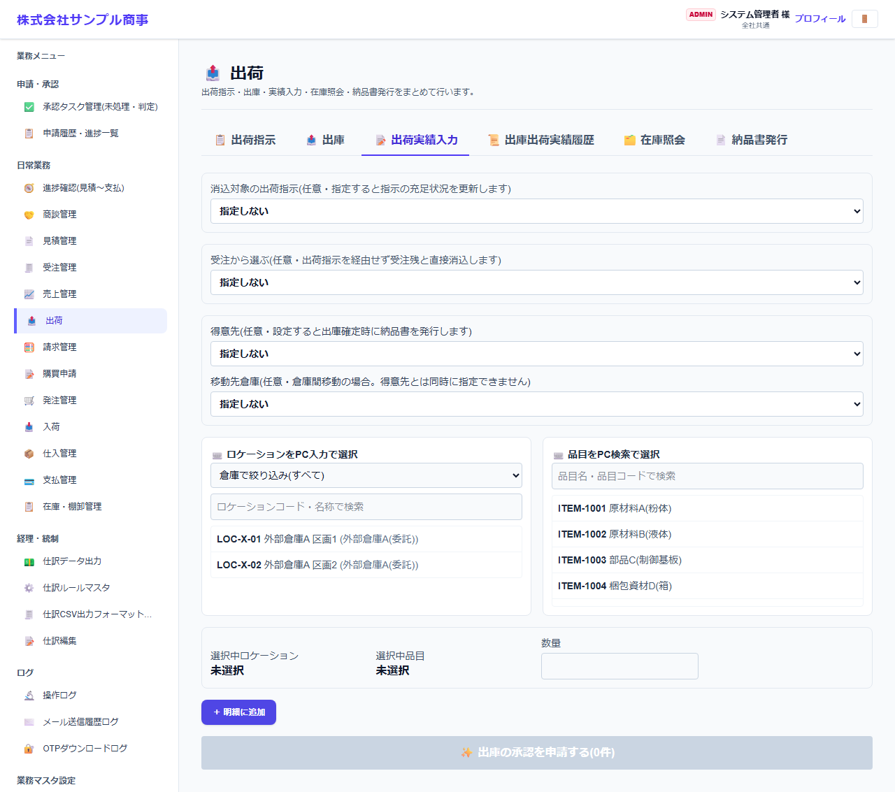
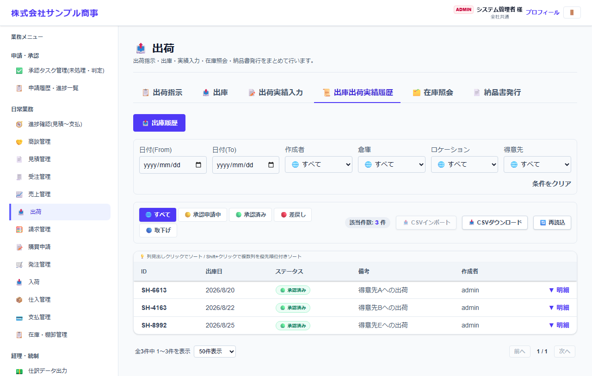
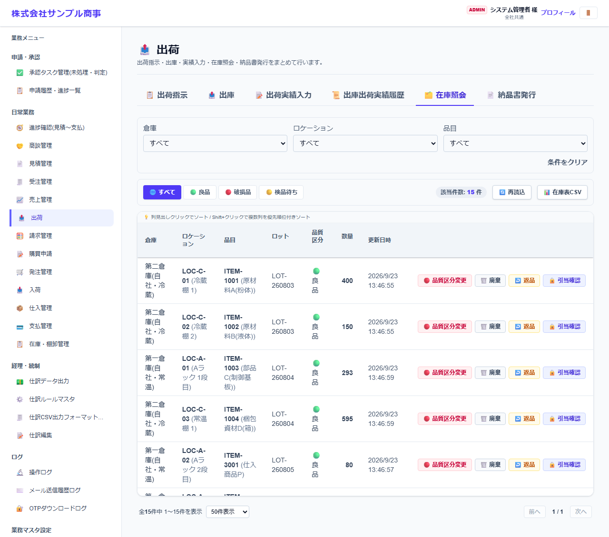
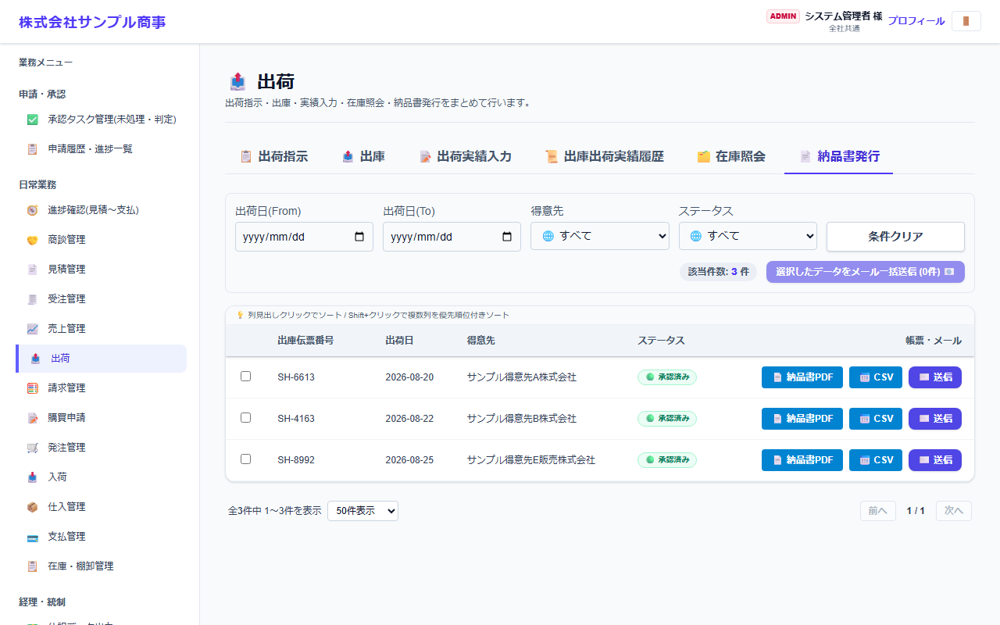

# 出荷

[マニュアルの一覧](../README.md) > 日常業務 > 出荷

得意先への出荷のために、在庫から出します(出庫)。外部倉庫を使う場合は、出荷指示書を送り、実績を入力します。納品書の発行もここで行います。

- **開き方**: メニューの **日常業務** > **出荷**
- **対象**: 全員
- 一覧・検索・並び替え・CSV・承認の共通の操作は、[共通の操作](../basics/common-operations.md) を参照してください。

画面の上のタブで作業を切り替えます。入荷の画面と同じ作りです([入荷](receiving.md) も参照してください)。

| タブ | 内容 |
|---|---|
| 出荷指示 | 外部倉庫へ、出荷の予定(得意先・品目・数量・予定日)を指示します。**受注から選ぶ** で受注を引き継げます |
| 出庫 | 自社倉庫で、在庫から出します(スマートフォンのスキャン可) |
| 出荷実績入力 | 外部倉庫からの出荷の実績を入力します |
| 出庫出荷実績履歴 | これまでの出庫・出荷の記録。差戻しの修正・再申請もここから行います |
| 在庫照会 | 今の在庫 |
| 納品書発行 | 出庫の記録から、得意先に送る納品書を発行します |

## 出荷指示(外部倉庫向け)

得意先・外部倉庫・出荷予定日を選び、品目・ロット・数量を明細に追加して **出荷指示を発行** します。外部倉庫の担当者に、出荷指示書(PDF)をメールで送れます。

## 出庫(自社倉庫)

1. 出す場所(ロケーション)と品目を、スキャンまたはパソコンの一覧で選びます(入庫と同じ操作です)。
2. ロット・品質区分・数量を入れて、明細に追加します。
3. 得意先、または **移動先倉庫**(倉庫間の移動の場合)を選びます。得意先を選ぶと、出庫の確定時に納品書と納品予定データが作られます。
4. 確定します(承認機能を使う場合は申請になります)。

## 出荷実績入力・履歴・在庫照会・納品書発行

| 出荷実績入力 | 出庫出荷実績履歴 |
|---|---|
|  |  |

| 在庫照会 |
|---|
|  |

- **納品書発行**: 出庫から作られた納品書(PDF)を確認し、得意先にメールで送ります。
