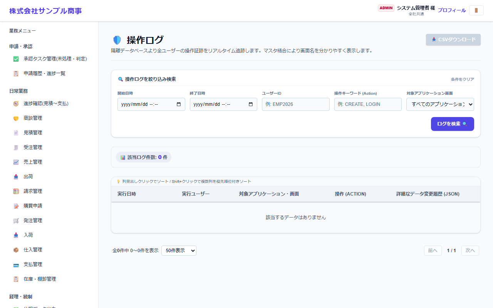

# 操作ログ

[マニュアルの一覧](../README.md) > ログ > 操作ログ

誰が・いつ・どの画面で・どんな操作をしたか(登録・変更・削除・ログインなど)の記録を確認します。記録するかどうかは、会社・システム設定で切り替えます。

- **開き方**: メニューの **ログ** > **操作ログ**
- **対象**: 管理者
- 一覧・検索・並び替え・CSV・承認の共通の操作は、[共通の操作](../basics/common-operations.md) を参照してください。

1. 開始日時・終了日時・ユーザーID・操作キーワード(例: `CREATE`・`LOGIN`)・対象の画面で絞り込みます。
2. **ログを検索** を押します。

- **詳細(データ変更履歴)** に、変更前と変更後の値(JSON)が表示されます。
- **CSVダウンロード** で保存できます。
