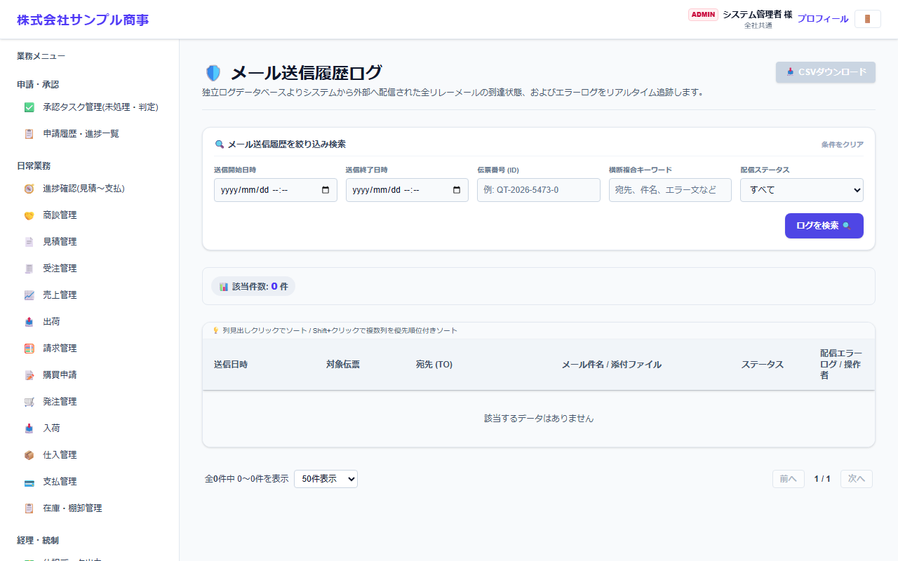

# メール送信履歴ログ

[マニュアルの一覧](../README.md) > ログ > メール送信履歴ログ

システムから送ったメール(帳票・承認の通知など)の送信状況と、エラーを確認します。

- **開き方**: メニューの **ログ** > **メール送信履歴ログ**
- **対象**: 管理者
- 一覧・検索・並び替え・CSV・承認の共通の操作は、[共通の操作](../basics/common-operations.md) を参照してください。

送信日時・伝票番号・キーワード(宛先・件名・エラー文)・配信ステータスで絞り込み、**ログを検索** を押します。

- メールは送信待ちの一覧に入れた後、1分ごとにまとめて送ります。送信に失敗したメールは、時間をおいて再送します。
- 届かない場合は、エラーの内容と、会社・システム設定の SMTP の設定を確認してください。
