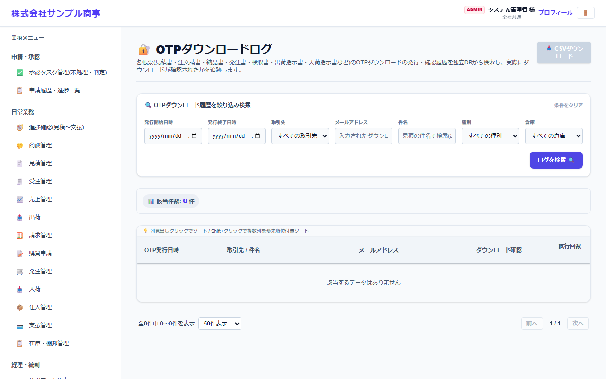

# OTPダウンロードログ

[マニュアルの一覧](../README.md) > ログ > OTPダウンロードログ

取引先・外部倉庫の方が、確認コード(OTP)を使って書類(見積書・注文請書・納品書・請求書・発注書・検収書・出荷指示書・入荷指示書など)をダウンロードした記録を確認します。

- **開き方**: メニューの **ログ** > **OTPダウンロードログ**
- **対象**: 管理者
- 一覧・検索・並び替え・CSV・承認の共通の操作は、[共通の操作](../basics/common-operations.md) を参照してください。

発行日時・取引先・メールアドレス・件名・種別・倉庫で絞り込み、**ログを検索** を押します。
確認コードの発行日時・送り先・ダウンロードの確認・試行回数が表示されます。
