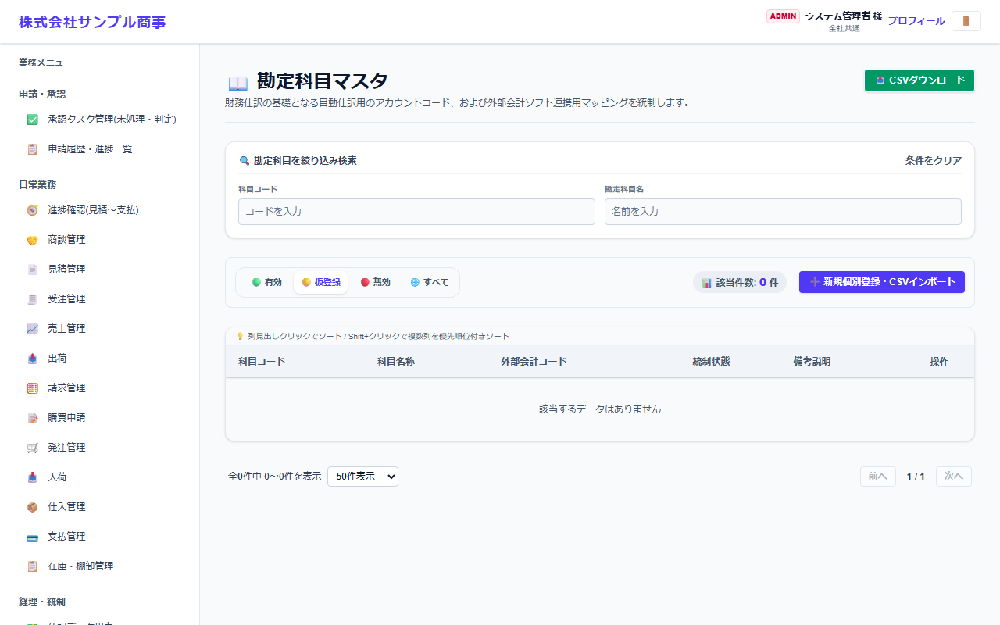
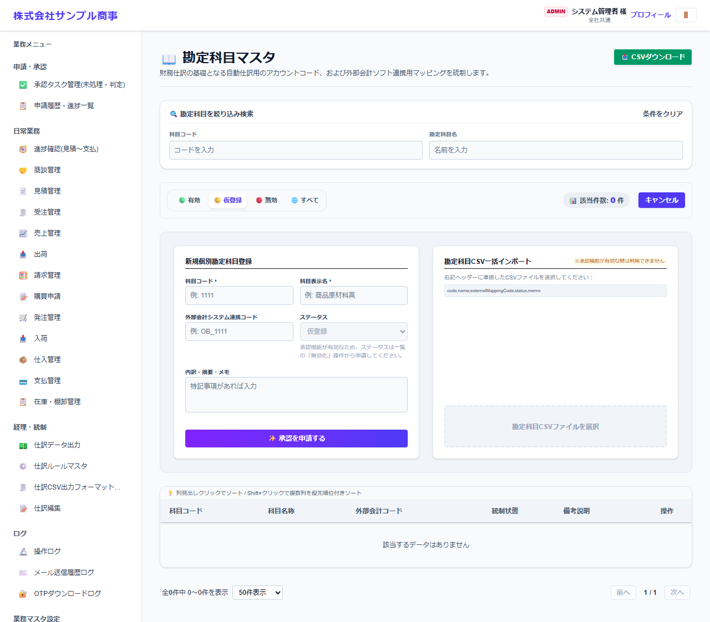

# 勘定科目マスタ

[マニュアルの一覧](../README.md) > 業務マスタ設定 > 勘定科目マスタ

仕訳・購買などで使う勘定科目を登録します。

- **開き方**: メニューの **業務マスタ設定** > **勘定科目マスタ**
- 一覧・検索・登録・CSV の共通の操作は、[共通の操作](../basics/common-operations.md) を参照してください。

## 一覧



科目コード・科目名称・外部会計コード(会計ソフト側のコード)が表示されます。

## 登録する

**➕ 新規個別登録・CSVインポート**(画面によっては **➕ 新規…**)を押すと、登録の欄が開きます。



| 項目 | 説明 |
|---|---|
| 科目コード *・科目表示名 * |  |
| 外部会計システム連携コード | 仕訳データを会計ソフトに取り込む時の、会計ソフト側の科目コード |
| ステータス | 新しく登録した科目は、承認されるまで仮登録です |
| 内訳・摘要・メモ |  |

`*` の付いた項目は必須です。

## CSV で一括登録する

CSV の1行目(見出し)は、次の形にします。

```text
"code","name","externalMappingCode","status","memo"
```

見本: [`sampledata/accounts_import_sample.csv`](../../../sampledata/accounts_import_sample.csv)

## 補足

- 仕訳の作り方(どの取引でどの科目を使うか)は、経理・統制の **仕訳ルールマスタ** で設定します。
