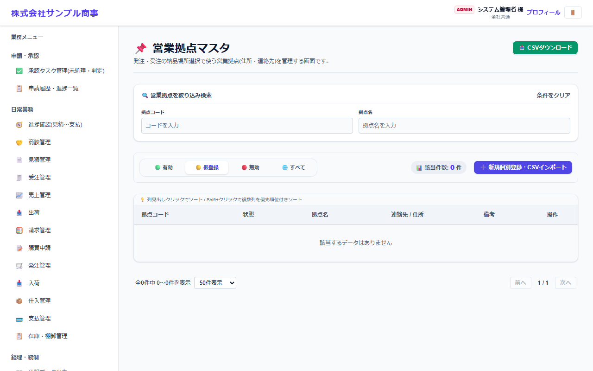
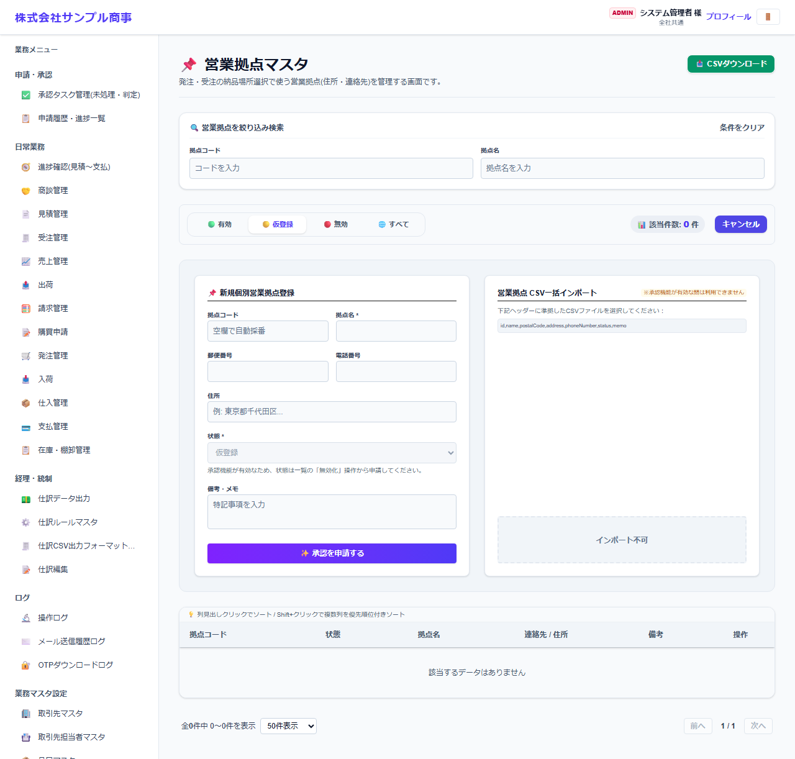

# 営業拠点マスタ

[マニュアルの一覧](../README.md) > 業務マスタ設定 > 営業拠点マスタ

自社の営業拠点(本社・支店・営業所など)を登録します。発注の納品場所として選べます。

- **開き方**: メニューの **業務マスタ設定** > **営業拠点マスタ**
- 一覧・検索・登録・CSV の共通の操作は、[共通の操作](../basics/common-operations.md) を参照してください。

## 一覧

拠点コード・状態・拠点名などが表示されます。

## 登録する

**➕ 新規個別登録・CSVインポート**(画面によっては **➕ 新規…**)を押すと、登録の欄が開きます。

| 項目 | 説明 |
|---|---|
| 拠点コード | 空欄にすると自動で番号を付けます |
| 拠点名 * |  |
| 郵便番号・電話番号・住所 | 発注書の納品場所に印字されます |
| 状態 * |  |
| 備考・メモ |  |

`*` の付いた項目は必須です。

## 補足

- 倉庫を納品場所にする場合は、発注の画面で倉庫を選びます(倉庫マスタに登録した倉庫)。
