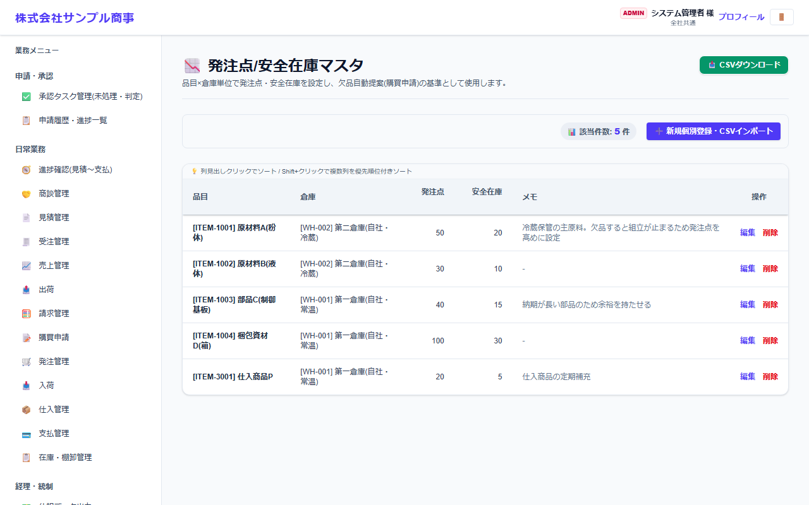
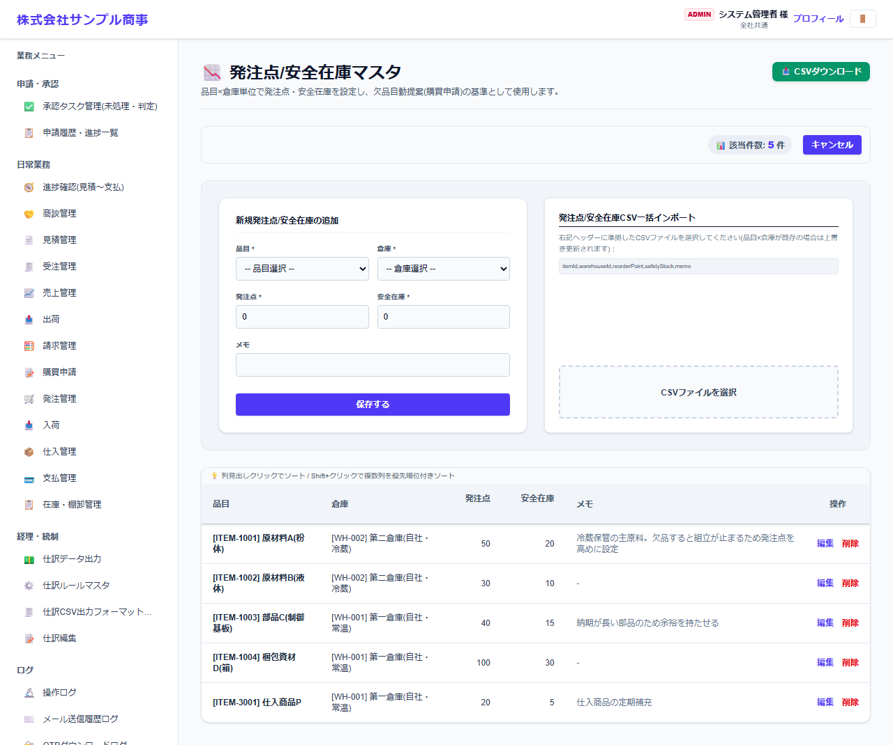

# 発注点/安全在庫マスタ

[マニュアルの一覧](../README.md) > 業務マスタ設定 > 発注点/安全在庫マスタ

品目 × 倉庫ごとに、発注点(この数を下回ったら発注する)と安全在庫(最低限持っておく数)を登録します。在庫が足りなくなる品目の自動提案に使います。

- **開き方**: メニューの **業務マスタ設定** > **発注点/安全在庫マスタ**
- 一覧・検索・登録・CSV の共通の操作は、[共通の操作](../basics/common-operations.md) を参照してください。

## 一覧



品目・倉庫・発注点・安全在庫が表示されます。

## 登録する

**➕ 新規個別登録・CSVインポート**(画面によっては **➕ 新規…**)を押すと、登録の欄が開きます。



| 項目 | 説明 |
|---|---|
| 品目 *・倉庫 * |  |
| 発注点 * | 在庫がこの数を下回ったら、発注の候補として提案します |
| 安全在庫 * |  |
| メモ |  |

`*` の付いた項目は必須です。

## CSV で一括登録する

CSV の1行目(見出し)は、次の形にします。

```text
"itemId","warehouseId","reorderPoint","safetyStock","memo"
```

見本: [`sampledata/item_reorder_settings_import_sample.csv`](../../../sampledata/item_reorder_settings_import_sample.csv)
