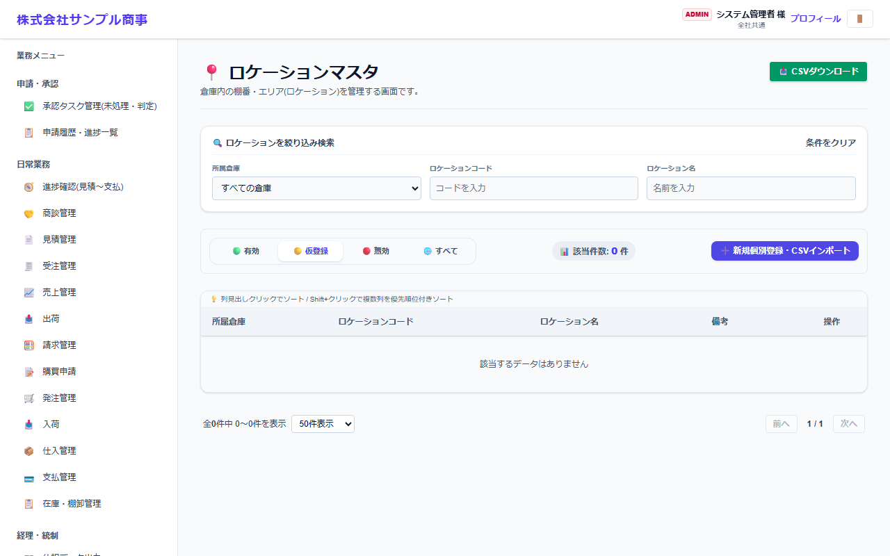
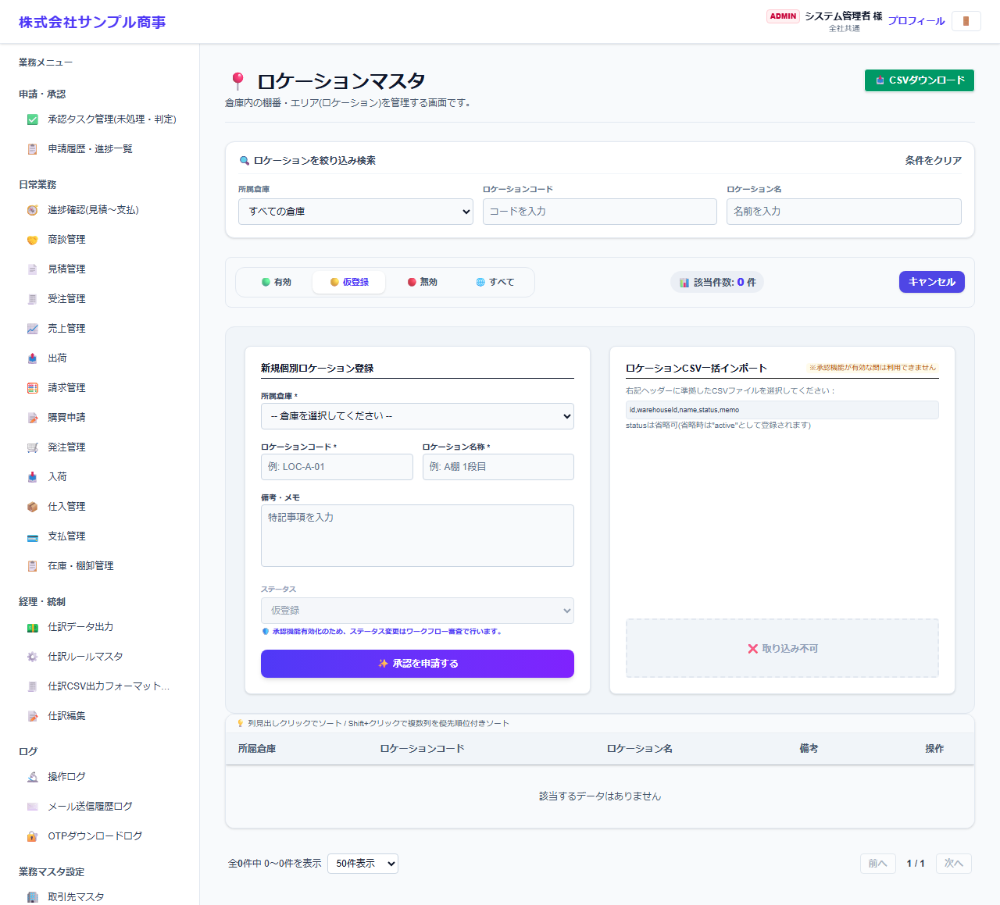

# ロケーションマスタ

[マニュアルの一覧](../README.md) > 業務マスタ設定 > ロケーションマスタ

倉庫の中の保管場所(棚・区画)を登録します。入庫・出庫は、このロケーション単位で行います。

- **開き方**: メニューの **業務マスタ設定** > **ロケーションマスタ**
- 一覧・検索・登録・CSV の共通の操作は、[共通の操作](../basics/common-operations.md) を参照してください。

## 一覧



所属倉庫・ロケーションコード・ロケーション名が表示されます。上の検索欄で倉庫を選ぶと、その倉庫のロケーションだけを表示します。

## 登録する

**➕ 新規個別登録・CSVインポート**(画面によっては **➕ 新規…**)を押すと、登録の欄が開きます。



| 項目 | 説明 |
|---|---|
| 所属倉庫 * |  |
| ロケーションコード *・ロケーション名称 * | 例: LOC-A-01、A棚1段目 |
| 備考・メモ・ステータス |  |

`*` の付いた項目は必須です。

## CSV で一括登録する

CSV の1行目(見出し)は、次の形にします。

```text
"id","warehouseId","name","status","memo"
```

見本: [`sampledata/locations_import_sample.csv`](../../../sampledata/locations_import_sample.csv)

## 補足

- 一覧から、ロケーションに貼る QR コードのラベルを印刷できます。入荷・出荷の画面で、スマートフォンのカメラで読み取ってロケーションを選べます。
