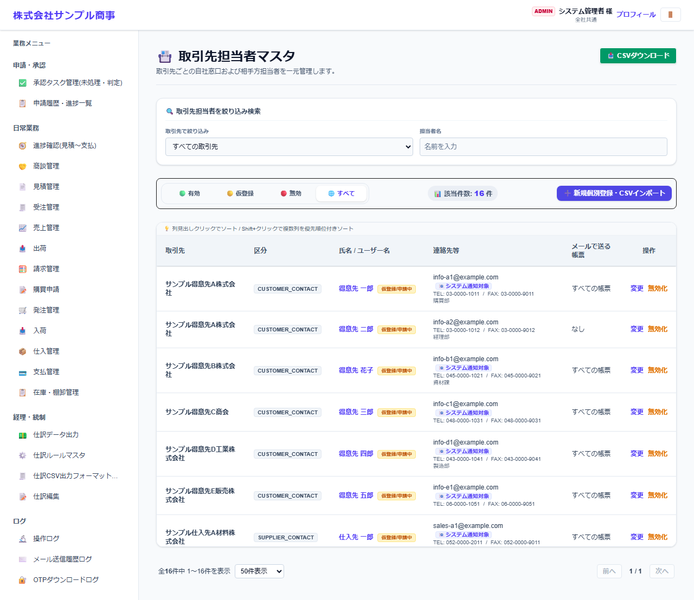
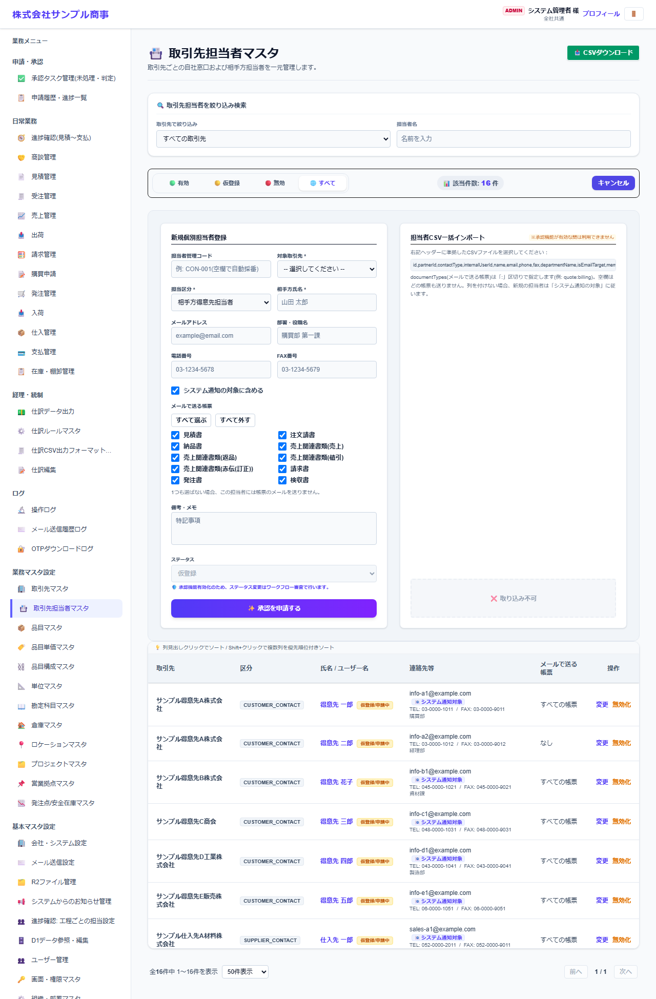

# 取引先担当者マスタ

[マニュアルの一覧](../README.md) > 業務マスタ設定 > 取引先担当者マスタ

取引先の担当者と連絡先を登録します。見積書・注文請書・請求書などをメールで送る時の宛先になります。

- **開き方**: メニューの **業務マスタ設定** > **取引先担当者マスタ**
- 一覧・検索・登録・CSV の共通の操作は、[共通の操作](../basics/common-operations.md) を参照してください。

## 一覧



取引先・区分・氏名などが表示されます。上の検索欄で取引先を選ぶと、その取引先の担当者だけを表示します。

## 登録する

**➕ 新規個別登録・CSVインポート**(画面によっては **➕ 新規…**)を押すと、登録の欄が開きます。



| 項目 | 説明 |
|---|---|
| 担当者管理コード | 空欄にすると自動で番号を付けます |
| 対象取引先 * | 担当者が所属する取引先 |
| 担当区分 * | 相手方得意先担当者・相手方仕入先担当者・自社営業側担当者・自社購買側担当者。自社の担当者の場合は、ユーザーを選びます |
| 相手方氏名 * |  |
| メールアドレス・部署/役職名・電話番号・FAX番号 |  |
| システム通知の対象に含める | オンにすると、帳票のメールの送り先になります |
| メールで送る帳票 | この担当者に送る帳票を選びます(見積書・注文請書・納品書・請求書・発注書・検収書など)。1つも選ばない場合、この担当者には帳票のメールを送りません |
| 備考・メモ・ステータス |  |

`*` の付いた項目は必須です。

## CSV で一括登録する

CSV の1行目(見出し)は、次の形にします。

```text
"id","partnerId","contactType","internalUserId","name","email","phone","fax","departmentName","isEmailTarget","memo"
```

見本: [`sampledata/partner_contacts_import_sample.csv`](../../../sampledata/partner_contacts_import_sample.csv)

## 補足

- CSV で取り込んだ新しい担当者は、画面で登録した時と同じ状態(承認機能が無効なら有効)になります。登録済みの担当者の状態は、取り込んでも変わりません。
