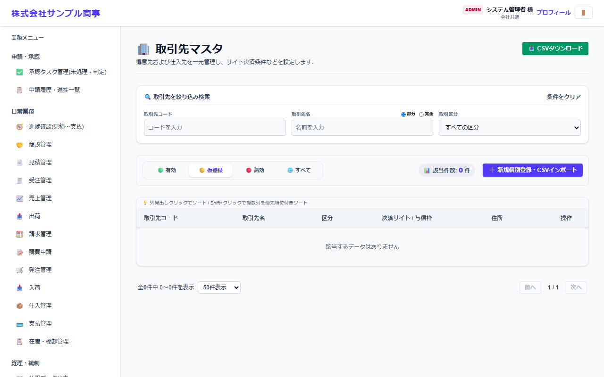
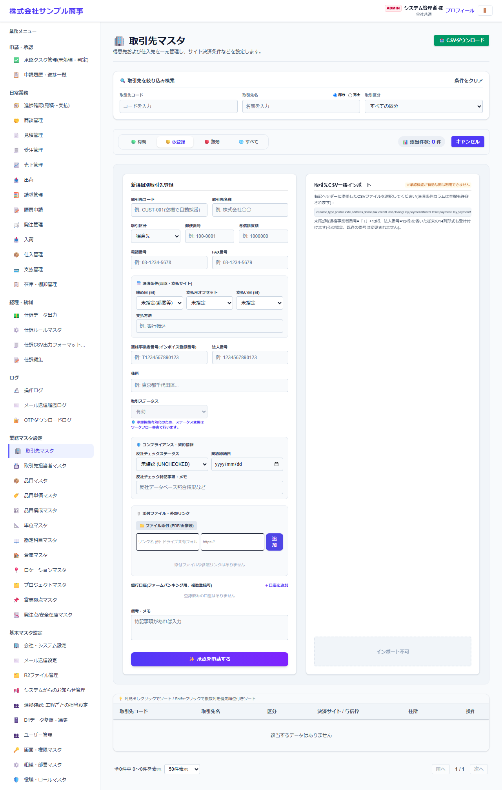

# 取引先マスタ

[マニュアルの一覧](../README.md) > 業務マスタ設定 > 取引先マスタ

得意先(売り先)・仕入先(買い先)・見込み客を登録します。締め日・支払条件・与信限度額など、請求や支払に使う条件もここで設定します。

- **開き方**: メニューの **業務マスタ設定** > **取引先マスタ**
- 一覧・検索・登録・CSV の共通の操作は、[共通の操作](../basics/common-operations.md) を参照してください。

## 一覧



取引先コード・取引先名・区分・決済サイト(締め日と支払日)・与信枠・住所が表示されます。**地図で見る**で住所の地図を開けます。操作列の **納品先** から、取引先ごとの納品先(受注で選ぶ届け先)を登録できます。

## 登録する

**➕ 新規個別登録・CSVインポート**(画面によっては **➕ 新規…**)を押すと、登録の欄が開きます。



| 項目 | 説明 |
|---|---|
| 取引先コード | 空欄にすると自動で番号を付けます(例: CUST-0001) |
| 取引先名称 * | 会社名など |
| 取引区分 | 得意先・仕入先・得意先と仕入先の両方・見込み客 |
| 郵便番号・住所・電話番号・FAX番号 | 帳票の宛先などに使います |
| 与信限度額 | この金額を超える受注をする時に、警告を出します |
| 決済条件(締め日・支払月オフセット・支払日・支払方法) | 例: 31日締め・翌月・31日払い。請求・支払の予定日の計算に使います |
| 適格事業者番号(インボイス登録番号)・法人番号 | T+13桁、13桁 |
| 取引ステータス | 有効・無効など |
| コンプライアンス・契約情報 | 反社会的勢力のチェックの状況・契約締結日・特記事項 |
| 添付ファイル・外部リンク | 契約書などのファイルや、共有フォルダのリンク |
| 銀行口座(ファームバンキング用) | 支払の振込先。**+口座を追加** で複数登録できます(全銀形式の振込ファイルに使います) |
| 備考・メモ |  |

`*` の付いた項目は必須です。

## CSV で一括登録する

CSV の1行目(見出し)は、次の形にします。

```text
"id","name","type","postalCode","address","phone","fax","creditLimit","closingDay","paymentMonthOffset","paymentDay","paymentMethod","status","memo","qualifiedInvoiceNumber","corporateNumber"
```

見本: [`sampledata/partners_import_sample.csv`](../../../sampledata/partners_import_sample.csv)

## 補足

- 取引先を無効にしても、過去の伝票には名前がそのまま表示されます。
- 見込み客は、商談・見積で使えます。受注するようになったら、区分を得意先に変更します。
