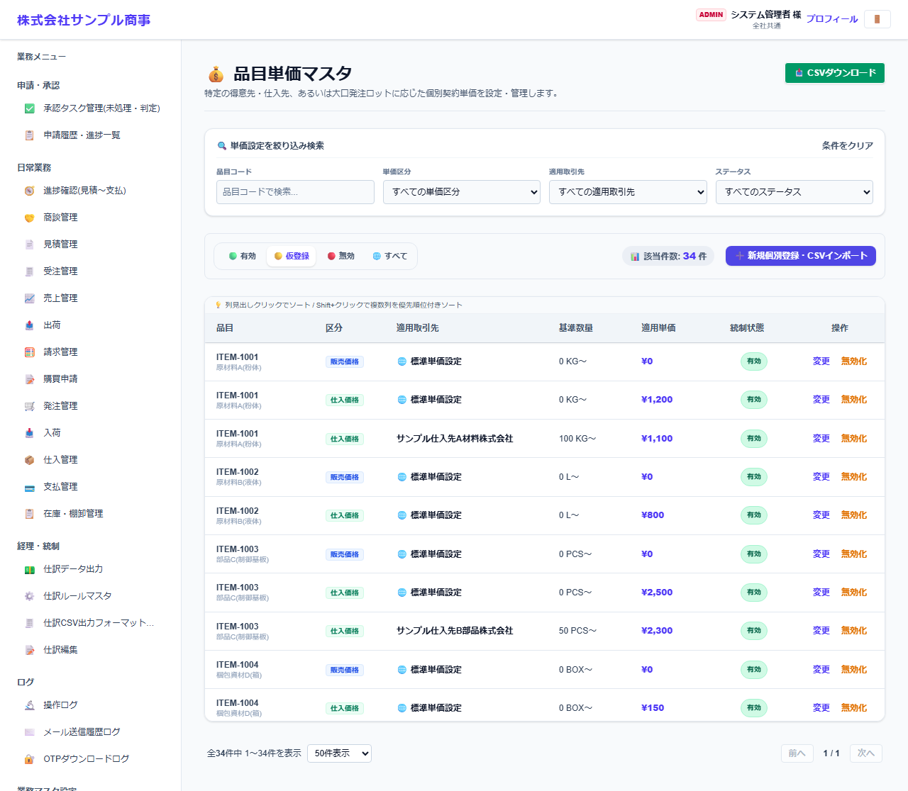
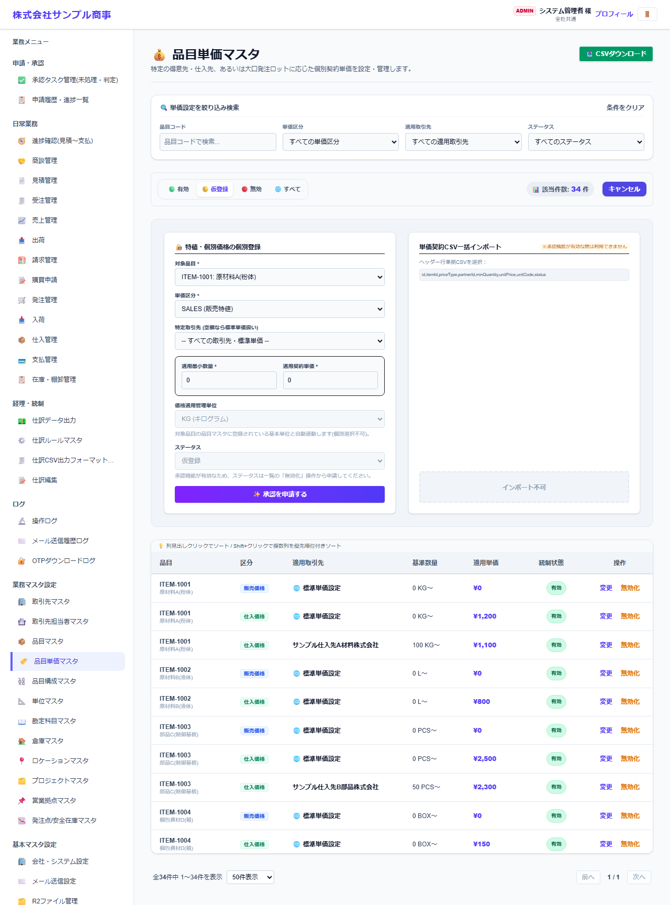

# 品目単価マスタ

[マニュアルの一覧](../README.md) > 業務マスタ設定 > 品目単価マスタ

品目ごとの特別な単価(特価・取引先別の単価・数量による単価)を登録します。登録が無い場合は、品目マスタの標準単価を使います。

- **開き方**: メニューの **業務マスタ設定** > **品目単価マスタ**
- 一覧・検索・登録・CSV の共通の操作は、[共通の操作](../basics/common-operations.md) を参照してください。

## 一覧



品目・区分(販売価格・仕入価格)・適用する取引先・単価などが表示されます。

## 登録する

**➕ 新規個別登録・CSVインポート**(画面によっては **➕ 新規…**)を押すと、登録の欄が開きます。



| 項目 | 説明 |
|---|---|
| 対象品目 * |  |
| 単価区分 * | SALES(販売価格)・PURCHASE(仕入価格) |
| 特定取引先 | 空欄なら、すべての取引先に使う標準単価になります |
| 適用最小数量 *・適用契約単価 * | この数量以上の時に、この単価を使います |
| 価格適用管理単位 | 品目マスタの基本単位が自動で入ります(変更不可) |
| ステータス |  |

`*` の付いた項目は必須です。

## CSV で一括登録する

CSV の1行目(見出し)は、次の形にします。

```text
"id","itemId","priceType","customerId","minQuantity","unitPrice","unitCode","status"
```

見本: [`sampledata/product_prices_import_sample.csv`](../../../sampledata/product_prices_import_sample.csv)
