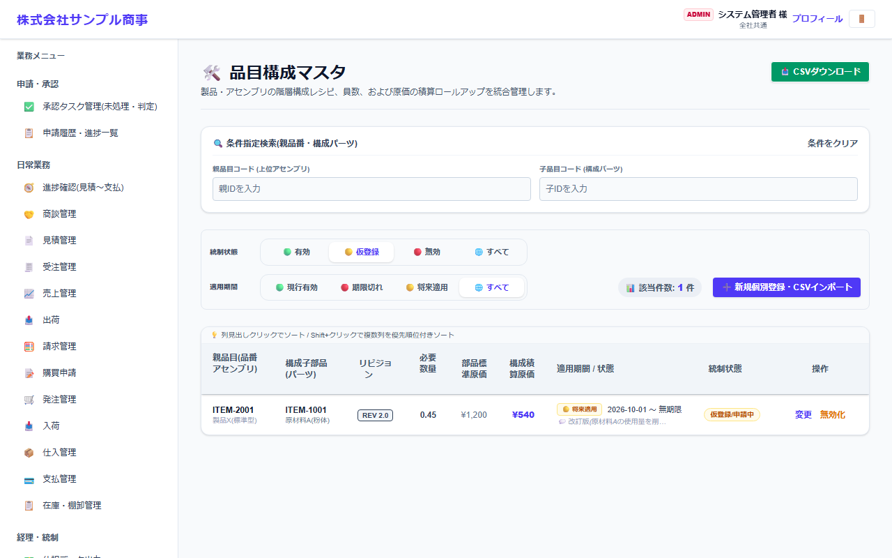
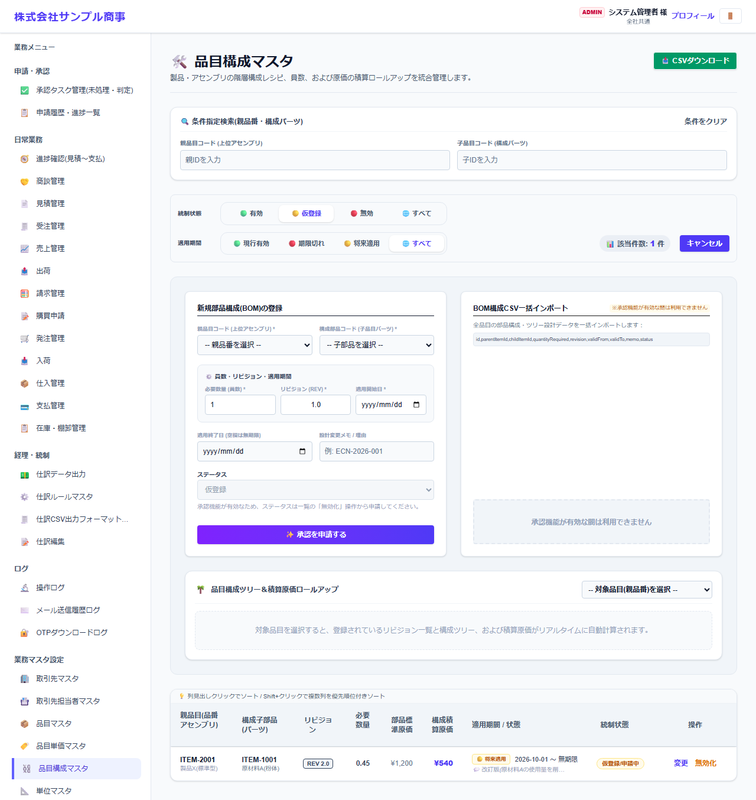

# 品目構成マスタ

[マニュアルの一覧](../README.md) > 業務マスタ設定 > 品目構成マスタ

製品を作るのに必要な部品と数量(部品構成・BOM)を登録します。

- **開き方**: メニューの **業務マスタ設定** > **品目構成マスタ**
- 一覧・検索・登録・CSV の共通の操作は、[共通の操作](../basics/common-operations.md) を参照してください。

## 一覧



親品目(製品)・構成部品・リビジョン・必要数量・部品の標準原価などが表示されます。**統制状態**(有効・仮登録・無効)と**適用期間**(現行有効・期限切れ・将来適用)で絞り込めます。

## 登録する

**➕ 新規個別登録・CSVインポート**(画面によっては **➕ 新規…**)を押すと、登録の欄が開きます。



| 項目 | 説明 |
|---|---|
| 親品目コード(上位アセンブリ) * | 作る製品 |
| 構成部品コード(子品目パーツ) * | 使う部品 |
| 必要数量(員数) *・リビジョン(REV) *・適用開始日 * | 同じ製品でも、設計変更ごとにリビジョンを分けられます |
| 適用終了日 | 空欄なら期限なし |
| 設計変更メモ/理由 |  |
| ステータス |  |

`*` の付いた項目は必須です。

## CSV で一括登録する

CSV の1行目(見出し)は、次の形にします。

```text
"id","parentItemId","childItemId","quantityRequired","revision","validFrom","validTo","memo","status"
```

見本: [`sampledata/products_bom_import_sample.csv`](../../../sampledata/products_bom_import_sample.csv)

## 補足

- **品目構成ツリー&積算原価ロールアップ** で品目を選ぶと、登録したリビジョンの一覧と構成、部品から積み上げた原価を確認できます。
