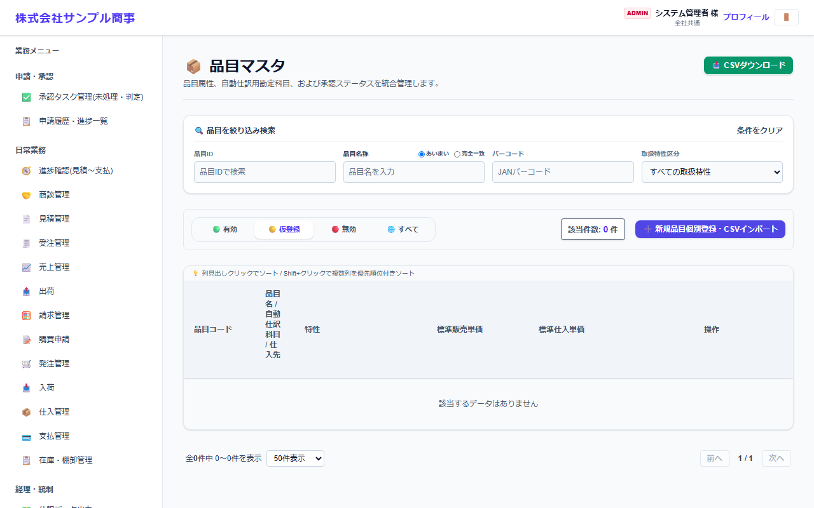
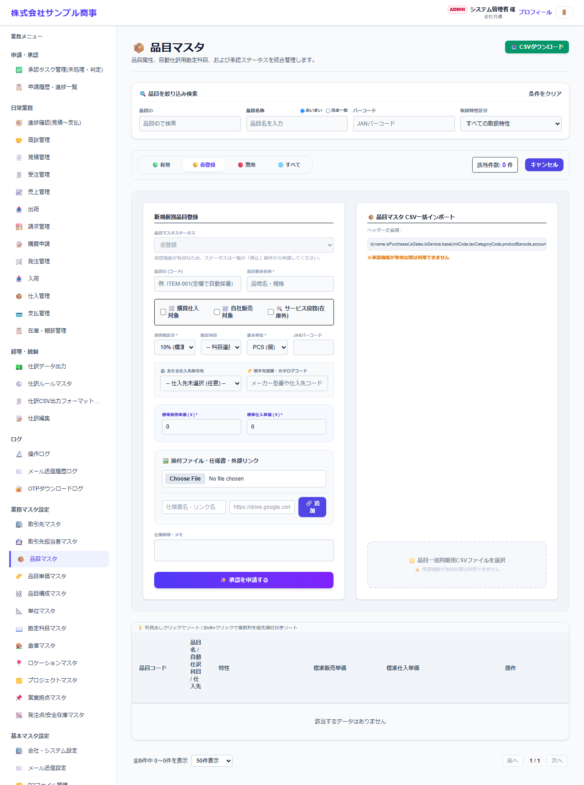

# 品目マスタ

[マニュアルの一覧](../README.md) > 業務マスタ設定 > 品目マスタ

販売・購買・在庫で扱う品目(商品・製品・原材料・部品・サービス)を登録します。

- **開き方**: メニューの **業務マスタ設定** > **品目マスタ**
- 一覧・検索・登録・CSV の共通の操作は、[共通の操作](../basics/common-operations.md) を参照してください。

## 一覧



品目コード・品目名・自動仕訳の科目・仕入先・特性(税区分など)・標準販売単価などが表示されます。

## 登録する

**➕ 新規個別登録・CSVインポート**(画面によっては **➕ 新規…**)を押すと、登録の欄が開きます。



| 項目 | 説明 |
|---|---|
| 品目マスタデータ(状態) | 仮登録・有効など |
| 品目ID(コード) | 空欄にすると自動で番号を付けます(例: ITEM-001) |
| 品目表示名称 * | 品名・規格 |
| 購買仕入対象・自社販売対象・サービス役務(在庫外) | 品目の使い方を選びます。サービスは在庫を持ちません |
| 消費税区分 *・勘定科目・基本単位 *・JANバーコード | JAN は、入荷・出荷のバーコード読み取りに使います |
| 主たる仕入先取引先・相手先型番/カタログコード | よく仕入れる仕入先と、仕入先側の品番 |
| 標準販売単価 *・標準仕入単価 * | 取引先別の単価が無い時に使う単価 |
| 添付ファイル・仕様書・外部リンク | 図面・写真・仕様書など |
| 仕様説明・メモ |  |

`*` の付いた項目は必須です。

## CSV で一括登録する

CSV の1行目(見出し)は、次の形にします。

```text
"id","name","isPurchased","isSales","isService","baseUnitCode","taxCategoryCode","productBarcode","accountCode","supplierId","supplierPartNumber","memo","standardSalesPrice","standardPurchasePrice","status"
```

見本: [`sampledata/products_import_sample.csv`](../../../sampledata/products_import_sample.csv)

## 補足

- 取引先別・数量別の単価は、[品目単価マスタ](product-prices.md)で登録します。
- 一覧から、品目に貼るバーコードのラベルを印刷できます。入荷・出荷の画面で、スマートフォンのカメラで読み取って品目を選べます。
- ラベルのバーコードは、JAN バーコードが正しい JAN(13桁・8桁で、最後の桁のチェックデジットが合うもの)なら JAN で、それ以外(英字を含むものなど)は CODE128 で描きます。JAN バーコードが空の品目は、品目コードを CODE128 で描きます。
