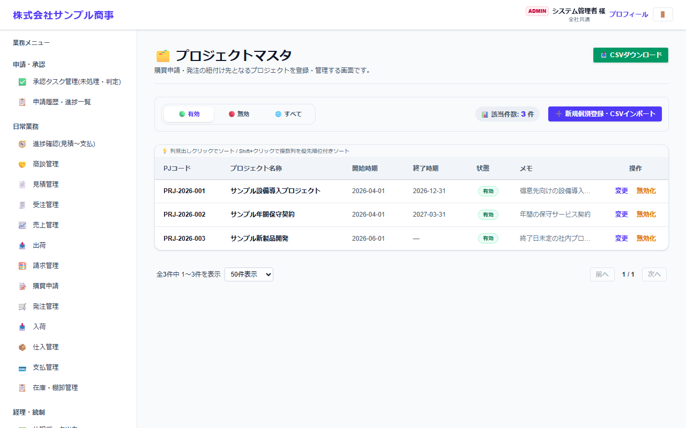
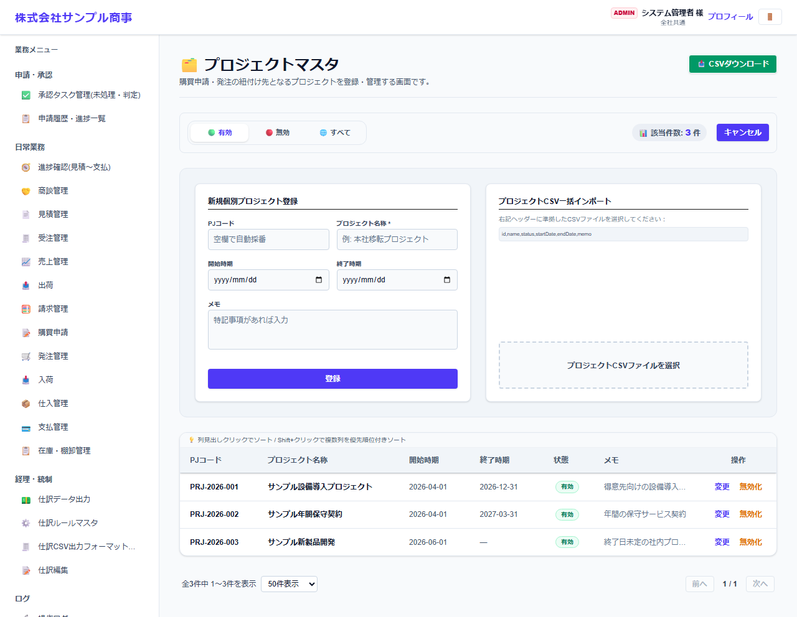

# プロジェクトマスタ

[マニュアルの一覧](../README.md) > 業務マスタ設定 > プロジェクトマスタ

案件・プロジェクトを登録します。見積・受注・購買申請・発注・仕入・売上にプロジェクトを付けると、プロジェクトごとに集計できます。

- **開き方**: メニューの **業務マスタ設定** > **プロジェクトマスタ**
- 一覧・検索・登録・CSV の共通の操作は、[共通の操作](../basics/common-operations.md) を参照してください。

## 一覧



PJコード・プロジェクト名称・開始時期・終了時期が表示されます。

## 登録する

**➕ 新規個別登録・CSVインポート**(画面によっては **➕ 新規…**)を押すと、登録の欄が開きます。



| 項目 | 説明 |
|---|---|
| PJコード | 空欄にすると自動で番号を付けます |
| プロジェクト名称 * |  |
| 開始時期・終了時期 |  |
| メモ |  |

`*` の付いた項目は必須です。

## CSV で一括登録する

CSV の1行目(見出し)は、次の形にします。

```text
"id","name","status","startDate","endDate","memo"
```

見本: [`sampledata/projects_import_sample.csv`](../../../sampledata/projects_import_sample.csv)
