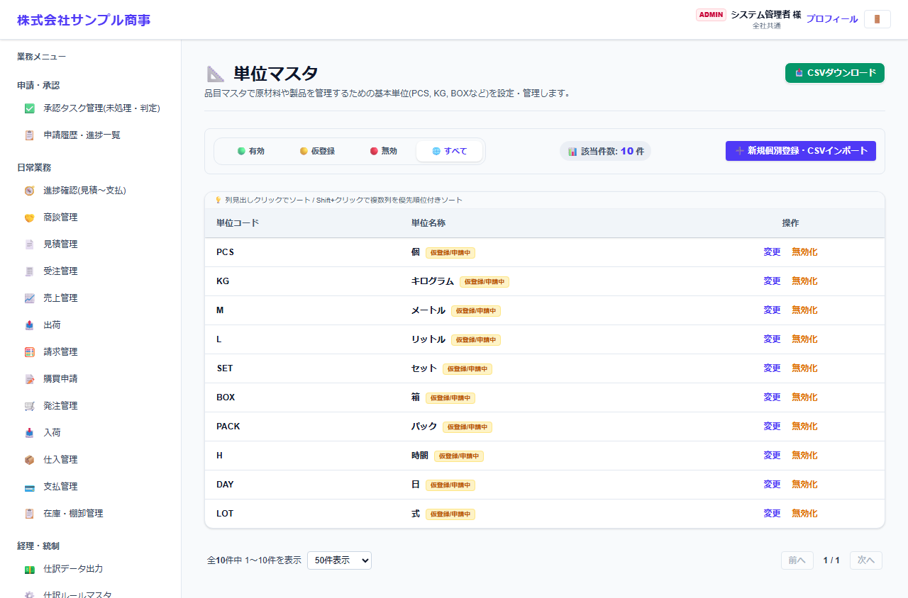
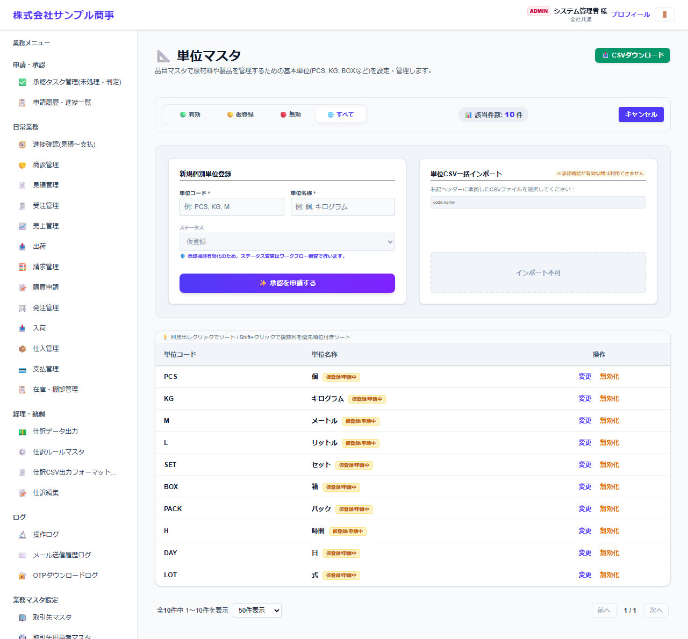

# 単位マスタ

[マニュアルの一覧](../README.md) > 業務マスタ設定 > 単位マスタ

品目で使う単位(個・kg・箱など)を登録します。

- **開き方**: メニューの **業務マスタ設定** > **単位マスタ**
- 一覧・検索・登録・CSV の共通の操作は、[共通の操作](../basics/common-operations.md) を参照してください。

## 一覧



単位コードと単位名称が表示されます。

## 登録する

**➕ 新規個別登録・CSVインポート**(画面によっては **➕ 新規…**)を押すと、登録の欄が開きます。



| 項目 | 説明 |
|---|---|
| 単位コード * | 例: PCS、KG、M |
| 単位名称 * | 例: 個、キログラム |
| ステータス |  |

`*` の付いた項目は必須です。

## CSV で一括登録する

CSV の1行目(見出し)は、次の形にします。

```text
"code","name","status"
```

- `status`(状態)は省略できます。`active`(有効)・`temporary`(仮登録)・`suspended`(無効)のどれかです。
  空欄の場合、新しい単位は有効で登録し、登録済みの単位は今の状態のままにします。

見本: [`sampledata/units_import_sample.csv`](../../../sampledata/units_import_sample.csv)

## 補足

- 単位の承認機能が有効な間は、CSV で取り込めません。
