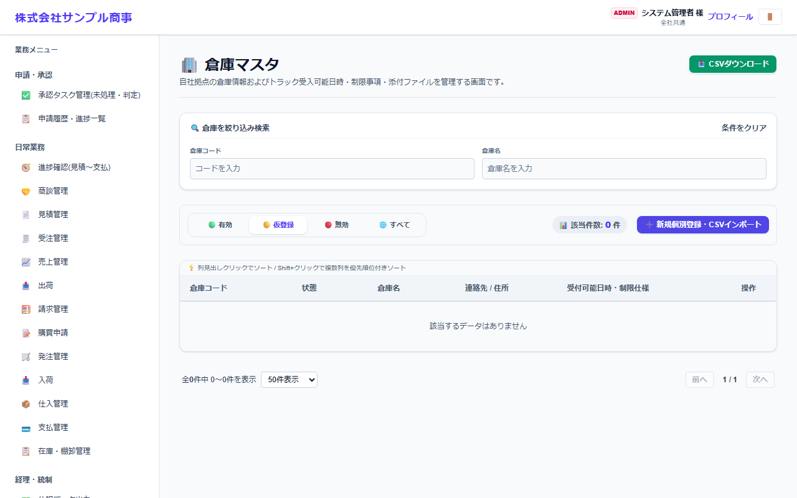
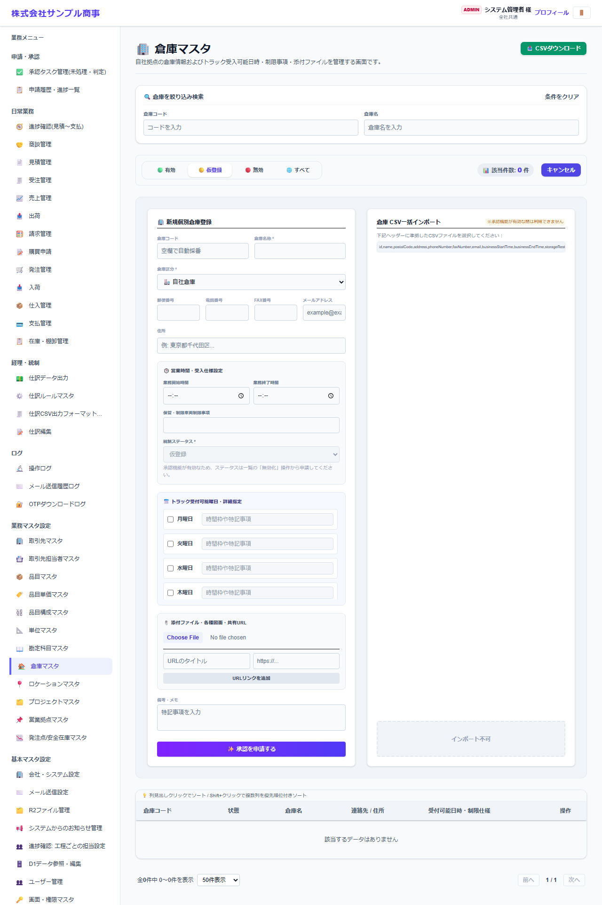

# 倉庫マスタ

[マニュアルの一覧](../README.md) > 業務マスタ設定 > 倉庫マスタ

在庫を置く倉庫を登録します。自社の倉庫と、外部に委託している倉庫を区別します。

- **開き方**: メニューの **業務マスタ設定** > **倉庫マスタ**
- 一覧・検索・登録・CSV の共通の操作は、[共通の操作](../basics/common-operations.md) を参照してください。

## 一覧



倉庫コード・状態・倉庫名(外部倉庫には印が付きます)・連絡先・住所が表示されます。

## 登録する

**➕ 新規個別登録・CSVインポート**(画面によっては **➕ 新規…**)を押すと、登録の欄が開きます。



| 項目 | 説明 |
|---|---|
| 倉庫コード | 空欄にすると自動で番号を付けます |
| 倉庫名称 * |  |
| 倉庫区分 * | 自社倉庫・外部倉庫。外部倉庫には、入荷・出荷の指示書を送ります |
| 郵便番号・電話番号・FAX番号・メールアドレス・住所 |  |
| 営業時間・受入仕様設定 | 業務開始・終了時間、保管・車両の制限事項、統制ステータス |
| トラック受付可能曜日・詳細指定 | 曜日ごとに受け付けるかと、時間帯などの特記事項 |
| 添付ファイル・各種図面・共有URL |  |
| 備考・メモ |  |

`*` の付いた項目は必須です。

## CSV で一括登録する

CSV の1行目(見出し)は、次の形にします。

```text
"id","name","postalCode","address","phoneNumber","faxNumber","email","businessStartTime","businessEndTime","storageRestrictions","warehouseType","status","memo"
```

見本: [`sampledata/warehouses_import_sample.csv`](../../../sampledata/warehouses_import_sample.csv)

## 補足

- 外部倉庫の担当者(出荷指示書・入荷指示書のメールの送り先)は、倉庫マスタの画面で倉庫ごとに登録します。
- 倉庫の中の棚などの保管場所は、[ロケーションマスタ](locations.md)で登録します。
