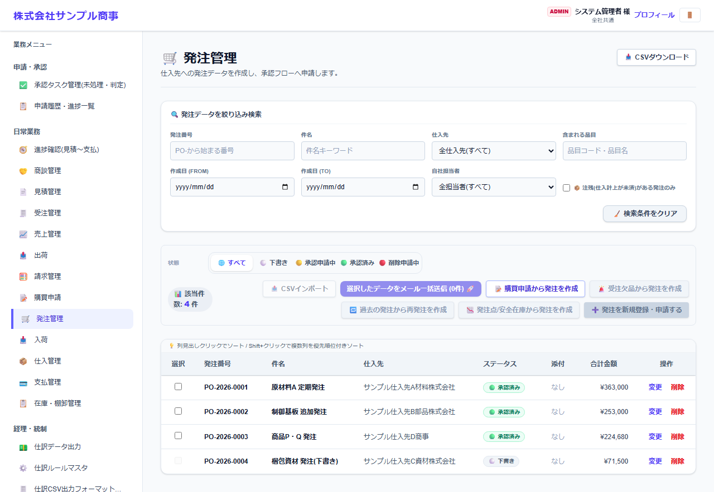
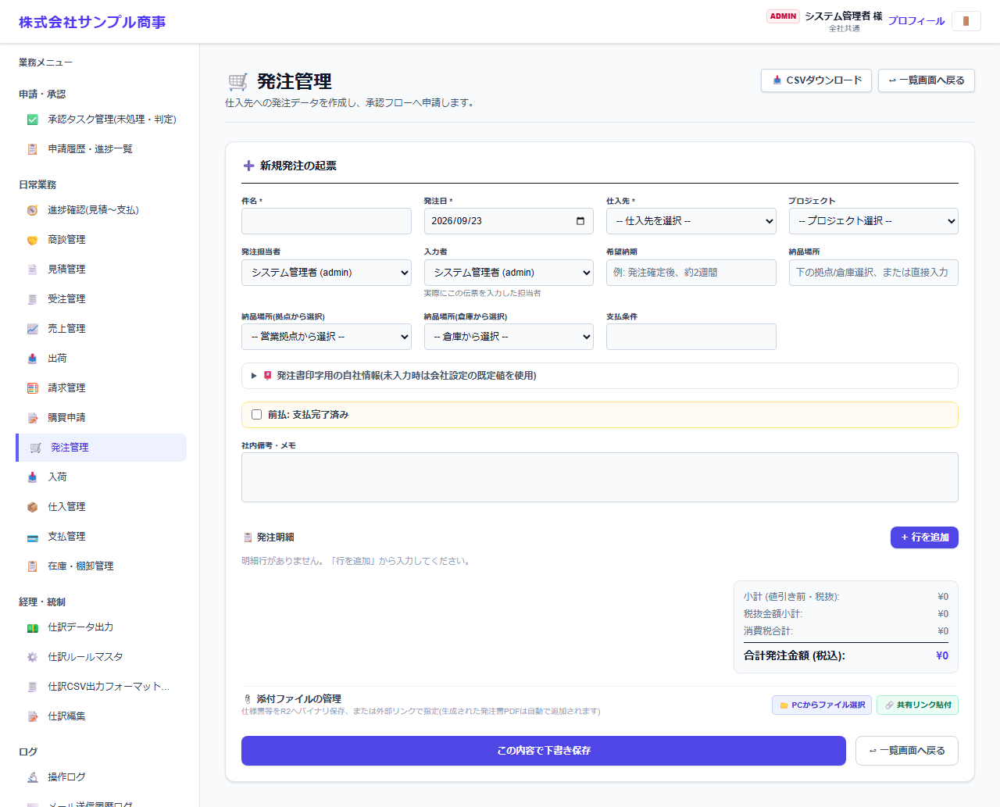

# 発注管理

[マニュアルの一覧](../README.md) > 日常業務 > 発注管理

仕入先への発注を作り、発注書を PDF で出力したり、メールで送ったりします。

- **開き方**: メニューの **日常業務** > **発注管理**
- **対象**: 全員
- 一覧・検索・並び替え・CSV・承認の共通の操作は、[共通の操作](../basics/common-operations.md) を参照してください。

## 一覧

### 一覧の操作

| 操作 | 内容 |
|---|---|
| 状態のタブ | すべて・下書き・承認申請中・承認済み・削除申請中で絞り込みます |
| 絞り込み検索 | 番号・件名・取引先・品目・作成日・自社担当者などで探します |
| 番号を押す | 伝票を開いて、内容の確認・変更・PDF の出力などを行います |
| 左端のチェックボックス + 一括メール送信 | 選んだ伝票の帳票を、取引先の担当者にまとめてメールで送ります(送り先は取引先担当者マスタの「メールで送る帳票」で決まります) |
| CSVインポート / CSVダウンロード | 伝票を一括で取り込む・保存する |

発注の作り方は、ボタンで選べます。

| ボタン | 内容 |
|---|---|
| 購買申請から発注を作成 | 承認済みの購買申請を引き継ぎます |
| 受注欠品から発注を作成 | 在庫が足りない受注から作ります |
| 過去の発注から再発注を作成 | 以前の発注を引き継ぎます |
| 発注点/安全在庫から発注を作成 | 発注点を下回った品目から作ります |
| 発注を新規登録・申請する | 一から作ります |

## 発注を作る

| 項目 | 説明 |
|---|---|
| 件名 *・発注日 *・仕入先 *・プロジェクト | |
| 発注担当者・入力者・希望納期 | |
| 納品場所 | 営業拠点・倉庫から選ぶか、自由に入力します(住所が発注書に印字されます) |
| 支払条件 | |
| 発注書印字用の自社情報 | 未入力の場合は、会社・システム設定の値を使います |
| 前払: 支払完了済み | 先に支払う(前払)取引で、支払が済んだら付けます |
| 発注明細 | 品目・数量・単価・税区分・勘定科目 |
| 添付ファイル | 発注書の控え・仕様書など |

**この内容で下書き保存** で保存します。発注書は、保存した発注を開いて PDF 出力・メール送信します。
