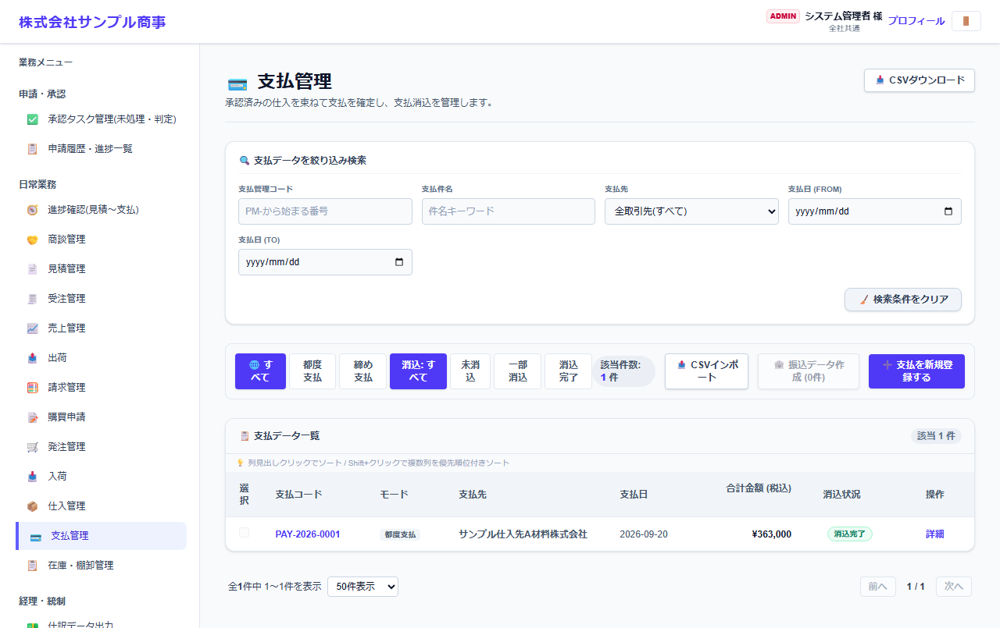
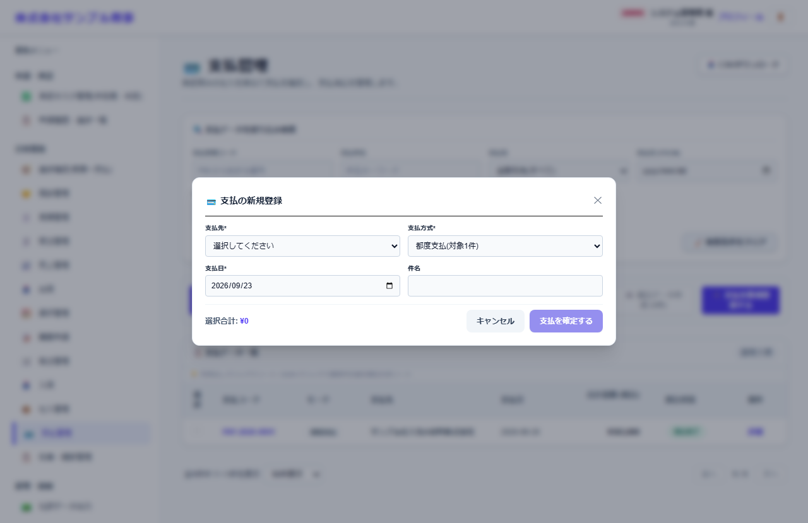

# 支払管理

[マニュアルの一覧](../README.md) > 日常業務 > 支払管理

承認済みの仕入(または検収の記録)をまとめて支払を作り、支払の実績を記録して消し込みます。

- **開き方**: メニューの **日常業務** > **支払管理**
- **対象**: 全員
- 一覧・検索・並び替え・CSV・承認の共通の操作は、[共通の操作](../basics/common-operations.md) を参照してください。

## 一覧

状態のタブで、支払の方式(都度支払・締め支払)や、消込の状況(未消込・一部消込・消込完了)で絞り込みます。
**振込データ作成** で、選んだ支払から全銀形式の振込ファイルを作れます(取引先マスタの振込先口座と、会社・システム設定の振込元の情報を使います)。

## 支払を作る

**支払を新規登録する** を押すと、支払の作成の画面が開きます。

| 項目 | 説明 |
|---|---|
| 支払先 * | |
| 支払方式 * | **都度支払**(1件ごと)か、**締め支払**(まとめて) |
| 支払日 *・件名 | |

対象の仕入・検収を選んで **支払を確定する** を押します。支払の実績(支払日・金額)は、支払の **詳細** から記録して消し込みます。
