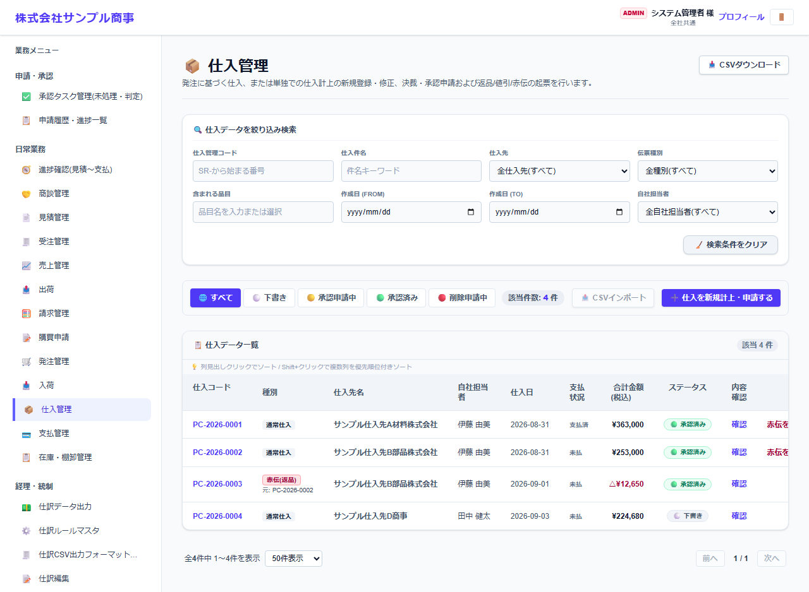
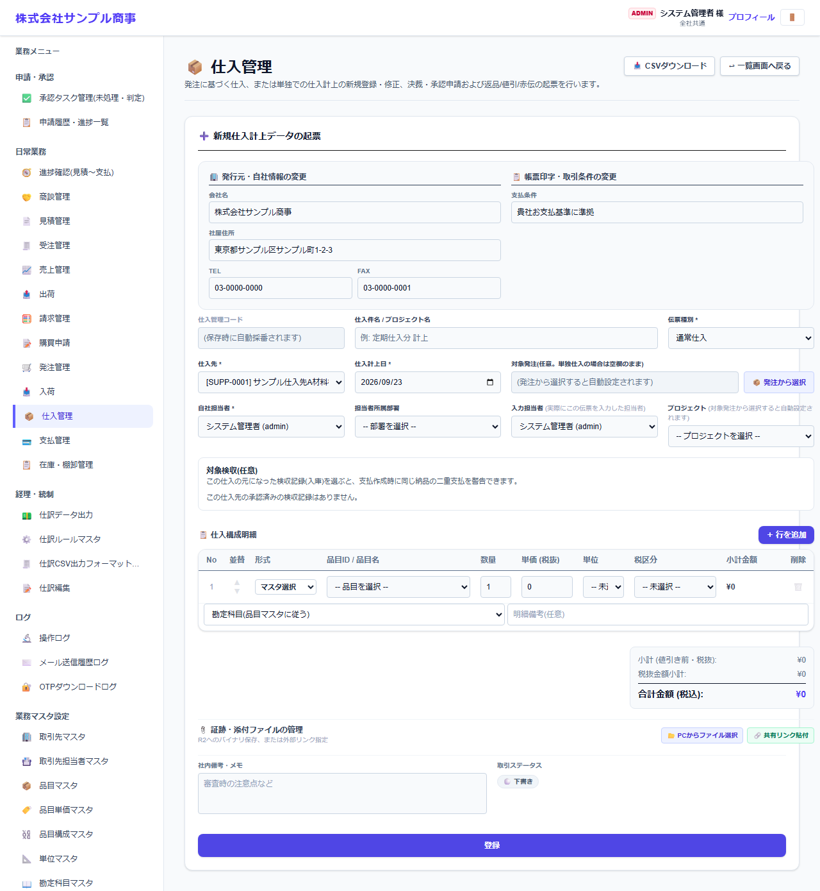

# 仕入管理

[マニュアルの一覧](../README.md) > 日常業務 > 仕入管理

仕入を計上します。発注から作る方法と、発注なしで直接作る方法があります。返品は赤伝(マイナスの伝票)で登録します。

- **開き方**: メニューの **日常業務** > **仕入管理**
- **対象**: 全員
- 一覧・検索・並び替え・CSV・承認の共通の操作は、[共通の操作](../basics/common-operations.md) を参照してください。

## 一覧

### 一覧の操作

| 操作 | 内容 |
|---|---|
| 状態のタブ | すべて・下書き・承認申請中・承認済み・削除申請中で絞り込みます |
| 絞り込み検索 | 番号・件名・取引先・品目・作成日・自社担当者などで探します |
| 番号を押す | 伝票を開いて、内容の確認・変更・PDF の出力などを行います |
| 左端のチェックボックス + 一括メール送信 | 選んだ伝票の帳票を、取引先の担当者にまとめてメールで送ります(送り先は取引先担当者マスタの「メールで送る帳票」で決まります) |
| CSVインポート / CSVダウンロード | 伝票を一括で取り込む・保存する |

一覧の **支払状況** で、支払に含めたかどうかが分かります。

## 仕入を計上する

**仕入を新規計上・申請する** を押すと、計上の画面になります。

| 項目 | 説明 |
|---|---|
| 伝票種類 * | 通常仕入・返品(赤伝)など |
| 仕入先 *・仕入計上日 * | |
| 対象発注 | **発注から選択** を押すと、発注の残りの数量から明細を作ります |
| 対象検収(任意) | この仕入の元になった入庫(検収)の記録を選ぶと、同じ納品を二重に支払わないよう、支払の作成時に警告します |
| 明細・添付・社内備考・取引ステータス | |

- 会社・システム設定で「入庫した数量までしか仕入にできない」ようにしている場合は、入庫した数量が上限になります。
