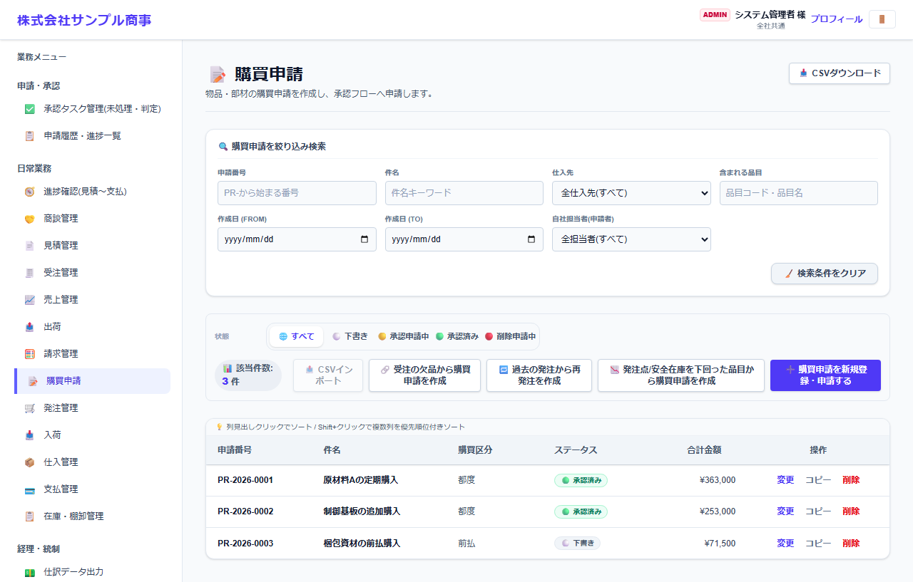
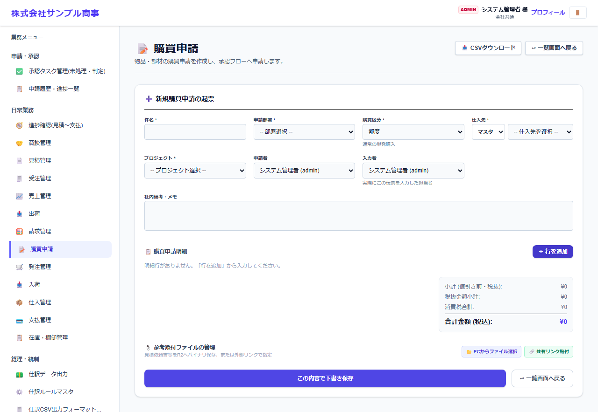

# 購買申請

[マニュアルの一覧](../README.md) > 日常業務 > 購買申請

物品・部材の購入を申請します。承認された購買申請から、発注を作ります。

- **開き方**: メニューの **日常業務** > **購買申請**
- **対象**: 全員
- 一覧・検索・並び替え・CSV・承認の共通の操作は、[共通の操作](../basics/common-operations.md) を参照してください。

## 一覧

| 操作 | 内容 |
|---|---|
| 状態のタブ | すべて・下書き・承認申請中・承認済み・削除申請中 |
| 受注の欠品から購買申請を作成 | 在庫が足りない受注の明細から、購買申請を作ります |
| 過去の発注から再発注を作成 | 以前の発注の内容を引き継いで、購買申請を作ります |
| 発注点/安全在庫を下回った品目から購買申請を作成 | 発注点を下回った品目を提案します(発注点/安全在庫マスタの設定を使います) |
| 変更・コピー・削除 | 一覧の右の操作 |

## 購買申請を作る

**購買申請を新規登録・申請する** を押すと、作成の画面になります。

| 項目 | 説明 |
|---|---|
| 件名 *・申請部署 *・購買区分 * | 購買区分は、都度・前払など |
| 仕入先 | マスタから選ぶか、直接入力します |
| プロジェクト *・申請者・入力者 | |
| 購買申請明細 | **+ 行を追加** で、品目・数量・見積単価・希望納期などを入力します |
| 参考添付ファイル | 仕入先の見積書など |

**この内容で下書き保存** で保存します。承認機能を使う場合は、保存した申請を開いて申請します。
